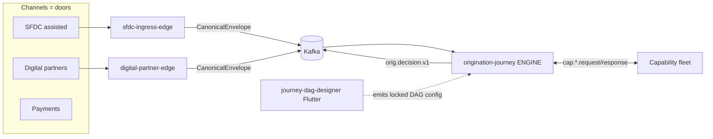
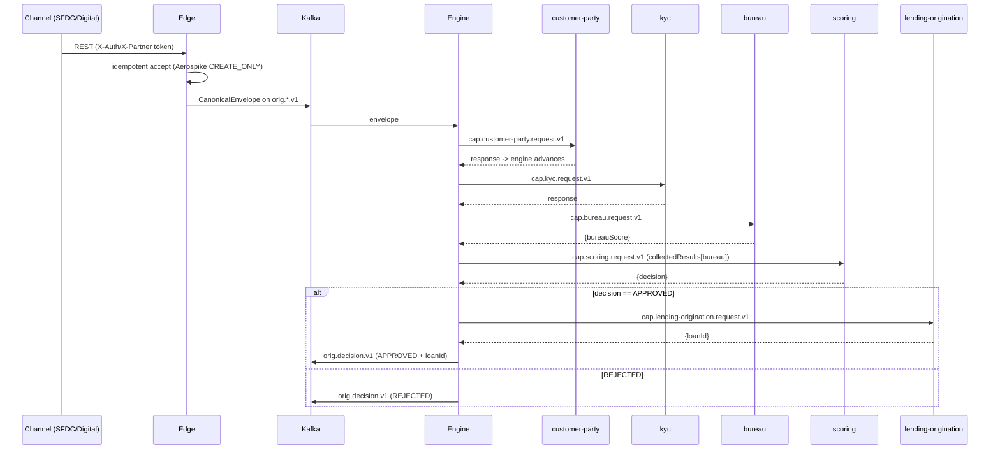

# IDFC Integration Platform — Design Document (Frontend + Backend)

**Status:** living design of the *current code*
**Scope:** the orchestration backend (`idfc-integration-platform`) and the
control‑plane authoring frontend (`journey-dag-designer`)
**Audience:** engineers, architects, reviewers

---

## 1. Thesis

> **One platform serves every channel — assisted (SFDC), digital (fintech
> partners), and payments — with no separate repository or service per channel.
> A journey is *configuration*, not code.**

Everything in both repositories exists to make that sentence physically true and
continuously verifiable:

- A **channel** is just a *door* (an "edge"). Each edge normalizes its
  channel‑specific input into **one** canonical envelope and drops it on **one**
  Kafka topic family. The SFDC edge and the digital partner edge produce
  **byte‑identical** envelope shapes — proven by a test.
- A **business function** is a *capability* (KYC, bureau, scoring, booking…). A
  capability is a small hexagonal service that consumes a request topic and
  produces a response topic. It knows nothing about channels or journeys.
- A **journey** is a **DAG of capability calls** held as data. The
  config‑driven **engine** walks the DAG; it contains no per‑product `if`
  branches. Onboarding a new product/partner is a new *config row*, not a new
  service.
- The **frontend** is the authoring tool for those DAGs. It emits exactly the
  config the engine loads — the two sides share a locked schema (the
  "schema lock").



---

## 2. Two repositories, one contract

| Repo | Role | Stack |
|---|---|---|
| `idfc-integration-platform` | **Runtime** — edges, engine, capabilities, mocks | Java 21, Spring Boot 3.4.5, Gradle (Kotlin DSL), Kafka, Aerospike |
| `journey-dag-designer` | **Control plane** — authors journeys as DAGs; never executes them | Flutter (Web), Dart 3, Riverpod, go_router, freezed |

The alignment seam is narrow and explicit: **Journey/DAG ↔ orchestration**. The
DAG the designer produces must map onto the engine's `JourneyDefinition`. That
mapping is pinned by the **schema lock** (§7).

---

## 3. Backend design

### 3.1 Architectural style — hexagonal (ports & adapters)

Every backend module follows the same shape:

```
domain/      pure business types + services — NO framework imports
ports/       interfaces the domain needs (in/out)
adapter/in/  drivers (Kafka listener, REST controller) -> call the domain
adapter/out/ driven adapters (Aerospike, Kafka publisher, HTTP vendor, JDBC)
config/      Spring wiring (the only place that knows about Spring)
application/ orchestrates domain + ports into a use case
```

The domain has no dependency on Spring, Kafka, or Aerospike. Frameworks are
plugged at the edges. This is what lets a capability be unit‑tested over an
in‑memory bus and re‑hosted without rewrites.

> Vocabulary: **capability** = a business function; **edge** = a channel door;
> **engine** = a config‑driven sequencer. These are the three node types of the
> whole system.

### 3.2 Module map (Gradle multi‑project)

```
shared/
  shared-domain          THE cross-cutting contracts (envelope + capability)
  shared-observability   otel/micrometer helpers
platform/
  platform-idempotency   (extraction target for the Aerospike store)
  platform-auth          two-token auth (Hydra + Kong)
  platform-config        org-config-as-data
  platform-messaging     shared Kafka helpers
edges/
  sfdc-ingress-edge      assisted channel (REST -> envelope -> Kafka)   :8080
  digital-partner-edge   digital channel (partner REST -> SAME envelope) :8081
  sfdc-egress-edge       (stub — later slice)
capabilities/
  customer-party  kyc  bureau  scoring
  lending-origination  lending-servicing  payments
orchestration/
  origination-journey    THE engine (walks the DAG)
full-flow-it             choreography test: real engine + 5 real capabilities
infra/                   docker-compose infra + vendor mocks
```

Build conventions live in `buildSrc` as three plugins
(`idfc.java-conventions`, `idfc.library-conventions`,
`idfc.spring-boot-app-conventions`); group `com.idfcfirstbank`, version
`0.1.0-SNAPSHOT`.

### 3.3 The two shared contracts (`shared:shared-domain`)

These are the only types both edges and the engine agree on. They contain **no
framework imports**.

**(a) The Canonical Envelope** — the cross‑edge contract.

```
CanonicalEnvelope { correlationId, sourceSystem, applicationRef, type,
                    orgId, payloadRef, ... }
SourceSystem = SFDC | DIGITAL
```

Both edges emit this exact shape. `EnvelopeShapeIdentityTest` (digital edge)
asserts the digital envelope's JSON keys equal the SFDC envelope's keys — the
thesis as an executable check. Applicant payload travels by **claim‑check**
(`payloadRef` → S3), not inline.

**(b) The Capability Contract** — the edge‑independent call shape every
capability speaks.

```
CapabilityRequest  { ... , collectedResults: Map<key,result> }
CapabilityResponse { status, result }
CapabilityStatus   = OK | ERROR
CapabilityTopics:   request  = "cap." + key + ".request.v1"
                    response = "cap." + key + ".response.v1"
```

A capability *is* "something that consumes `cap.<key>.request.v1` and produces
`cap.<key>.response.v1`." The engine and capabilities never share a Java type
beyond this.

### 3.4 The engine (`orchestration:origination-journey`)

The engine is the heart of "config not code." It loads a `JourneyDefinition`
(the DAG) and walks it, dispatching capability requests and advancing on
responses.

**Domain model**

```
JourneyDefinition { startNodeId, nodes[] }
JourneyNode (NodeType = TASK | BRANCH | TERMINAL)
  TASK     -> capabilityKey, next[], joinOn[], meter?, compensation?
  BRANCH   -> arms[] (BranchArm = expression -> next)
  TERMINAL -> action?, emit[]
JourneyInstance  { status, collectedResults, completedNodeIds, dispatchedNodeIds }
JourneyDecision  (final outcome)
```

**Domain services**

- `JourneyEngine` — given an instance + an arrived capability response, computes
  the next set of nodes to dispatch (fan‑out when `next.length > 1`, join when a
  node lists `joinOn`), evaluates `BRANCH` arms top‑to‑bottom (first match wins),
  and produces an `EngineOutcome`.
- `ExpressionEvaluator` — evaluates branch‑arm expressions against the run
  context (e.g. `decision == 'APPROVED'`).

**Ports / adapters**

```
ports:    CapabilityRequestPort, DecisionOutboundPort, JourneyInstanceStore
adapter/out/kafka    -> publishes cap.<key>.request.v1 and orig.decision.v1
adapter/out/loader   -> JourneyDefinitionLoader (reads the locked DAG config)
adapter/out/store    -> InMemoryJourneyInstanceStore | AerospikeJourneyInstanceStore
```

**Durable run state (config toggle).** `JourneyInstance` is the audit
source‑of‑truth, so its store is pluggable via `idfc.engine.state-store`:

- `in-memory` (default, for tests/dev)
- `aerospike` — `AerospikeJourneyInstanceStore` JSON‑encodes the run state into
  bins (corr/jkey/appRef/status/payload/collected/completed/dispatched), keyed by
  `journeyInstanceId`, with native TTL, and rehydrates via
  `JourneyInstance.restore(...)`.

### 3.5 Capabilities

Five participate in the live origination flow; all are hexagonal and
config‑addressed by their key (= backend module name):

| Capability | Vendor (mock) | Result it contributes |
|---|---|---|
| `customer-party` | Posidex | `{crn, customerId}` |
| `kyc` | NSDL | `{status, kycRefId}` |
| `bureau` | CIBIL (+multi/commercial) | `bureauScore`, `bureauGrade`, `reportId`, `bureauResults[]` |
| `scoring` | FICO + DecisionRule | `{decision, score, reasons}` |
| `lending-origination` | FinnOne (Oracle SP, JDBC) | `{loanId}` |

Two design points worth calling out:

- **Bureau multi‑vendor fan‑out.** `bureau` is not a single CIBIL call. A
  `BureauFetchService` fans out in parallel (`CompletableFuture`) across vendor
  ports (`CibilBureauPort`, `MultiBureauPort`, `CommercialBureauPort`,
  `ScorecardInfraPort`), each with a mock + HTTP adapter, and merges into a
  `BureauReportSet`. The **invariant** preserved for downstream scoring is the
  primary `bureauScore` (CIBIL, or the lowest available) — so scoring is
  unchanged while the report set grows richer.
- **Scoring reads upstream results.** `scoring` pulls
  `request.collectedResults().get("bureau")` → `bureauScore`, applies a
  configurable threshold, and emits the `decision` the engine branches on.
- **Booking is real I/O.** `lending-origination` calls a FinnOne stored procedure
  over JDBC (`{ call SP_FINNONE_SUBMISSION(?, ?) }`) and is back‑pressured by a
  `meter` (`finnone_pool`); the DAG declares a `compensation` node for saga
  rollback.

### 3.6 Edges (channels)

Both edges do the same three things — authenticate, **idempotently** accept,
normalize to `CanonicalEnvelope`, publish — differing only in their inbound
protocol.

- **`sfdc-ingress-edge`** (`:8080`, `POST /api/v1/sfdc/notifications`,
  `X-Auth-Token`). Out‑adapters: `AerospikeIdempotencyStore`,
  `KafkaMessagePublisher`, plus mocks for S3 blob store / org‑config / auth /
  SFDC response / FinnOne meter.
- **`digital-partner-edge`** (`:8081`,
  `POST /api/v1/digital/origination`, `X-Partner-Token`). `DigitalNormalizer`
  produces the **same** envelope with `source = DIGITAL`. Partner registry is
  config‑as‑data.

**Hot‑key‑safe idempotency.** Both edges accept exactly once under concurrent
resends using Aerospike `CREATE_ONLY` (atomic insert) with a transient
**KEY_BUSY** retry (result code 14 = "Hot key" = same‑key contention, **not**
"already exists"): retry with bounded backoff
(`HOT_KEY_MAX_RETRIES = 12`, `Math.min(2 + attempt*2, 25)` ms). Proven by
`AerospikeIdempotencyStoreConcurrencyIT` — 32 threads race the same key via a
`CyclicBarrier`, asserting exactly one winner.

### 3.7 Topic wiring

| Topic | Producer | Consumer |
|---|---|---|
| `orig.sfdc.pl.v1` (+ lap/bl/commercial) | edges | engine (`idfc.engine.origination-topics`) |
| `cap.<key>.request.v1` | engine | the matching capability |
| `cap.<key>.response.v1` | each capability | engine (pattern `cap\..*\.response\.v1`) |
| `orig.decision.v1` | engine | decision push‑back (seam) |

Kafka serde is String‑JSON throughout.

---

## 4. Frontend design (`journey-dag-designer`)

### 4.1 Purpose & non‑goal

The frontend is a **control plane**: it authors journeys and pushes config to
the registry. It **never executes** a journey — there is no runtime, no live
applicant data. Its output is the canonical DAG config the engine loads.

### 4.2 Layered, framework‑light architecture

```
domain/      freezed models + 4 PURE services (no Flutter imports)
data/        repositories — Mock (seeded, in-memory) | Http (dio) [swap by flag]
core/        auth, config (Env), network, error
features/    auth · journeys (registry) · editor (the authoring surface)
app/         providers (Riverpod DI), router (go_router), theme
```

The domain mirrors the backend engine's model so the two stay aligned:

```
Journey { key, name, businessLine?, product?, partner?, versions[], activeVersion? }
JourneyVersion { version, status, dag, authorId, approverId?, note? }
ApprovalStatus = draft | pendingApproval | approved | published | rejected
Dag { startNodeId, nodes[], layout{} }
DagNode (sealed) = TaskNode | BranchNode | TerminalNode      // == engine NodeType
BranchArm { expression, next }
Capability { key, name, domain?, isMoneyOrBookingNode }      // key == backend module
```

**Scoping has no tenant axis.** A journey is scoped by
`businessLine × product × partner`; `null` = a global template refined by
`Binding`s. Onboarding a partner = a new binding row, not a new service — the
governance message of the whole tool.

### 4.3 The four pure services (the alignment core)

| Service | Responsibility |
|---|---|
| `DagValidator` | 9 graph rules (start resolves, unique ids, reachable, acyclic, no dangling edges, branch arms reach a terminal, `joinOn` are real predecessors, money/meter nodes need `compensation`, `capabilityKey` is registered). **Mirrors the server validator.** |
| `ConfigSerializer` | The single source of canonical DAG config JSON — the byte‑for‑byte contract with the engine loader. Round‑trip invariant: `fromJson(toJson(dag)) == dag`. |
| `DagDiffService` | Version‑to‑version diff for review. |
| `SimulationEngine` | Dry‑run a DAG (fan‑out/join/branch/meter/compensation) for authoring feedback — pure, deterministic, no backend. |

These are unit‑tested in isolation and carry the schema lock fixtures.

### 4.4 The authoring editor (the production UI)

The editor (`/journeys/:id`) is the surface a maker uses to *configure a
workflow*:

- **Palette** — registered capabilities only (config‑vs‑code boundary made
  physical) + Branch/Terminal node kinds.
- **Visual DAG canvas** — nodes at persisted `layout` coordinates, draggable;
  task `next` edges drawn solid, branch arms dashed + labelled with the
  expression; click‑to‑connect; pan/zoom; selection ring; red ring on validation
  errors.
- **Node inspector** — type‑specific forms: task (capability/next/joinOn/meter/
  compensation/optional), branch (ordered arms), terminal (action/emit).
- **Validation panel** — live `DagValidator` output; click an issue to focus its
  node. Errors gate Submit.
- **Config preview** — exactly what `ConfigSerializer` emits, copy‑to‑clipboard.

### 4.5 Maker‑checker lifecycle

```
draft --submit--> pendingApproval --approve--> published
                                  \--reject--> rejected
```

- **Maker** authors and submits (Submit gated on validation).
- **Checker** approves/publishes or rejects with a comment.
- **author ≠ approver** is enforced in the UI (`RoleGate` + the action bar
  disables Approve on your own version) **and** by the backend (403).
- Published/rejected versions are read‑only; "Edit as new draft" forks a fresh
  draft. The `EditorController` (Riverpod `StateNotifier`) holds one editable DAG
  copy and re‑runs `DagValidator` on every edit; only `draft` versions are
  mutable.

Roles come from `AuthController`; in mock mode any non‑empty credentials log in,
and a username starting `checker` also gets the checker role (so both sides are
exercisable locally).

---

## 5. End‑to‑end data flow (origination)



The branch is driven by `applicationRef` in the demo (CIBIL mock returns 780 by
default, 540 when `applicationRef` matches `/LOW/i`), because the live envelope
carries a `payloadRef` claim‑check rather than the inline PAN (documented seam).

---

## 6. Cross‑cutting concerns

| Concern | Mechanism |
|---|---|
| **Idempotency** | Aerospike `CREATE_ONLY` + KEY_BUSY retry at each edge; exactly‑once accept under concurrent resends. |
| **Durability / audit** | Engine `JourneyInstance` store toggle (`in-memory` | `aerospike`), native TTL, generation‑CAS where needed. |
| **Back‑pressure** | `meter` markers on money nodes (`finnone_pool`) bound vendor concurrency; backlog drains. |
| **Config‑as‑data** | Journey DAGs, partner registry, org config, scoping bindings are all data, not code. |
| **Observability** | `shared-observability` (otel/micrometer) wiring helpers. |
| **Auth** | Two‑token model (Hydra + Kong) at the platform layer; edges check `X-Auth-Token` / `X-Partner-Token`. |

---

## 7. The schema lock (the alignment contract)

The DAG config JSON is a **two‑sided contract**: the frontend's
`ConfigSerializer` emits it; the engine's `JourneyDefinitionLoader` consumes it.
The canonical shape:

```json
{
  "key": "loan-origination",
  "startNodeId": "n_customer",
  "nodes": [
    {"type":"task","id":"n_customer","capabilityKey":"customer-party","next":["n_kyc"]},
    {"type":"branch","id":"n_decide","arms":[{"expression":"decision == 'APPROVED'","next":"n_book"}]},
    {"type":"terminal","id":"n_done","action":"push_decision_to_channel","emit":["LoanBooked"]}
  ],
  "layout": {"n_customer":{"x":80,"y":200}}
}
```

Alignment rules that keep the two repos honest:

1. `type` discriminators (`task|branch|terminal`) match `NodeType`.
2. `capabilityKey` values equal real backend module names
   (`scoring`, **not** `scoring-decisioning`).
3. The frontend `DagValidator` rule set mirrors the server validator; the server
   re‑validates authoritatively.
4. The same fixture journeys (`loan-origination`, `payment-execution`) are
   checked on both sides.

---

## 8. Runtime & deployment

Layered Docker Compose:

- **`docker-compose.infra.yml`** — pull‑only: Aerospike, Kafka (dual listeners),
  vendor mocks (Posidex/CIBIL/FICO/NSDL via WireMock, FinnOne via Oracle‑XE).
  Shared external network `idfc`.
- **`docker-compose.services.yml`** — the 8 `idfc/*` images built by
  `./gradlew bootBuildImage` (buildpacks). Reach infra by hostname
  (`kafka:9092`, `aerospike`, `mock-*`); no cross‑file `depends_on` so it runs
  standalone against already‑up infra.
- **`docker-compose.yml`** — thin `include:` of both layers.

Driver: `./demo.sh infra | images | services | up | approved | rejected |
digital | decisions | burst | down`.

The frontend builds to a static web app (`flutter build web`); in mock mode it
runs with no backend.

---

## 9. Testing strategy

| Level | What it proves |
|---|---|
| Backend unit | Each capability/domain service in isolation over an in‑memory bus. |
| `full-flow-it` | **Real** engine + 5 **real** capabilities over an in‑memory bus prove both outcomes (APPROVED+loanId, REJECTED) through the real DecisionRule, bureau score, and booking. |
| Integration (`@Tag("integration")`) | Testcontainers Kafka/Aerospike (e.g. the hot‑key concurrency IT). Excluded from the fast `build`. |
| Frontend domain | `DagValidator`, `ConfigSerializer` (round‑trip), `DagDiffService`, `SimulationEngine` + schema‑lock fixtures. |
| Frontend editor | `EditorController` lifecycle: fork draft → author → submit; empty‑draft invalid → authoring. |
| Identity | `EnvelopeShapeIdentityTest` — digital envelope keys == SFDC keys (the thesis). |

---

## 10. Known seams (documented, not hidden)

1. **Decision push‑back.** The engine publishes `orig.decision.v1`; the SFDC edge
   currently exposes an HTTP decision endpoint rather than a Kafka consumer, so
   the loop back into SFDC push‑back is a scoped follow‑up.
2. **S3 claim‑check resolution.** Capabilities branch on envelope identity fields
   (`applicationRef`) in the live path; resolving the real applicant payload from
   S3 is a follow‑up.
3. **Payments depth.** `payments` is modelled as a router over rails (IMPS / UPI
   mandate / bill‑pay); reversal/compensation is a later refinement. The
   `payment-execution` journey is shown as config (third channel) but not run
   live.

---

## 11. Where to read next

- `ARCHITECTURE_INDEX.md` — module‑by‑module index (backend).
- `orchestration/origination-journey/ARCHITECTURE.md` — the engine in depth.
- `edges/sfdc-ingress-edge/ARCHITECTURE.md`, `edges/digital-partner-edge/ARCHITECTURE.md`.
- `capabilities/{customer-party,bureau,scoring,lending-origination}/ARCHITECTURE.md`.
- `docs/DEMO.md` — wiring, run, checklist.
- Frontend build doc + `lib/domain/services/config_serializer.dart` — the schema source.
