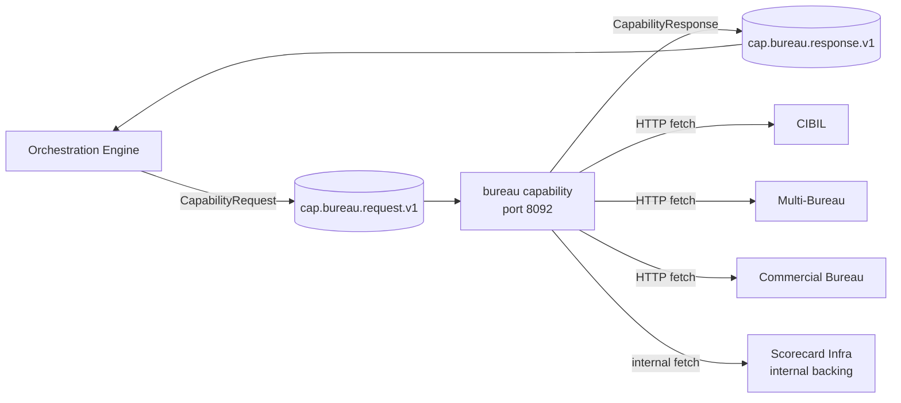
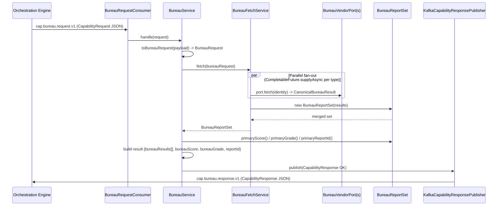

# Bureau Capability — Architecture

> **Module:** `capabilities/bureau` · **Type:** capability · **Port:** 8092 · **Runtime:** Spring Boot (Java, hexagonal)

## 1. Purpose & Context
The bureau capability is the single place the bank pulls applicant credit-bureau data, replacing the previously duplicated per-vendor bureau clients. The orchestration engine invokes it over Kafka (`cap.bureau.request.v1`) for a bureau task node; it fans out across the requested credit bureaus (CIBIL, Multi-Bureau, Commercial, Scorecard-Infra) in parallel, normalizes each vendor's wire shape into a canonical result, and replies on `cap.bureau.response.v1` with the full per-bureau result set plus a single primary score/grade. Bureau **only fetches** — it does not make a credit decision (that is the scoring capability).

## 2. High-Level Block Diagram



## 3. Low-Level Block Diagram

```mermaid
flowchart TB
    subgraph Inbound
        CONSUMER[BureauRequestConsumer<br/>@KafkaListener cap.bureau.request.v1]
    end

    subgraph AppDomain[Application / Domain]
        SVC[BureauService<br/>handle]
        FETCH[BureauFetchService<br/>fetch - parallel fan-out]
        REQM[BureauRequest]
        SET[BureauReportSet<br/>primaryScore / primaryGrade]
        CANON[CanonicalBureauResult]
        TYPE[BureauType enum<br/>CIBIL / MULTI_BUREAU / COMMERCIAL / SCORECARD_INFRA]
    end

    subgraph OutPorts[Outbound Ports]
        VPORT[BureauVendorPort.type/fetch]
        CIBILP[CibilBureauPort]
        MULTIP[MultiBureauPort]
        COMMP[CommercialBureauPort]
        SCIP[ScorecardInfraPort]
        RESPP[CapabilityResponsePort]
    end

    subgraph Adapters
        CIBILA[CibilHttpAdapter / MockCibilAdapter]
        MULTIA[MultiBureauHttpAdapter / MockMultiBureauAdapter]
        COMMA[CommercialBureauHttpAdapter / MockCommercialBureauAdapter]
        SCIA[MockScorecardInfraAdapter]
        PUB[KafkaCapabilityResponsePublisher<br/>cap.bureau.response.v1]
    end

    CONSUMER --> SVC
    SVC --> REQM
    SVC --> FETCH
    FETCH -->|per requested BureauType| VPORT
    VPORT --> CIBILP --> CIBILA
    VPORT --> MULTIP --> MULTIA
    VPORT --> COMMP --> COMMA
    VPORT --> SCIP --> SCIA
    CIBILA --> CANON
    MULTIA --> CANON
    COMMA --> CANON
    SCIA --> CANON
    CANON --> SET
    FETCH --> SET
    SET --> SVC
    SVC --> RESPP --> PUB
```

## 4. Flow Diagram



## 5. Key Classes & Files

| File | Role |
| --- | --- |
| `src/main/java/.../bureau/BureauApplication.java` | Spring Boot entry point for the bureau capability. |
| `src/main/java/.../bureau/adapter/in/kafka/BureauRequestConsumer.java` | Inbound Kafka adapter; `@KafkaListener` on `cap.bureau.request.v1`, deserializes the `CapabilityRequest`, invokes the service, publishes the response. |
| `src/main/java/.../bureau/application/BureauService.java` | Framework-free handler; builds `BureauRequest`, fans out via the fetch service, maps the merged set into a `CapabilityResponse`. |
| `src/main/java/.../bureau/application/BureauFetchService.java` | Fan-out/normalize core; invokes each registered `BureauVendorPort` in parallel via `CompletableFuture` and merges into a `BureauReportSet`. |
| `src/main/java/.../bureau/domain/model/BureauRequest.java` | Canonical request (identity, bureau types, purpose, consent reference). |
| `src/main/java/.../bureau/domain/model/BureauType.java` | Enum of supported bureaus: `CIBIL`, `MULTI_BUREAU`, `COMMERCIAL`, `SCORECARD_INFRA`. |
| `src/main/java/.../bureau/domain/model/CanonicalBureauResult.java` | One bureau's report normalized to the canonical shape (score/grade/reportId/source/fetchedAt/normalizedReport). |
| `src/main/java/.../bureau/domain/model/BureauReportSet.java` | Merged fan-out result; exposes `primaryScore`/`primaryGrade`/`primaryReportId` (CIBIL preferred, else lowest/most-conservative score). |
| `src/main/java/.../bureau/domain/port/BureauVendorPort.java` | Outbound port per vendor (`type()` + `fetch(identity)`). |
| `src/main/java/.../bureau/domain/port/{CibilBureauPort,MultiBureauPort,CommercialBureauPort,ScorecardInfraPort}.java` | Per-vendor marker ports extending `BureauVendorPort`. |
| `src/main/java/.../bureau/domain/port/CapabilityResponsePort.java` | Outbound port to publish the `CapabilityResponse`. |
| `src/main/java/.../bureau/adapter/out/cibil/{CibilHttpAdapter,MockCibilAdapter}.java` | Real (HTTP `POST /cibil/report`) and mock CIBIL adapters. |
| `src/main/java/.../bureau/adapter/out/multibureau/{MultiBureauHttpAdapter,MockMultiBureauAdapter}.java` | Real and mock Multi-Bureau adapters. |
| `src/main/java/.../bureau/adapter/out/commercial/{CommercialBureauHttpAdapter,MockCommercialBureauAdapter}.java` | Real and mock Commercial Bureau adapters. |
| `src/main/java/.../bureau/adapter/out/scorecard/MockScorecardInfraAdapter.java` | Internal Scorecard-Infra backing (mock only, no external URL). |
| `src/main/java/.../bureau/adapter/out/kafka/KafkaCapabilityResponsePublisher.java` | Outbound Kafka adapter; publishes JSON to `cap.bureau.response.v1`. |
| `src/main/java/.../bureau/config/BureauConfiguration.java` | Wires fetch service, per-vendor ports (mock vs real), Kafka producer/template, response port. |
| `src/main/java/.../bureau/config/BureauProperties.java` | `idfc.bureau.*` config (default bureau types + per-vendor mode/url). |
| `src/main/resources/application.yml` | Base config (port 8092, Kafka, default bureau types, vendor modes). |

## 6. Interfaces

- **Inbound:** consumes `cap.bureau.request.v1` (topic derived via `CapabilityTopics.request("bureau")`); SPI entry is `BureauRequestConsumer.onMessage(String)` → `BureauService.handle(CapabilityRequest)`.
- **Outbound:** produces `cap.bureau.response.v1` (via `CapabilityTopics.response(capabilityKey)`); calls vendor ports `BureauVendorPort.fetch(identity)` per requested `BureauType` (CIBIL real → `POST /cibil/report`, plus Multi-Bureau / Commercial / Scorecard-Infra). No domain events emitted.
- **Contract:** `CapabilityRequest` / `CapabilityResponse` (`CapabilityStatus.OK` / `CapabilityStatus.ERROR`) from `shared:shared-domain`. The OK result map carries `bureauResults[]`, `bureauScore`, `bureauGrade`, `reportId`.

## 7. Configuration & How to Run

- **Server port:** `8092` (`server.port`, overridable via `SERVER_PORT`).
- **Spring profiles:**
  - `local` (`application-local.yml`): Kafka on `localhost:29092`; all three vendors set to `mode: real` pointing at the docker-compose mocks (`http://localhost:19102`).
  - `eks` (`application-eks.yml`): production posture — `cibil`, `multi-bureau`, `commercial` all `mode: real` with URLs from cluster env (`CIBIL_URL`, `MULTI_BUREAU_URL`, `COMMERCIAL_URL`).
- **Key `application.yml` settings:**
  - `idfc.bureau.default-bureau-types` (default `CIBIL`; a request may ask for more, e.g. `[CIBIL, MULTI_BUREAU, COMMERCIAL]`).
  - `idfc.bureau.<vendor>.mode` = `mock` | `real` and `idfc.bureau.<vendor>.url` per vendor (`SCORECARD_INFRA` is mock-only internal backing).
  - `spring.kafka.bootstrap-servers` (default `localhost:9092`).
  - Actuator exposes only `health,info,prometheus`.
- **Run locally:**
  ```bash
  docker compose -f docker-compose.infra.yml up -d
  ./gradlew :capabilities:bureau:bootRun --args='--spring.profiles.active=local'
  ```
