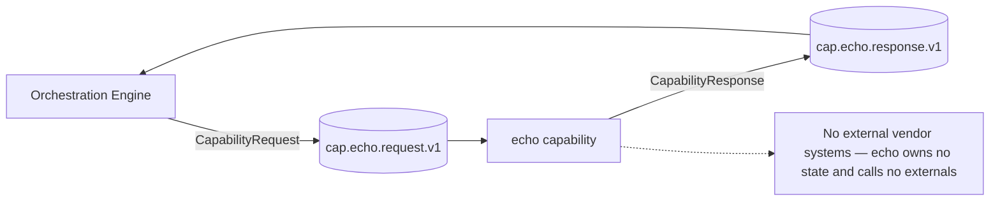

# Echo Capability — Architecture

> **Module:** `capabilities/echo` · **Type:** capability (shared-capability framework) · **Port:** 8097 · **Runtime:** Spring Boot (Java, hexagonal)

## 1. Purpose & Context

The echo capability is the trivial reference capability that proves the **shared capability framework** (`shared/shared-capability`) end-to-end. It exposes a single operation, `echo`, that returns the request payload back as output; it owns no state and calls no external systems. Its only job is to demonstrate that the homogeneous, engine-invokable contract plus idempotent dispatch works with zero plumbing in the app — every other capability (e.g. `mandate`) inherits exactly this wiring. The `CapabilityFrameworkConcurrencyTest` is the framework gate: 32 threads hand the dispatcher the same request and the operation runs **exactly once**.

## 2. High-Level Block Diagram



## 3. Low-Level Block Diagram

```mermaid
flowchart TB
    subgraph Framework["Framework (shared-capability)"]
        cfg[CapabilityFrameworkConfiguration\nKafka request→response shell]
        disp[CapabilityDispatcher\nresolve op · classify ErrorClass]
        idem[CapabilityIdempotencyStore\nInMemoryCapabilityIdempotencyStore\nexecuteOnce]
    end

    subgraph Cap["Capability / Operations"]
        capbean[EchoCapability\nkey = echo]
        op1[echo]
    end

    subgraph App["Application / Domain"]
        domain[none — returns payload directly\nMap.of\"echo\", payload]
    end

    subgraph Ports["Outbound Ports"]
        none1[none]
    end

    subgraph Adapters["Adapters"]
        none2[none]
    end

    cfg --> disp --> idem
    disp --> capbean
    capbean --> op1
    op1 --> domain
```

## 4. Flow Diagram

Primary path — the single `echo` operation through the framework's exactly-once gate:

```mermaid
sequenceDiagram
    participant Engine as Orchestration Engine
    participant ReqT as cap.echo.request.v1
    participant Cfg as CapabilityFrameworkConfiguration
    participant Disp as CapabilityDispatcher
    participant Idem as CapabilityIdempotencyStore
    participant Op as EchoCapability.echo
    participant RespT as cap.echo.response.v1

    Engine->>ReqT: CapabilityRequest(operation="echo", payload)
    ReqT->>Cfg: record (listener)
    Cfg->>Disp: handle(request)
    Disp->>Idem: executeOnce(idempotencyKey, compute)
    Idem->>Disp: dispatch() (first caller only; redelivered/concurrent reuse cached)
    Disp->>Op: execute(request)
    Op-->>Disp: {"echo": payload}
    Disp-->>Cfg: CapabilityResponse.ok(...)
    Cfg->>RespT: publish response (key = nodeId)
    RespT-->>Engine: CapabilityResponse
```

## 5. Key Classes & Files

| File | Role |
| --- | --- |
| `src/main/java/.../echo/EchoApplication.java` | Spring Boot entry point; declares the capability app |
| `src/main/java/.../echo/EchoCapability.java` | The `Capability` bean (key `echo`); one operation `echo` returning the payload |
| `src/test/java/.../echo/CapabilityFrameworkConcurrencyTest.java` | Framework gate: 32 threads → operation runs exactly once; plus echo-returns-payload and unknown-op-is-PERMANENT tests |
| `src/main/resources/application.yml` | Port 8097, Kafka, actuator config |
| `shared/shared-capability/.../CapabilityFrameworkConfiguration.java` | Auto-config Kafka request→response shell |
| `shared/shared-capability/.../CapabilityDispatcher.java` | Resolve op, run once, classify `ErrorClass` |
| `shared/shared-capability/.../CapabilityIdempotencyStore.java` | `executeOnce` exactly-once primitive |
| `shared/shared-capability/.../InMemoryCapabilityIdempotencyStore.java` | `computeIfAbsent`-backed default store |

## 6. Interfaces

- **Inbound:** consumes `cap.echo.request.v1` (group `cap-echo`). Operation: `echo` (the single/default operation — a null `operation` field resolves to it).
- **Outbound:** publishes `CapabilityResponse` to `cap.echo.response.v1` (keyed by `nodeId`). No vendor ports, no domain events — echo calls no externals.
- **Contract:** `CapabilityRequest` (journeyInstanceId, correlationId, capabilityKey, nodeId, payload, collectedResults, **operation**, **idempotencyKey**) → `CapabilityResponse` (echoed routing identity, `CapabilityStatus` OK/ERROR, result `{"echo": payload}`, **errorClass** — `TRANSIENT`/`PERMANENT` on error, null on OK). Topic names are derived from the key via `CapabilityTopics`.

## 7. Configuration & How to Run

- **Server port:** `8097` (override `SERVER_PORT`); HTTP exposes only Actuator health/info/prometheus.
- **Kafka:** `KAFKA_BOOTSTRAP_SERVERS` (default `localhost:9092`); String key/value serdes; consumer `auto-offset-reset: earliest`.
- **Profiles:** none required; echo has no external dependencies or extra config.
- **Idempotency:** default framework `InMemoryCapabilityIdempotencyStore` (`computeIfAbsent`) provides the exactly-once guarantee verified by `CapabilityFrameworkConcurrencyTest`.
- **Run:** start Kafka, then `./gradlew :capabilities:echo:bootRun` (or run `EchoApplication`). Produce a `CapabilityRequest` JSON onto `cap.echo.request.v1` and read the reply on `cap.echo.response.v1`. The concurrency gate can be run standalone with `./gradlew :capabilities:echo:test` (no Kafka needed — it exercises the dispatcher directly).
