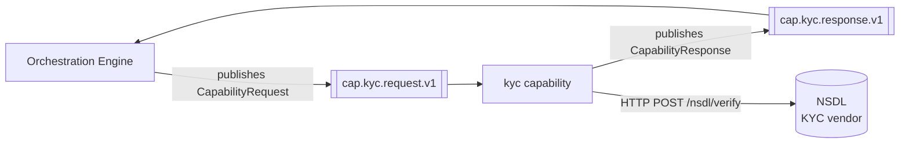
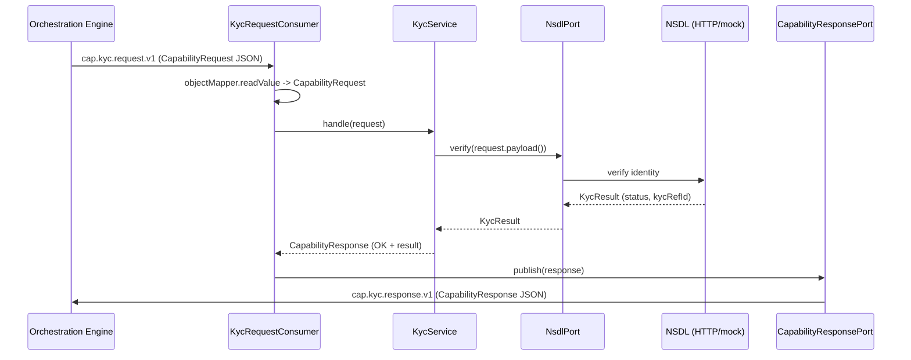

# KYC — Architecture

> **Module:** `capabilities/kyc` · **Type:** capability · **Port:** 8091 · **Runtime:** Spring Boot (Java, hexagonal)

## 1. Purpose & Context

The kyc capability verifies an applicant's KYC against the vendor NSDL, returning a KYC status and reference id. It is a capability microservice in the IDFC integration platform's hexagonal architecture: the orchestration engine invokes it over Kafka for a single DAG task node, passing the applicant identity in the `CapabilityRequest` payload. The capability performs verification and replies with a `CapabilityResponse` so the engine can store the result and advance the journey. KYC is an integration — it verifies the applicant against the vendor, it does not own the record.

## 2. High-Level Block Diagram



## 3. Low-Level Block Diagram

```mermaid
flowchart TB
    subgraph Inbound
        CONSUMER[KycRequestConsumer<br/>@KafkaListener]
    end

    subgraph AppDomain["Application / Domain"]
        SERVICE[KycService<br/>handle CapabilityRequest]
        RESULT[KycResult<br/>domain record]
    end

    subgraph Ports["Outbound Ports"]
        NSDLPORT[NsdlPort<br/>verify]
        RESPPORT[CapabilityResponsePort<br/>publish]
    end

    subgraph Adapters
        HTTP[NsdlHttpAdapter<br/>real - RestClient]
        MOCK[MockNsdlAdapter<br/>mock]
        PUB[KafkaCapabilityResponsePublisher<br/>KafkaTemplate]
    end

    CONSUMER --> SERVICE
    SERVICE --> NSDLPORT
    SERVICE --> RESULT
    NSDLPORT -. real .-> HTTP
    NSDLPORT -. mock .-> MOCK
    CONSUMER --> RESPPORT
    RESPPORT --> PUB
```

## 4. Flow Diagram



On any `RuntimeException` from `nsdl.verify(...)`, `KycService.handle()` returns a `CapabilityResponse` with `CapabilityStatus.ERROR` and an empty result, and the engine fails the journey.

## 5. Key Classes & Files

| File | Role |
| --- | --- |
| `src/main/java/.../kyc/KycApplication.java` | Spring Boot entry point (`@SpringBootApplication`). |
| `src/main/java/.../kyc/adapter/in/kafka/KycRequestConsumer.java` | Inbound Kafka adapter; `@KafkaListener` on the request topic; deserializes `CapabilityRequest`, calls the service, publishes the response. |
| `src/main/java/.../kyc/application/KycService.java` | Framework-free application service; `handle(CapabilityRequest)` verifies KYC and maps it to a `CapabilityResponse`. |
| `src/main/java/.../kyc/domain/model/KycResult.java` | Domain record: `status`, `kycRefId`. |
| `src/main/java/.../kyc/domain/port/NsdlPort.java` | Outbound port: `KycResult verify(Map<String,Object> identity)`. |
| `src/main/java/.../kyc/domain/port/CapabilityResponsePort.java` | Outbound port: `void publish(CapabilityResponse)`. |
| `src/main/java/.../kyc/adapter/out/nsdl/NsdlHttpAdapter.java` | Real NSDL adapter; HTTP `POST /nsdl/verify` via `RestClient`. |
| `src/main/java/.../kyc/adapter/out/nsdl/MockNsdlAdapter.java` | Mock NSDL adapter; deterministic `VERIFIED` result derived from the applicant's PAN. |
| `src/main/java/.../kyc/adapter/out/kafka/KafkaCapabilityResponsePublisher.java` | Outbound Kafka adapter; publishes the response JSON keyed by `journeyInstanceId`. |
| `src/main/java/.../kyc/config/KycConfiguration.java` | Bean wiring; selects mock/real NSDL by config; builds the producer factory, `KafkaTemplate`, and response publisher. |
| `src/main/java/.../kyc/config/NsdlProperties.java` | `@ConfigurationProperties(prefix = "idfc.kyc.nsdl")`; `mode` selects the mock/real adapter via `isReal()`. |
| `src/main/resources/application.yml` | Base config: server port, Kafka serde, NSDL mode/url, actuator. |

## 6. Interfaces

- **Inbound:** consumes `cap.kyc.request.v1` (Kafka, JSON String serde) via `KycRequestConsumer` with consumer group `${idfc.capability.group:kyc}`. The topic is derived from the capability key `kyc` through `CapabilityTopics.request(...)`.
- **Outbound:**
  - Produces `cap.kyc.response.v1` (topic derived from the response's `capabilityKey` via `CapabilityTopics.response(...)`) through `KafkaCapabilityResponsePublisher`.
  - Vendor port: `NsdlPort.verify(...)` — real adapter calls NSDL over HTTP `POST /nsdl/verify`; mock adapter verifies locally.
  - No separate domain/integration events are emitted beyond the `CapabilityResponse`.
- **Contract:** the shared capability contract in `shared:shared-domain` — `CapabilityRequest`, `CapabilityResponse`, `CapabilityStatus`, with topic names from `CapabilityTopics`. This capability implements its own `KycService.handle(CapabilityRequest)` method directly; it does **not** use the shared-capability framework (`CapabilityDispatcher` / `Capability`).

## 7. Configuration & How to Run

- **Server port:** `8091` (`SERVER_PORT` override).
- **Spring profiles:**
  - `local` (`application-local.yml`): Kafka at `localhost:29092` (docker host listener); NSDL `mode: real`, `url: http://localhost:19104` (docker-compose mock vendor).
  - `eks` (`application-eks.yml`): production posture — NSDL `mode: real`, `url: ${NSDL_URL}` injected from the cluster ConfigMap/Secret.
  - default (no profile, `application.yml`): Kafka at `localhost:9092`, NSDL `mode: mock` (`NSDL_MODE`), `url: http://localhost:19104` (`NSDL_URL`).
- **Key `application.yml` settings:** `spring.application.name=kyc`; Kafka String key/value serde, `auto-offset-reset=earliest`; `idfc.kyc.nsdl.{mode,url}`; actuator exposes only `health,info,prometheus`.
- **How to run:**
  - IntelliJ: run `KycApplication` (optionally set the active profile `local` or `eks` via `SPRING_PROFILES_ACTIVE`).
  - Gradle: `./gradlew :capabilities:kyc:bootRun` (add `-Dspring.profiles.active=local` to run against the docker-compose infra started with `docker compose -f docker-compose.infra.yml up -d`).
