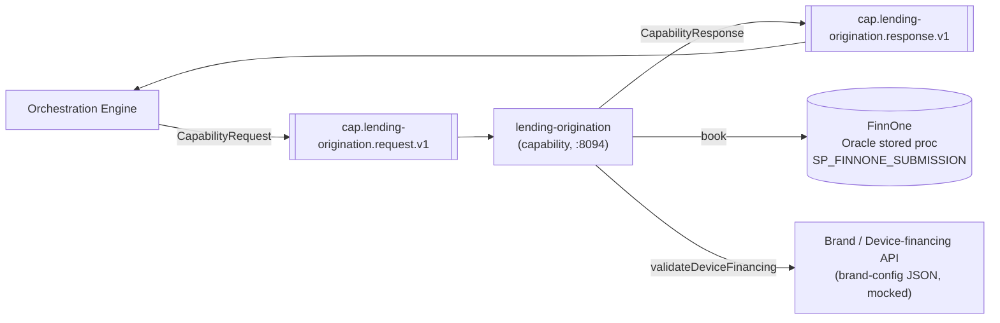
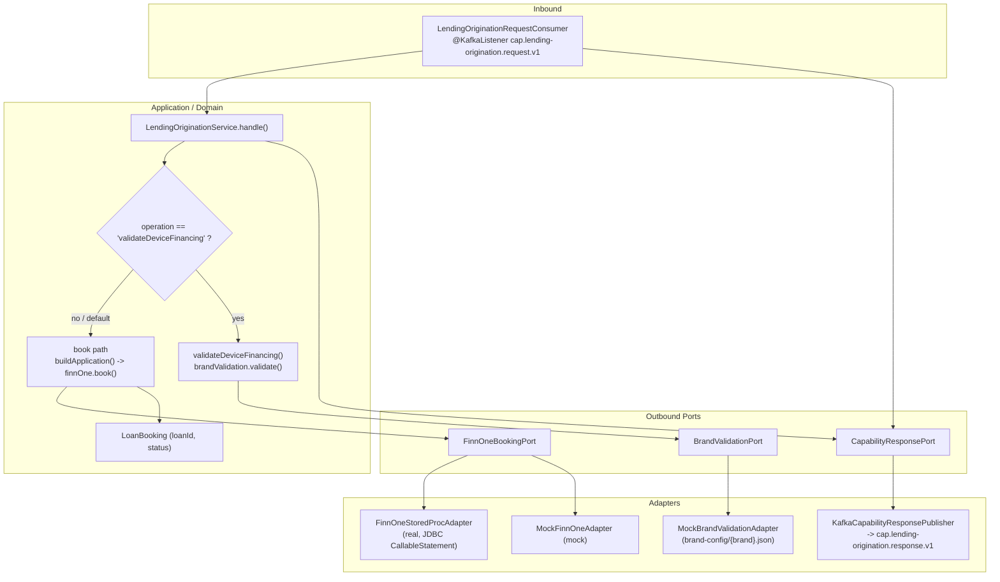
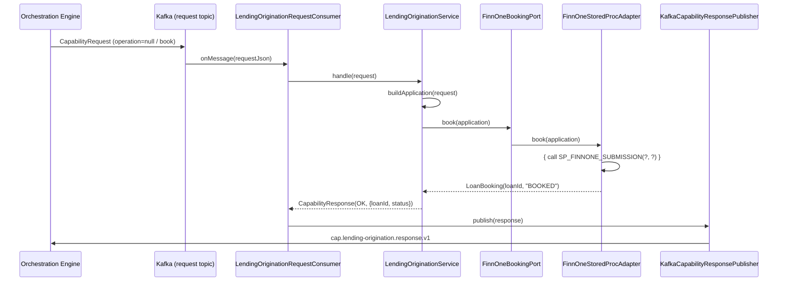

# Lending Origination — Architecture

> **Module:** `capabilities/lending-origination` · **Type:** capability · **Port:** 8094 · **Runtime:** Spring Boot (Java, hexagonal)

## 1. Purpose & Context

`lending-origination` is a capability microservice in the IDFC integration platform's hexagonal architecture. The orchestration engine invokes it over Kafka using the shared capability contract (`CapabilityRequest`/`CapabilityResponse` in `shared-domain`). It exposes two operations, dispatched by `CapabilityRequest.operation()` inside `LendingOriginationService.handle()`: the default **booking** path, which books an APPROVED loan in FinnOne (the loan system of record) via `FinnOneBookingPort` and returns the FinnOne `loanId` (LAN); and **`validateDeviceFinancing`**, a config-driven brand/device-financing EMI validation (BRD §5) via `BrandValidationPort` against `brand-config/{brand}.json`. FinnOne owns the loan — this capability just triggers the booking and reports the LAN back to the engine.

## 2. High-Level Block Diagram

## 3. Low-Level Block Diagram

## 4. Flow Diagram

Primary path: the **booking** operation.

## 5. Key Classes & Files

| File | Role |
| --- | --- |
| `src/main/java/.../LendingOriginationApplication.java` | Spring Boot entry point; excludes `DataSourceAutoConfiguration` so it starts in mock mode without `spring.datasource.*`. |
| `src/main/java/.../adapter/in/kafka/LendingOriginationRequestConsumer.java` | IN adapter; `@KafkaListener` on the request topic, deserializes `CapabilityRequest`, calls the service, publishes the response. |
| `src/main/java/.../application/LendingOriginationService.java` | Framework-free handler; dispatches `validateDeviceFinancing` vs the default booking path in `handle()`. |
| `src/main/java/.../domain/port/FinnOneBookingPort.java` | OUT port — book a loan, returns `LoanBooking`. |
| `src/main/java/.../domain/port/BrandValidationPort.java` | OUT port — config-driven brand/device-financing validation. |
| `src/main/java/.../domain/port/CapabilityResponsePort.java` | OUT port — publish the `CapabilityResponse`. |
| `src/main/java/.../domain/model/LoanBooking.java` | Domain record `(loanId, status)` — FinnOne LAN + booking outcome. |
| `src/main/java/.../adapter/out/finnone/FinnOneStoredProcAdapter.java` | Real OUT adapter; JDBC `CallableStatement` calling `SP_FINNONE_SUBMISSION(?, ?)`. |
| `src/main/java/.../adapter/out/finnone/MockFinnOneAdapter.java` | Mock OUT adapter; books locally. |
| `src/main/java/.../adapter/out/brand/MockBrandValidationAdapter.java` | Brand validation adapter; loads `brand-config/{brand}.json` and applies `passLogic`. |
| `src/main/java/.../adapter/out/kafka/KafkaCapabilityResponsePublisher.java` | OUT adapter; publishes JSON to `cap.<key>.response.v1`. |
| `src/main/java/.../config/LendingOriginationConfiguration.java` | Wires ports to adapters; selects the FinnOne adapter by `finnone.mode`; builds the Kafka producer/template. |
| `src/main/java/.../config/FinnOneProperties.java` | Binds `idfc.lending-origination.finnone.*`. |
| `src/main/resources/brand-config/samsung-upgrade.json` | Config-as-data brand rule (`passLogic.fieldPath == equals`). |
| `src/main/resources/application*.yml` | Server port, Kafka, FinnOne mode and (real-mode) datasource. |

## 6. Interfaces

- **Inbound:** Consumes the request topic `cap.lending-origination.request.v1` (derived via `CapabilityTopics.request("lending-origination")`), consumer group `${idfc.capability.group:lending-origination}`. Operations dispatched in `handle()`:
  - default / `null` operation → **book** (FinnOne loan booking).
  - `validateDeviceFinancing` → brand/device-financing EMI validation.
- **Outbound:** Publishes `CapabilityResponse` JSON to `cap.lending-origination.response.v1` (`CapabilityTopics.response(capabilityKey)`). Vendor ports: `FinnOneBookingPort` (Oracle stored proc `SP_FINNONE_SUBMISSION`, JDBC — not HTTP) and `BrandValidationPort` (config-driven brand API, mocked). No additional domain events.
- **Contract:** `CapabilityRequest` / `CapabilityResponse` / `CapabilityStatus` / `CapabilityTopics` from `shared:shared-domain`. Booking result keys: `loanId` (read by the engine for the decision — must be exactly `loanId`) and `status`. Validation result keys: `brand`, `pass` (`"Y"`/`"N"`), `rule`.

## 7. Configuration & How to Run

- **Server port:** `8094` (`server.port`, overridable via `SERVER_PORT`).
- **Spring profiles:**
  - `local` — Kafka on `localhost:29092`; FinnOne `mode: real` against the Oracle-XE mock (`jdbc:oracle:thin:@localhost:1521/XEPDB1`, user/pass `finnone`/`finnone`); override `FINNONE_MODE=mock` to skip Oracle.
  - `eks` — production posture; FinnOne `mode: real` with the datasource from `FINNONE_JDBC_URL` / `FINNONE_DB_USER` / `FINNONE_DB_PASSWORD` (Oracle driver). Endpoints injected from the cluster ConfigMap/Secret as env vars.
- **Key `application.yml` settings:** `spring.kafka.bootstrap-servers` (`KAFKA_BOOTSTRAP_SERVERS`, default `localhost:9092`); Kafka String key/value serdes, `auto-offset-reset: earliest`; `idfc.lending-origination.finnone.mode` (`FINNONE_MODE`, default `mock`); Actuator exposes only `health,info,prometheus`.
- **Run:**
  - Start infra: `docker compose -f docker-compose.infra.yml up -d`.
  - Run with the local profile, e.g. `./gradlew :capabilities:lending-origination:bootRun --args='--spring.profiles.active=local'` (or run the built jar). Set `FINNONE_MODE=mock` to start without Oracle.
