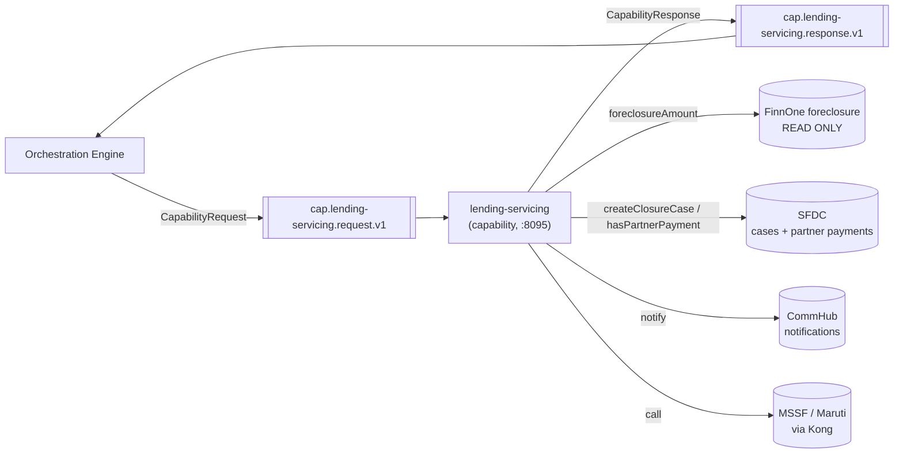
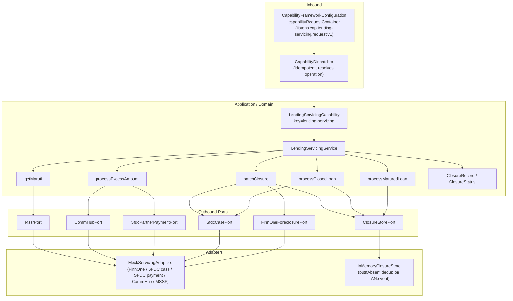
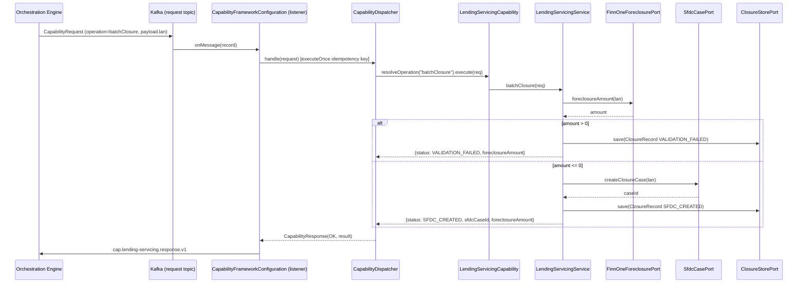

# Lending Servicing — Architecture

> **Module:** `capabilities/lending-servicing` · **Type:** capability · **Port:** 8095 · **Runtime:** Spring Boot (Java, hexagonal)

## 1. Purpose & Context

`lending-servicing` is a capability microservice in the IDFC integration platform's hexagonal architecture. The orchestration engine invokes it over Kafka using the shared capability contract (`CapabilityRequest`/`CapabilityResponse` in `shared-domain`). Unlike origination it never books — it handles loan-closure/foreclosure servicing (BRD §4): it READS FinnOne foreclosure amounts and WRITES SFDC cases, and queries SFDC partner payments / notifies CommHub / bridges to MSSF (Maruti). It registers a single `Capability` bean (`LendingServicingCapability`) exposing five operations that the shared `CapabilityDispatcher` routes by `operation` name: `processMaturedLoan`, `processClosedLoan`, `processExcessAmount`, `batchClosure`, and `getMaruti`. A closure store dedups on `LAN + event` (`insertIfAbsent`) so a redelivered event never creates a duplicate SFDC case.

## 2. High-Level Block Diagram

## 3. Low-Level Block Diagram

## 4. Flow Diagram

Primary path: the **`batchClosure`** operation.

## 5. Key Classes & Files

| File | Role |
| --- | --- |
| `src/main/java/.../LendingServicingApplication.java` | Spring Boot entry point. |
| `src/main/java/.../application/LendingServicingCapability.java` | The `Capability` bean (`key = "lending-servicing"`); maps the five operation names to service methods. |
| `src/main/java/.../application/LendingServicingService.java` | Domain logic for `processMaturedLoan`, `processClosedLoan`, `processExcessAmount`, `batchClosure`, `getMaruti`; dedups via the closure store. |
| `src/main/java/.../domain/model/ClosureRecord.java` | Record `(lan, event, status, sfdcCaseId)` — keyed by `LAN + event`. |
| `src/main/java/.../domain/model/ClosureStatus.java` | Enum `MATURED, VALIDATION_FAILED, SFDC_CREATED, ERROR`. |
| `src/main/java/.../domain/port/out/FinnOneForeclosurePort.java` | OUT port — `foreclosureAmount(lan)` (READ ONLY). |
| `src/main/java/.../domain/port/out/SfdcCasePort.java` | OUT port — `createClosureCase(lan)`. |
| `src/main/java/.../domain/port/out/SfdcPartnerPaymentPort.java` | OUT port — `hasPartnerPayment(lan)`. |
| `src/main/java/.../domain/port/out/CommHubPort.java` | OUT port — `notify(lan, message)`. |
| `src/main/java/.../domain/port/out/MssfPort.java` | OUT port — `call(kind, loanRef)` (Maruti via Kong). |
| `src/main/java/.../domain/port/out/ClosureStorePort.java` | OUT port — `insertIfAbsent(record)` / `save(record)`. |
| `src/main/java/.../adapter/out/mock/MockServicingAdapters.java` | `@Configuration` providing the mocked FinnOne / SFDC case / SFDC payment / CommHub / MSSF beans. |
| `src/main/java/.../adapter/out/store/InMemoryClosureStore.java` | In-memory `ClosureStorePort`; `putIfAbsent` dedup on `lan:event`. |
| `src/main/resources/application*.yml` | Server port, Kafka, Actuator. |
| `shared/shared-capability/.../CapabilityFrameworkConfiguration.java` | Shared Kafka shell: listener + idempotent dispatch + response publish (no per-service Kafka code). |

## 6. Interfaces

- **Inbound:** Consumes the request topic `cap.lending-servicing.request.v1` (`CapabilityTopics.request("lending-servicing")`), consumer group `cap-lending-servicing`, wired by the shared `CapabilityFrameworkConfiguration`. Operations (resolved by `CapabilityDispatcher` from `request.operation()`):
  - `processMaturedLoan` — record a matured loan (dedup on `lan:matured`).
  - `processClosedLoan` — create an SFDC closure case (dedup on `lan:closed`).
  - `processExcessAmount` — check SFDC partner payment; CommHub-notify if absent.
  - `batchClosure` — read FinnOne foreclosure amount, validate `<= 0`, create SFDC case.
  - `getMaruti` — Maruti loan/doc status via the MSSF (Kong) bridge.
- **Outbound:** Publishes `CapabilityResponse` JSON to `cap.lending-servicing.response.v1` (`CapabilityTopics.response(key)`). Vendor ports: `FinnOneForeclosurePort` (READ), `SfdcCasePort`, `SfdcPartnerPaymentPort`, `CommHubPort`, `MssfPort`; plus `ClosureStorePort` for dedup/state. No additional domain events.
- **Contract:** `CapabilityRequest` / `CapabilityResponse` / `CapabilityStatus` / `ErrorClass` from `shared:shared-domain`, plus the `Capability` / `CapabilityOperation` / `CapabilityDispatcher` SPI from `shared:shared-capability`. Failures throw `CapabilityException(PERMANENT|TRANSIENT)`; the dispatcher maps them to an ERROR response with an `ErrorClass`.

## 7. Configuration & How to Run

- **Server port:** `8095` (`server.port`, overridable via `SERVER_PORT`).
- **Spring profiles:**
  - `local` — Kafka on `localhost:29092` (host listener of the docker-compose infra). All servicing externals are mocked (`MockServicingAdapters`); the FinnOne mock returns `1500.0` if the LAN contains `DUE`, otherwise `0.0` (closeable).
  - `eks` — production posture; Kafka-only at this slice (no extra datasources). Infra endpoints injected from the cluster ConfigMap/Secret as env vars.
- **Key `application.yml` settings:** `spring.application.name: lending-servicing`; the shared framework derives Kafka topics and the `cap-lending-servicing` group from the capability key; Actuator exposes only `health,info,prometheus` with health probes enabled.
- **Run:**
  - Start infra: `docker compose -f docker-compose.infra.yml up -d`.
  - Run with the local profile, e.g. `./gradlew :capabilities:lending-servicing:bootRun --args='--spring.profiles.active=local'` (or run the built jar). No external datasource is required — all vendor ports are mocked.
