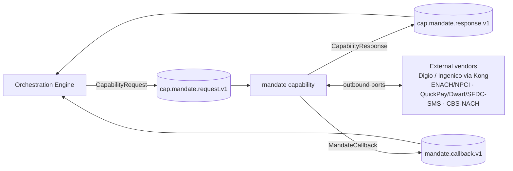
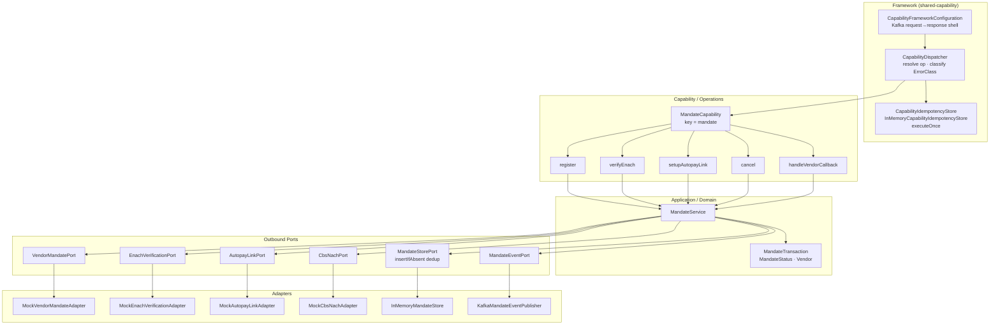
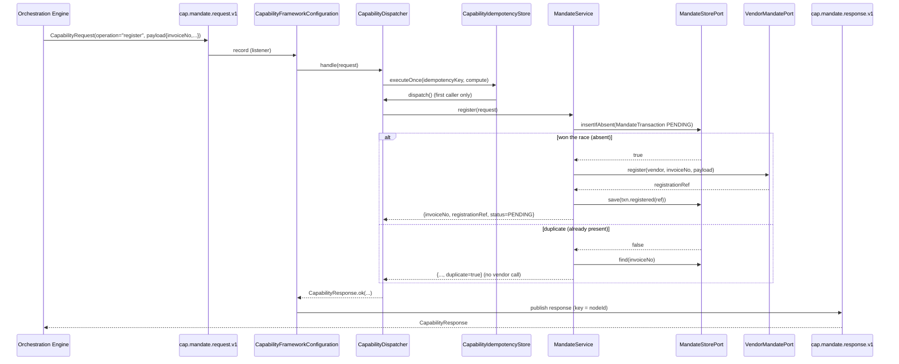

# Mandate Capability — Architecture

> **Module:** `capabilities/mandate` · **Type:** capability (shared-capability framework) · **Port:** 8098 · **Runtime:** Spring Boot (Java, hexagonal)

## 1. Purpose & Context

The mandate capability owns the e-mandate (e-NACH / autopay) lifecycle for the IDFC integration platform: registering a mandate with an external vendor, verifying it via ENACH/NPCI, setting up and delivering an autopay link, cancelling via CBS-NACH, and processing the asynchronous vendor callback. It is invoked by the orchestration engine as a single DAG task node and runs on the **shared capability framework** (`shared/shared-capability`): the app declares one `MandateCapability` bean exposing five named operations, and the framework wires the idempotent Kafka request→response shell around it with zero plumbing in the app. The capability owns its mandate state and dedups on `invoiceNo` so a concurrent or redelivered `register` calls the vendor **exactly once**.

## 2. High-Level Block Diagram

## 3. Low-Level Block Diagram

## 4. Flow Diagram

Primary path — the `register` operation, showing the framework's exactly-once gate and the `insertIfAbsent` vendor dedup:

## 5. Key Classes & Files

| File | Role |
| --- | --- |
| `src/main/java/.../mandate/MandateApplication.java` | Spring Boot entry point; declares the capability app |
| `src/main/java/.../mandate/application/MandateCapability.java` | The `Capability` bean (key `mandate`); maps the 5 operations to `MandateService` methods |
| `src/main/java/.../mandate/application/MandateService.java` | Operation logic; owns lifecycle state; `register` dedups on `invoiceNo` |
| `src/main/java/.../mandate/domain/model/MandateTransaction.java` | Owned state, keyed by `invoiceNo`; mutable status + registration ref |
| `src/main/java/.../mandate/domain/model/MandateStatus.java` | `PENDING / SUCCESS / FAILURE` |
| `src/main/java/.../mandate/domain/model/Vendor.java` | `DIGIO / INGENICO` (via Kong) |
| `src/main/java/.../mandate/domain/port/out/MandateStorePort.java` | State store; `insertIfAbsent` atomic dedup gate |
| `src/main/java/.../mandate/domain/port/out/VendorMandatePort.java` | Register mandate with vendor |
| `src/main/java/.../mandate/domain/port/out/EnachVerificationPort.java` | ENACH/NPCI verification |
| `src/main/java/.../mandate/domain/port/out/AutopayLinkPort.java` | QuickPay → Dwarf → SFDC-SMS chain |
| `src/main/java/.../mandate/domain/port/out/CbsNachPort.java` | CBS NACH enquire/cancel |
| `src/main/java/.../mandate/domain/port/out/MandateEventPort.java` | Emit `MandateCallback` event |
| `src/main/java/.../mandate/adapter/out/store/InMemoryMandateStore.java` | `putIfAbsent`-backed store (demo default) |
| `src/main/java/.../mandate/adapter/out/mock/MockVendorMandateAdapter.java` | Mock Digio/Ingenico (Kong) |
| `src/main/java/.../mandate/adapter/out/mock/MockEnachVerificationAdapter.java` | Mock ENACH/NPCI |
| `src/main/java/.../mandate/adapter/out/mock/MockAutopayLinkAdapter.java` | Mock QuickPay/Dwarf/SFDC-SMS |
| `src/main/java/.../mandate/adapter/out/mock/MockCbsNachAdapter.java` | Mock CBS-NACH |
| `src/main/java/.../mandate/adapter/out/kafka/KafkaMandateEventPublisher.java` | Publishes `MandateCallback` to Kafka |
| `src/main/resources/application.yml` | Port 8098, Kafka, callback-topic config |
| `shared/shared-capability/.../CapabilityFrameworkConfiguration.java` | Auto-config Kafka request→response shell |
| `shared/shared-capability/.../CapabilityDispatcher.java` | Resolve op, run once, classify `ErrorClass` |
| `shared/shared-capability/.../CapabilityIdempotencyStore.java` | `executeOnce` exactly-once primitive |

## 6. Interfaces

- **Inbound:** consumes `cap.mandate.request.v1` (group `cap-mandate`). Operations: `register`, `verifyEnach`, `setupAutopayLink`, `cancel`, `handleVendorCallback`.
- **Outbound:** publishes `CapabilityResponse` to `cap.mandate.response.v1` (keyed by `nodeId`); emits the `MandateCallback` domain event to `mandate.callback.v1` (keyed by `invoiceNo`, configurable via `idfc.mandate.callback-topic`). Vendor ports: `VendorMandatePort`, `EnachVerificationPort`, `AutopayLinkPort`, `CbsNachPort` (all mocked locally), plus `MandateStorePort` and `MandateEventPort`.
- **Contract:** `CapabilityRequest` (journeyInstanceId, correlationId, capabilityKey, nodeId, payload, collectedResults, **operation**, **idempotencyKey**) → `CapabilityResponse` (echoed routing identity, `CapabilityStatus` OK/ERROR, result, **errorClass** — `TRANSIENT`/`PERMANENT` on error, null on OK). Topic names are derived from the key via `CapabilityTopics`.

## 7. Configuration & How to Run

- **Server port:** `8098` (override `SERVER_PORT`); HTTP exposes only Actuator health/info/prometheus.
- **Kafka:** `KAFKA_BOOTSTRAP_SERVERS` (default `localhost:9092`); String key/value serdes; consumer `auto-offset-reset: earliest`.
- **Mandate config:** `idfc.mandate.callback-topic` (`MANDATE_CALLBACK_TOPIC`, default `mandate.callback.v1`).
- **Profiles:** none required; all vendors are mocked locally (real Kong/JWE wiring is a later config-driven step).
- **Idempotency:** default `InMemoryCapabilityIdempotencyStore` (framework) + `InMemoryMandateStore` (`insertIfAbsent`); a durable Aerospike `CREATE_ONLY` variant can swap in behind the same ports for multi-instance.
- **Run:** start Kafka, then `./gradlew :capabilities:mandate:bootRun` (or run `MandateApplication`). Drive it by producing a `CapabilityRequest` JSON onto `cap.mandate.request.v1` and reading the reply on `cap.mandate.response.v1`.
