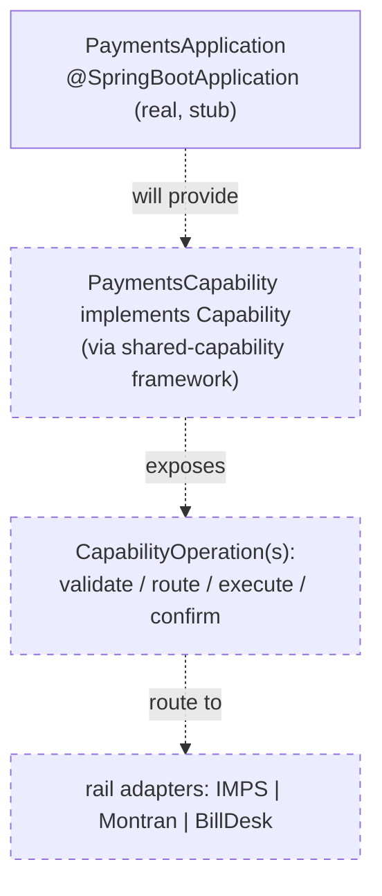
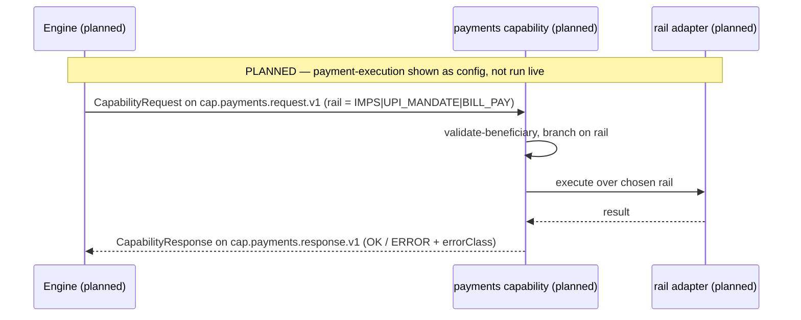

# Payments Capability — Architecture

> **Module:** `capabilities/payments` · **Type:** capability (stub) · **Port:** 8096 (`SERVER_PORT`, default `8096`; only `/actuator/health` is served today) · **Runtime:** Spring Boot · **Status:** stub/planned

## 1. Purpose & Context

**This is a Slice 1 stub** — a runnable Spring Boot app serving only `/actuator/health` with no `Capability` bean and no business logic yet (`PaymentsApplication`). Its **intended** responsibility (per the design docs) is to be a **router over payment rail adapters** — IMPS / UPI-mandate (Montran) / bill-pay (BillDesk) — structurally identical to the other capabilities (canonical in/out, vendors as swappable adapters), built on the `shared-capability` framework. The `payment-execution` journey is shown as **config-not-code** in the DAG Designer (the "third channel" demo proof), **not run live**; the capability module itself is deferred to a later slice.

## 2. High-Level Block Diagram

```mermaid
flowchart LR
    ENG["orchestration engine<br/>(payment-execution journey, shown as config)"]:::planned -. planned cap.payments.request.v1 .-> PAY
    PAY["payments capability<br/>(stub: /actuator/health only)"]
    PAY -. planned .-> IMPS["IMPS rail adapter"]:::planned
    PAY -. planned .-> MON["Montran (UPI mandate)"]:::planned
    PAY -. planned .-> BILL["BillDesk (bill-pay)"]:::planned
    classDef planned stroke-dasharray: 5 5;
```

## 3. Low-Level Block Diagram



## 4. Flow Diagram



## 5. Key Types / Classes & Files

| File | Role |
| --- | --- |
| `src/main/java/.../PaymentsApplication.java` | Slice 1 stub Spring Boot entrypoint; serves `/actuator/health`, no `Capability` bean yet. |
| `src/main/resources/application.yml` | App name `payments`; `server.port` `${SERVER_PORT:8096}`; exposes `health,info,prometheus`. |
| `src/main/resources/application-local.yml` / `application-eks.yml` | Profile config; EKS note: Kafka-only, rails wired in a later slice. |

## 6. Interfaces / Dependents

- **Intended inbound:** `cap.payments.request.v1` from the engine (the `payment-execution` journey).
- **Intended outbound:** `cap.payments.response.v1`, plus rail adapters (IMPS-mgmt-sys, Montran, BillDesk).
- **Today:** none — placeholder; no capability contract wired.

## 7. Configuration & How to Run / Use

Runnable only as a health-check shell (`SERVER_PORT`, default **8096**, `/actuator/health`). **Not yet runnable for real** — no payments logic and no `Capability` bean exist; the `payment-execution` journey lives as DAG config for the demo. Build via `idfc.spring-boot-app-conventions`.
