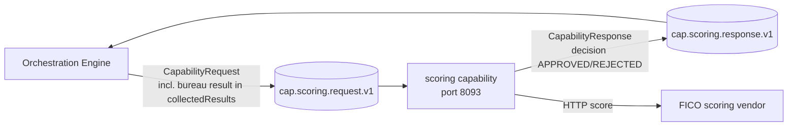

# Scoring Capability — Architecture

> **Module:** `capabilities/scoring` · **Type:** capability · **Port:** 8093 · **Runtime:** Spring Boot (Java, hexagonal)

## 1. Purpose & Context
The scoring capability is the decisioning capability — this is where the credit decision is actually made. The orchestration engine invokes it over Kafka (`cap.scoring.request.v1`) after the bureau node has run; scoring reads the upstream bureau score from `collectedResults`, enriches it with a FICO score, applies the pure `DecisionRule` against a configured cutoff threshold, and replies on `cap.scoring.response.v1` with `APPROVED`/`REJECTED` plus reasons. The engine's branch node then routes on that `decision`.

## 2. High-Level Block Diagram



## 3. Low-Level Block Diagram

```mermaid
flowchart TB
    subgraph Inbound
        CONSUMER[ScoringRequestConsumer<br/>@KafkaListener cap.scoring.request.v1]
    end

    subgraph AppDomain[Application / Domain]
        SVC[ScoringService<br/>handle - reads bureauScore from collectedResults]
        RULE[DecisionRule<br/>decide bureauScore vs threshold + negativeFlags]
        THRESH[[threshold cutoff<br/>idfc.scoring.threshold default 700]]
        DEC[ScoringDecision<br/>APPROVED / REJECTED + reasons]
    end

    subgraph OutPorts[Outbound Ports]
        FICOP[FicoPort.score]
        RESPP[CapabilityResponsePort]
    end

    subgraph Adapters
        FICOA[FicoHttpAdapter / MockFicoAdapter]
        PUB[KafkaCapabilityResponsePublisher<br/>cap.scoring.response.v1]
    end

    CONSUMER --> SVC
    SVC -->|enrich| FICOP --> FICOA
    SVC --> RULE
    THRESH --> RULE
    RULE --> DEC
    DEC --> SVC
    SVC --> RESPP --> PUB
```

## 4. Flow Diagram

```mermaid
sequenceDiagram
    participant Engine as Orchestration Engine
    participant Consumer as ScoringRequestConsumer
    participant Service as ScoringService
    participant Fico as FicoPort
    participant Rule as DecisionRule
    participant Pub as KafkaCapabilityResponsePublisher

    Engine->>Consumer: cap.scoring.request.v1 (CapabilityRequest JSON)
    Consumer->>Service: handle(request)
    Service->>Service: read collectedResults["bureau"].bureauScore
    Service->>Service: read payload.negativeFlags
    Service->>Fico: score(payload) -> ficoScore
    Fico-->>Service: ficoScore
    Service->>Rule: decide(bureauScore, negativeFlags, threshold)
    Rule->>Rule: APPROVED if score >= threshold AND no negative flags, else REJECTED
    Rule-->>Service: ScoringDecision(decision, score, reasons)
    Service->>Service: append "fico=<score>" to reasons; build result {decision, score, reasons}
    Service->>Pub: publish(CapabilityResponse OK)
    Pub->>Engine: cap.scoring.response.v1 (CapabilityResponse JSON)
```

## 5. Key Classes & Files

| File | Role |
| --- | --- |
| `src/main/java/.../scoring/ScoringApplication.java` | Spring Boot entry point for the scoring capability. |
| `src/main/java/.../scoring/adapter/in/kafka/ScoringRequestConsumer.java` | Inbound Kafka adapter; `@KafkaListener` on `cap.scoring.request.v1`, deserializes the `CapabilityRequest`, invokes the service, publishes the response. |
| `src/main/java/.../scoring/application/ScoringService.java` | Framework-free handler; reads the bureau score from `collectedResults`, enriches via `FicoPort`, applies `DecisionRule`, maps `ScoringDecision` into a `CapabilityResponse`. |
| `src/main/java/.../scoring/domain/service/DecisionRule.java` | Pure decision rule (no framework/IO); `APPROVED` when `bureauScore >= threshold` AND no negative flags, else `REJECTED`. |
| `src/main/java/.../scoring/domain/model/ScoringDecision.java` | Decision record (`decision`, `score`, `reasons`); constants `APPROVED` / `REJECTED`. |
| `src/main/java/.../scoring/domain/port/FicoPort.java` | Outbound port to the FICO vendor (`score(payload)`). |
| `src/main/java/.../scoring/domain/port/CapabilityResponsePort.java` | Outbound port to publish the `CapabilityResponse`. |
| `src/main/java/.../scoring/adapter/out/fico/FicoHttpAdapter.java` | Real FICO adapter; HTTP `POST /fico/score`. |
| `src/main/java/.../scoring/adapter/out/fico/MockFicoAdapter.java` | Mock FICO adapter; deterministic fixed score (750). |
| `src/main/java/.../scoring/adapter/out/kafka/KafkaCapabilityResponsePublisher.java` | Outbound Kafka adapter; publishes JSON to `cap.scoring.response.v1`. |
| `src/main/java/.../scoring/config/ScoringConfiguration.java` | Wires `FicoPort` (mock vs real), `DecisionRule`, `ScoringService` (with threshold), Kafka producer/template, response port. |
| `src/main/java/.../scoring/config/ScoringProperties.java` | `idfc.scoring.*` config (`ficoMode`, `ficoUrl`, `threshold` default 700). |
| `src/main/resources/application.yml` | Base config (port 8093, Kafka, threshold, FICO mode/url). |

## 6. Interfaces

- **Inbound:** consumes `cap.scoring.request.v1` (topic derived via `CapabilityTopics.request("scoring")`); SPI entry is `ScoringRequestConsumer.onMessage(String)` → `ScoringService.handle(CapabilityRequest)`. Reads the upstream bureau result from `request.collectedResults().get("bureau").bureauScore` and `payload.negativeFlags`.
- **Outbound:** produces `cap.scoring.response.v1` (via `CapabilityTopics.response(capabilityKey)`); calls vendor port `FicoPort.score(payload)` (real → `POST /fico/score`). No domain events emitted.
- **Contract:** `CapabilityRequest` / `CapabilityResponse` (`CapabilityStatus.OK` / `CapabilityStatus.ERROR`) from `shared:shared-domain`. The OK result map carries `decision` (`APPROVED`/`REJECTED`), `score`, and `reasons[]` (the rule's reasons plus `fico=<score>`).

## 7. Configuration & How to Run

- **Server port:** `8093` (`server.port`, overridable via `SERVER_PORT`).
- **Spring profiles:**
  - `local` (`application-local.yml`): Kafka on `localhost:29092`; `fico-mode: real` against the docker-compose mock (`http://localhost:9103`).
  - `eks` (`application-eks.yml`): production posture — `fico-mode: real` with `FICO_URL` from cluster env.
- **Key `application.yml` settings:**
  - `idfc.scoring.threshold` — the bureau-score cutoff for the decision rule (default `700`, override via `SCORING_THRESHOLD`).
  - `idfc.scoring.fico-mode` = `mock` | `real` and `idfc.scoring.fico-url` (default `http://localhost:9103`).
  - `spring.kafka.bootstrap-servers` (default `localhost:9092`).
  - Actuator exposes only `health,info,prometheus`.
- **Run locally:**
  ```bash
  docker compose -f docker-compose.infra.yml up -d
  ./gradlew :capabilities:scoring:bootRun --args='--spring.profiles.active=local'
  ```
