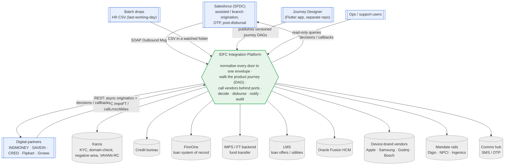

# L1 — System Context

**Zoom:** the whole platform as ONE box. **Audience:** business, product, new joiners.
**Question answered:** *Who uses it, and what external systems does it touch?*

The IDFC Integration Platform is the **middle layer** between IDFC's channels/systems-of-record and the
outside vendors that verify, score, book, disburse, and notify. Channels hand it work; it orchestrates the
right sequence of vendor calls and business decisions; it hands results back.

## What crosses the boundary

| Actor / system | Direction | Protocol | What flows |
|---|---|---|---|
| Salesforce (SFDC) | in | SOAP Outbound Message (HTTP) | origination (`Inbound_Wrapper`), OTP (`SENDSMS`), device-validation post-disbursal (`Post_Disbursal_*`) |
| Digital partners | in | REST/JSON, Bearer (Ory/Hydra) | async loan origination (CRED/Flipkart/Groww); **sync** `impsFT` (INDMONEY) and `callLmsUtilities` (SAVEIN) |
| Batch drops (HR) | in | CSV file in a watched folder | one row per employee last-working-day update |
| Journey Designer | in | REST to the journey registry | versioned journey DAGs (maker-checker) |
| Ops / support | in | REST (read-only, token-gated) | run status, node position, failure class, DLQ refs |
| Karza | out | REST/JSON (OAuth) | KYC, domain-check, negative-area, VAHAN vehicle-RC |
| Credit bureau | out | REST | bureau pull |
| FinnOne | out | REST | loan booking (system of record) — with compensation (reverse) |
| IMPS / FT backend | out | REST/JSON | real-time fund transfer (disbursal) |
| LMS | out | REST/JSON (house envelope) | loan offers / utilities (`OFFER_CHECK`, …) |
| Oracle Fusion HCM | out | REST | employee record update/read |
| Device-brand vendors | out | REST (per-brand auth) | validate / block / unblock a financed device |
| Mandate rails (Digio/NPCI/Ingenico) | out | REST + async callback | e-mandate setup / cancel |
| Comms hub | out | internal | SMS / OTP send |

## The one-paragraph version

Channels don't talk to vendors directly and vendors don't know about channels — **the platform sits in
the middle**. A door (edge) turns whatever the channel sent into one standard message; the engine runs the
product's journey, calling the right vendors in the right order and making the branch decisions; results
go back to the channel and everything is recorded for ops. New channel? New door. New product? New
journey (a diagram). New vendor? New adapter behind a port. The centre stays stable.

→ Next: **[L2 — Container](02-container.md)** (what actually runs, and how the pieces talk).
