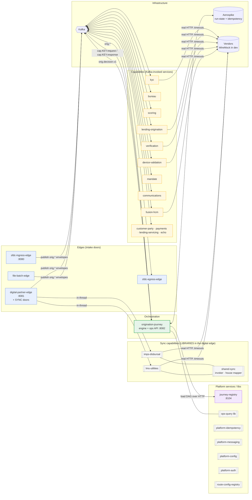
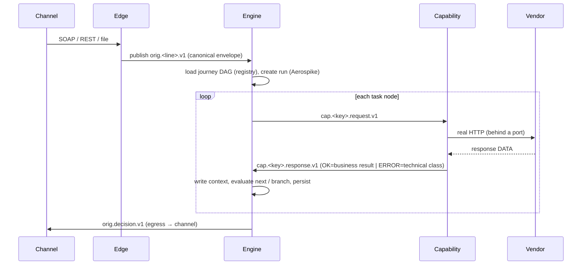
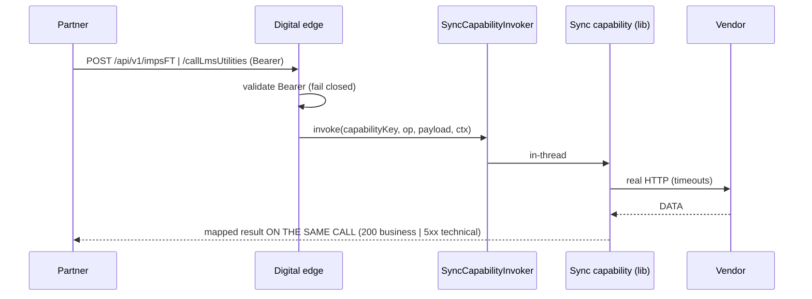

# L2 — Container (deployables)

**Zoom:** the runnable pieces. **Audience:** architects, ops, SRE.
**Question answered:** *What runs where, and how do the pieces talk?*

A "container" here = a thing you deploy/run (a Spring Boot service) or a shared library that several
services build on. There are two communication styles — **async over Kafka** (the engine lane) and
**sync in-thread HTTP** (the sync lane).

## The async engine lane — message flow

The heart of the platform. One request threads these topics:

**Topic naming (two families):**

| Family | Pattern | Named by | Example |
|---|---|---|---|
| Origination / entry | `orig.<source-or-line>.v1` | the source / business line | `orig.sfdc.pl.v1`, `orig.device-validation.v1` |
| Capability | `cap.<key>.request.v1` / `cap.<key>.response.v1` | the capability | `cap.device-validation.request.v1` |
| Decision | `orig.decision.v1` | — | terminal decision, keyed by `applicationRef` |
| Dead-letter | `orig.<line>.v1.dlq` | — | poison / permanent-failure quarantine |

## The sync lane — no Kafka, no engine

## State & guarantees (where the durability lives)

- **Run-state store** (Aerospike): every journey instance's context + node history — the audit source of
  truth and what the ops view reads. In-memory variant for tests.
- **Idempotency store** (Aerospike, `platform-idempotency`): dedupes intake resends and money movement.
- **Confirmed delivery** (`platform-messaging`): a publish is "done" only when the broker acks; failures
  dead-letter. No swallow-and-commit.
- **Journey registry**: the versioned DAG store (maker-checker); the engine pins the version it runs.

## Shared libraries (build-time, not deployables)

| Library | Gives every consumer |
|---|---|
| `shared-domain` | the canonical envelope + common value objects (the shared contract) |
| `shared-capability` | the homogeneous async capability shell (consume request → execute → produce response, idempotent) |
| `shared-sync` | the sync-lane contracts (invoker, request context, technical exception, house-envelope mapper) |
| `shared-observability` | OTel / Micrometer wiring |

→ Next: **[L3 — Component](03-component.md)** (inside the engine, a capability, the sync lane, an edge).
