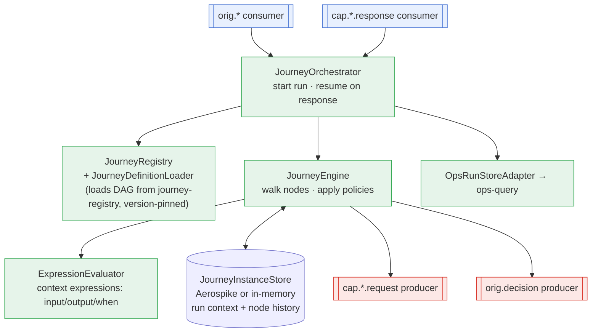
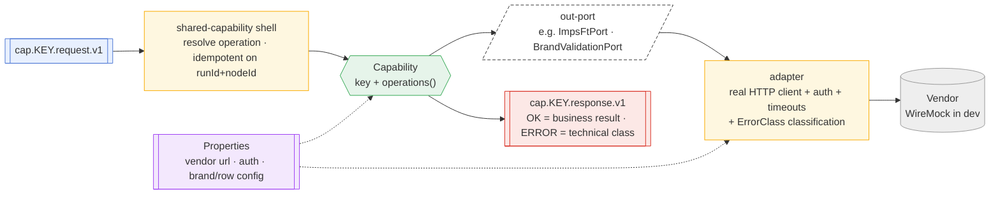
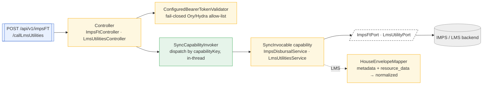
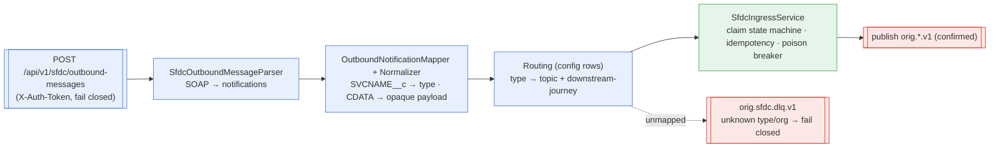

# L3 — Component (inside each container)

**Zoom:** the parts inside a deployable. **Audience:** developers.
**Question answered:** *What are the pieces of the engine / a capability / the sync lane / an edge, and who owns what?*

Four internals matter: the **engine** (the async brain), an **async capability** (the hexagonal worker),
the **sync lane** (the in-thread path), and an **edge** (the normaliser). Class names are the real ones.

---

## 3.1 The Orchestration Engine

The engine walks the DAG and owns **no business logic** — it traverses, invokes, persists, and enforces
policy. Business decisions live in capabilities; the DAG shape lives in the registry.

- **JourneyOrchestrator** — `onOrigination(envelope)` starts a run; a `cap.*.response` resumes the run at
  the node that was waiting. **Persist-before-publish**: state is saved before the next request is emitted,
  and responses are keyed by `journeyInstanceId` so a resume lands on the right run.
- **JourneyEngine + ExpressionEvaluator** — from the current node, evaluate `input` → dispatch, apply
  `output` to `context`, evaluate `branch` `when`/`default`, honour policies (`retry`, `timeout`, `meter`
  pool, `compensation`, `onFailure: dlq`). Terminal `status` (`completed|rejected|failed`) maps to the
  shared ops vocabulary.
- **JourneyInstanceStore** — the durable run: context document + per-node stats (attempts, failure class,
  deadlines). The **audit source of truth** and what the ops view reads.
- **Fail-closed routing** — an unmapped envelope `type` (no `type-to-journey` row) does **not** default to
  a journey; it dead-letters. Unknown terminal status never defaults to APPROVED.

---

## 3.2 An async Capability (hexagonal, on the shared shell)

Every async capability is the SAME shell (`shared-capability`) wrapped around a small hexagon: **business
logic in the middle, I/O at the edges behind ports.** No brand/vendor branching in code — differences are
config rows.

**Worked example — `device-validation`:** `DeviceValidationCapability` exposes four operations
(`decideActivities`, `validate`, `block`, `unblock`); `DeviceValidationVendorClient` is the real HTTP
adapter (per-brand auth, timeouts, 4xx→PERMANENT / 5xx→TRANSIENT / read-timeout→AMBIGUOUS);
`DeviceValidationProperties` holds the brand rows (flags, `validate-by`, pass-path). Adding a brand = a
row. The capability code has **zero brand `if`s** — proven by the HISENSE "add a brand with no code change"
test.

---

## 3.3 The Sync lane (in-thread, hosted on the digital edge)

The caller **blocks** for the result. No engine, no Kafka, no run-state. The contracts live in
`shared-sync`; the capabilities are libraries the edge `@Import`s.

- **Dispatch by capabilityKey only** — `source` (INDMONEY/SAVEIN) is trace/authz, never routing.
- **imps-disbursal** — idempotent (a repeated `idempotentId` returns the prior result, never double-transfers);
  `status:S` success / non-S business decline (200) / timeout-5xx technical (uniform 502, AMBIGUOUS on a
  money read-timeout).
- **lms-utilities** — `requestCode`-dispatched (`OFFER_CHECK` now; unknown → 422 fail-closed); response
  mapped by the shared `HouseEnvelopeMapper`; empty `resource_data` on SUCCESS = a clean "no offer".

---

## 3.4 An Edge (normaliser) — SFDC ingress

An edge's whole job: turn a channel-specific message into the **one canonical envelope** and route it —
schema-agnostic, opaque-payload, fail-closed, idempotent.

- **Opaque payload** — the edge carries the business body (CDATA) inline without parsing it; each
  `SVCNAME`'s downstream handler interprets it. The edge stays schema-agnostic.
- **Edge-generated correlationId** — the run key is minted by the edge (the inbound `correlationid` header
  is not trusted as the key); search ops by `notificationId` / `sfdcRecordId`.
- **Fail closed** — unknown `SVCNAME` (no routing row) or unknown org → DLQ, never a silent default.

→ Next: **[L4 — Journeys](04-journeys.md)** (each flow, node-by-node).
