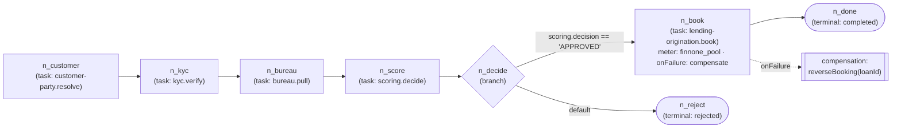
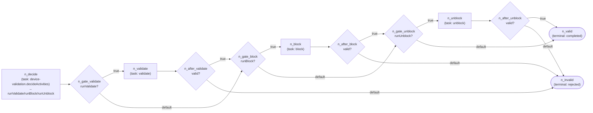
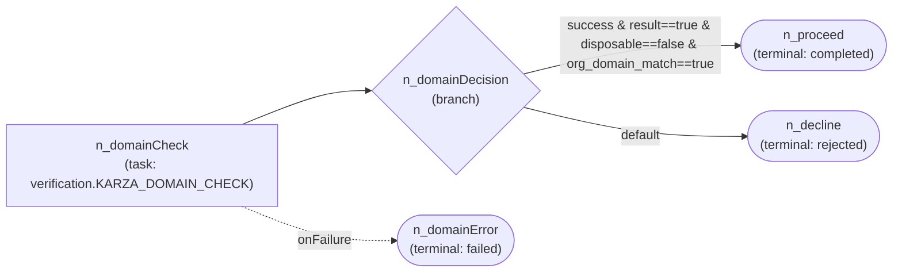
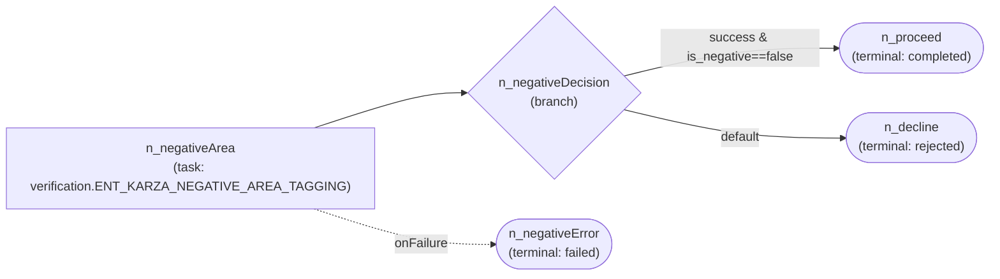
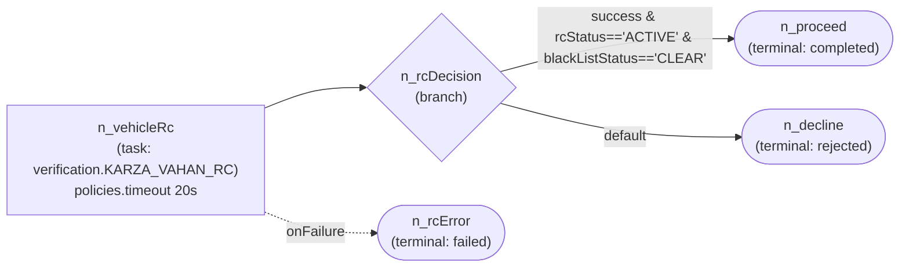
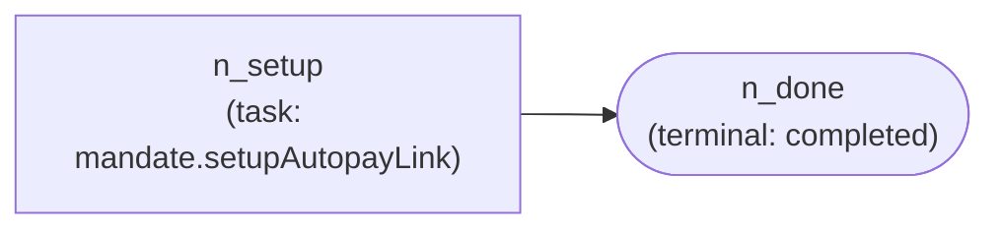
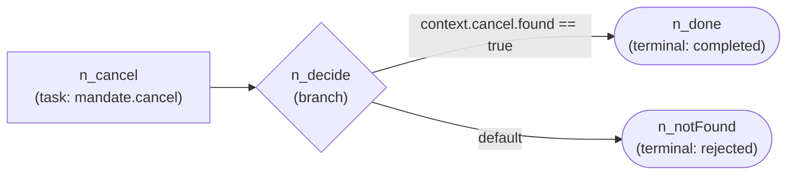
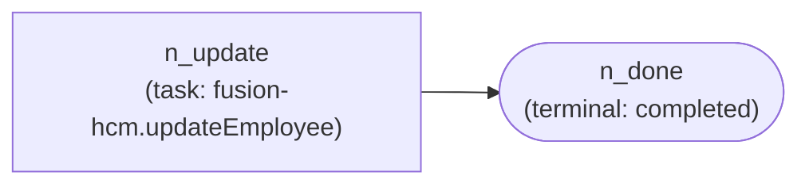
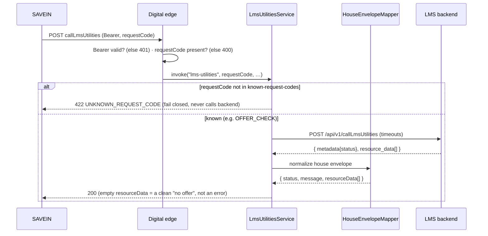

# L4 — Journeys (node-by-node)

**Zoom:** one flow, in full. **Audience:** implementers, reviewers, QA.
**Question answered:** *How does this specific journey actually execute?*

Everything here is faithful to the real DAG JSON (`orchestration/.../journeys/*.json`) and the sync
capabilities. For what a node *type* means, see the **[DAG Charter](../JOURNEY_DAG_CHARTER.md)**.

**Legend:** `[task]` invokes a capability · `{branch}` forks on a condition · `([terminal])` ends a path
with a status (`completed` → ops `COMPLETED_APPROVED`, `rejected` → `COMPLETED_DECLINED`, `failed` →
`FAILED_*`). A **business decline** is a `branch` `default` to a `rejected` terminal (a decision). A
**technical failure** is `onFailure: dlq`/a node-id route to a `failed` terminal (an error). The two are
never the same path.

The journeys fall in five families:

| Family | Journeys | Lane |
|---|---|---|
| Origination | `loan-origination` | async engine |
| Device | `device-validation` | async engine |
| Verification (Karza) | `domain-check`, `negative-area`, `vehicle-rc` | async engine |
| Mandate | `emandate-autopay-setup`, `emandate-cancel` | async engine |
| HR / batch | `employee-lwd-update` | async engine |
| **Digital sync** | `imps-disbursal`, `lms-utilities` | **sync (in-thread)** |

---

## `loan-origination` — the flagship async journey

**Purpose:** take an applicant from raw origination to a booked loan (or a decline), through KYC, bureau,
scoring, decision, and booking. · **Type:** async engine · **Entry:** SFDC `Inbound_Wrapper` / partner
origination → `orig.sfdc.*` · **Capabilities:** customer-party, kyc, bureau, scoring, lending-origination.



**Walkthrough:**

| node | type | capability.operation | writes / branch | next |
|---|---|---|---|---|
| `n_customer` | task | `customer-party.resolve` | `context.customer` | `n_kyc` |
| `n_kyc` | task | `kyc.verify` | `context.kyc` | `n_bureau` |
| `n_bureau` | task | `bureau.pull` | `context.bureau` | `n_score` |
| `n_score` | task | `scoring.decide` | `context.scoring` | `n_decide` |
| `n_decide` | branch | — | `when context.scoring.decision == 'APPROVED'` | `n_book` / default `n_reject` |
| `n_book` | task | `lending-origination.book` | `context.loan`; `meter: finnone_pool` (max 20 concurrent); `onFailure: compensate` | `n_done` |
| `n_done` | terminal | — | `completed`; emit `LoanBooked` | — |
| `n_reject` | terminal | — | `rejected`; emit `LoanRejected` | — |

**Outcomes & notables:** A **business decline** (`scoring.decision != APPROVED`) branches to `n_reject`
(`rejected`) — not an error. **Booking is the risky, side-effecting step**, so it carries two policies real
to this JSON: a **concurrency meter** (`finnone_pool`, cap 20 — protects FinnOne from overload) and a
**compensation** (`onFailure: compensate → reverseBooking(loanId)` — if a downstream step failed after the
loan was booked, the booking is reversed; the saga stays consistent). This is the reference for "a task
that moves the system of record must be metered and compensatable."

---

## `device-validation` — three config-gated activities

**Purpose:** validate / block / unblock a financed device with the brand's vendor. · **Type:** async
engine · **Entry:** `DEVICE_VALIDATION` (Kafka door) or SFDC `Post_Disbursal_Apple` → `orig.device-validation.v1`
· **Capabilities:** device-validation.

Which activities run = the intersection of **(the request `status` asks for it)** AND **(the brand
supports it)**. `status "1"` = validate+block (disbursal); `status "2"` = unblock (closure). Each activity
is a gated hop; any hop that returns `valid:false` routes to `n_invalid`.



**Walkthrough (the gate pattern):**

| node | type | capability.operation | writes / branch | next |
|---|---|---|---|---|
| `n_decide` | task | `device-validation.decideActivities` | `context.plan = {brand, validateBy, runValidate, runBlock, runUnblock}` | `n_gate_validate` |
| `n_gate_validate` | branch | — | `when context.plan.runValidate == true` | `n_validate` / default `n_gate_block` |
| `n_validate` | task | `validate` | `context.validateResult.valid` | `n_after_validate` |
| `n_after_validate` | branch | — | `when …valid == true` | `n_gate_block` / default `n_invalid` |
| `n_gate_block` / `n_block` / `n_after_block` | branch/task/branch | `block` | same gate→run→check shape | → `n_gate_unblock` / `n_invalid` |
| `n_gate_unblock` / `n_unblock` / `n_after_unblock` | branch/task/branch | `unblock` | same shape | → `n_valid` / `n_invalid` |
| `n_valid` | terminal | — | `completed`; emit `DeviceValidationValid` | — |
| `n_invalid` | terminal | — | `rejected`; emit `DeviceValidationInvalid` | — |

**Outcomes & notables:** **valid/invalid** (not approve/decline). A brand identifies a device by `imei` or
`serial` (`validate-by`). A vendor "no" (non-pass) is a **business invalid** (`rejected`); a vendor
4xx/5xx/timeout is a **technical failure** (`FAILED_*`, with `ErrorClass`). Zero brand branching in code —
adding a brand is a config row.

---

<!-- The six sections below are faithful to each journey's JSON. -->

### `domain-check-verification`

**Purpose:** Karza email/domain legitimacy check on a corporate email, then approve or decline. · **Type:**
async engine · **Entry:** seeded/registry-routed (`KARZA_DOMAIN_CHECK`) · **Capabilities:** verification.



| node | type | capability.operation | writes / branch | next |
|---|---|---|---|---|
| `n_domainCheck` | task | `verification.KARZA_DOMAIN_CHECK` | `context.domainCheck`; `idempotent:true`; `onFailure→n_domainError` | `n_domainDecision` |
| `n_domainDecision` | branch | — | `success && result==true && disposable==false && org_domain_match==true` | `n_proceed` / default `n_decline` |
| `n_proceed` / `n_decline` / `n_domainError` | terminals | — | `completed` / `rejected` / `failed` | — |

**Notables:** Three-way terminus. A non-corporate/disposable email or no org-domain match is a **business
decline** (`n_decline`, `rejected`); a call error is a **technical failure** (`onFailure: n_domainError`,
`failed`). Task is `idempotent:true` (safe read).

### `negative-area-verification`

**Purpose:** Karza address-risk (negative-area) check, then clear or flag. · **Type:** async engine ·
**Entry:** seeded/registry-routed (`NEGATIVE_AREA_CHECK`) · **Capabilities:** verification.



| node | type | capability.operation | writes / branch | next |
|---|---|---|---|---|
| `n_negativeArea` | task | `verification.ENT_KARZA_NEGATIVE_AREA_TAGGING` | `context.negativeArea`; `idempotent:true`; `onFailure→n_negativeError` | `n_negativeDecision` |
| `n_negativeDecision` | branch | — | `success && is_negative == false` | `n_proceed` / default `n_decline` |
| `n_proceed` / `n_decline` / `n_negativeError` | terminals | — | `completed` (`NegativeAreaClear`) / `rejected` (`NegativeAreaFlagged`) / `failed` | — |

**Notables:** Same single-hop-then-branch shape. Address tagged negative = **business decline**; call error
= **technical failure** (`onFailure`). `idempotent:true`.

### `vehicle-rc-verification`

**Purpose:** Karza VAHAN RC check that a vehicle registration is ACTIVE and not blacklisted. · **Type:**
async engine · **Entry:** `VEHICLE_RC` (shipped in `application-local.yml`) · **Capabilities:** verification.



| node | type | capability.operation | writes / branch | next |
|---|---|---|---|---|
| `n_vehicleRc` | task | `verification.KARZA_VAHAN_RC` | `context.vehicleRc`; `policies.timeout: "20s"`; `onFailure→n_rcError` | `n_rcDecision` |
| `n_rcDecision` | branch | — | `success && rcStatus=='ACTIVE' && blackListStatus=='CLEAR'` | `n_proceed` / default `n_decline` |
| `n_proceed` / `n_decline` / `n_rcError` | terminals | — | `completed` (`VehicleRcApproved`) / `rejected` (`VehicleRcDeclined`) / `failed` | — |

**Notables:** The only verification journey with an explicit **`policies.timeout: "20s"`** (a hard call
cap). RC not-ACTIVE / blacklisted = **business decline**; call error = **technical failure**.

### `emandate-autopay-setup`

**Purpose:** build the customer's autopay/e-mandate payment link and notify the channel. · **Type:** async
engine · **Entry:** started by journeyKey · **Capabilities:** mandate.



| node | type | capability.operation | writes / branch | next |
|---|---|---|---|---|
| `n_setup` | task | `mandate.setupAutopayLink` | `context.autopay = {invoiceNo, autopayLink, sent}` | `n_done` |
| `n_done` | terminal | — | `completed`; action `notify_channel`; emit `AutopayLinkSent` | — |

**Notables:** The simplest DAG — one linear task to `completed`. **Explicitly no `wait`/`timer` node:** the
link is built and sent synchronously inside `setupAutopayLink` (the charter's park-for-callback pattern
lives in a separate `emandate-register` example, not this journey).

### `emandate-cancel`

**Purpose:** cancel an existing e-mandate via CBS NACH (enquire, then cancel if found). · **Type:** async
engine · **Entry:** started by journeyKey · **Capabilities:** mandate.



| node | type | capability.operation | writes / branch | next |
|---|---|---|---|---|
| `n_cancel` | task | `mandate.cancel` | `context.cancel = {invoiceNo, found, cancelled}` | `n_decide` |
| `n_decide` | branch | — | `context.cancel.found == true` | `n_done` / default `n_notFound` |
| `n_done` / `n_notFound` | terminals | — | `completed` (`MandateCancelled`) / `rejected` (`MandateNotFound`) | — |

**Notables:** `n_notFound` (`rejected`) is a **business outcome** — the CBS enquiry found no mandate, so
there's nothing to cancel. It is the branch default, **not** a technical error.

### `employee-lwd-update`

**Purpose:** push an employee's Last Working Day to Oracle Fusion HCM (per-record body of the file-batch
flow). · **Type:** async engine · **Entry:** `EMPLOYEE_LWD_UPDATE`, fed by the file-batch edge on
`orig.employee-lwd-update.v1` · **Capabilities:** fusion-hcm.



| node | type | capability.operation | writes / branch | next |
|---|---|---|---|---|
| `n_update` | task | `fusion-hcm.updateEmployee` | input `{employeeId, lastWorkingDay}`; `context.fusion` | `n_done` |
| `n_done` | terminal | — | `completed`; emit `EmployeeLwdUpdated` | — |

**Notables:** Smallest write-path DAG. A well-formed record 200s and completes; a malformed date is a real
HTTP 400 → `PERMANENT`, failing **only that record's run** (the file-batch edge starts one run per row), so
the rest of the batch still completes.

---

## The sync lane — `imps-disbursal` & `lms-utilities`

These are **not** engine journeys — the caller **blocks** for the answer on one HTTP call. There is no DAG,
no run-state, no Kafka. They run in-thread on the digital edge (see [L3 §3.3](03-component.md)). Their
"flow" is a request/response sequence.

### `imps-disbursal` — real-time fund transfer (`POST /api/v1/impsFT`)

```mermaid
sequenceDiagram
  participant P as INDMONEY
  participant Edge as Digital edge
  participant Svc as ImpsDisbursalService
  participant Store as Idempotency store
  participant V as IMPS backend
  P->>Edge: POST impsFT (Bearer, idempotentId)
  Edge->>Edge: Bearer valid? (else 401) · idempotentId present? (else 400)
  Edge->>Svc: invoke("imps-disbursal","transfer", …)
  Svc->>Store: seen idempotentId?
  alt already processed
    Store-->>Svc: prior result
    Svc-->>P: 200 prior result (NO second transfer)
  else first time
    Svc->>V: POST /api/v1/impsFT (timeouts)
    alt 200 status:S
      V-->>Svc: success
      Svc->>Store: cache (definitive)
      Svc-->>P: 200 { status:S, transactionId }
    else 200 non-S (business no)
      V-->>Svc: errCode/errMessage
      Svc->>Store: cache (definitive)
      Svc-->>P: 200 { status:F, errCode } (not a 5xx)
    else timeout / 5xx (technical)
      V--x Svc: no/again
      Svc-->>P: 502 { errorClass: AMBIGUOUS|TRANSIENT } (not cached; retryable)
    end
  end
```

**Notables:** `idempotentId` guarantees **no double transfer**. A business decline is a 200 envelope; a
technical failure is a uniform 502 — a read timeout on a money movement is **AMBIGUOUS** (may have moved),
never faked as success.

### `lms-utilities` — real-time LMS query (`POST /api/v1/callLmsUtilities`)



**Notables:** `requestCode` dispatch is config (`known-request-codes`); an unknown code **fails closed**
(422). The `{metadata, resource_data[]}` house envelope is normalized by the **shared** `HouseEnvelopeMapper`
(reused across LMS, Karza, future services). An empty `resource_data` on SUCCESS is a business "no offer".

---

← Back to **[the philosophy & doc map](README.md)** · the node grammar is the **[DAG Charter](../JOURNEY_DAG_CHARTER.md)**.
