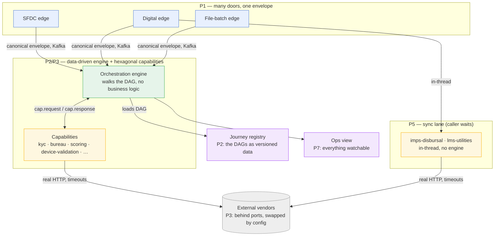

# IDFC Integration Platform — Architecture

This folder is the **architecture documentation set** for the integration platform. It is deliberately
**layered**: you read the level that matches your question and your role, not one giant document.

> **If you read one thing, read this page.** It states *why the platform is built the way it is* (the
> design philosophy) and *how the documents are organised* (so you know where to go next).

### 🎼 Visual overview (for stakeholders / management)

**[`architecture-visual.html`](architecture-visual.html)** — a single, colourful, self-contained page:
high-level → components → the loan-origination journey DAG, plus the **saga** pattern and
**orchestration vs choreography** (and why orchestration was chosen). Light/dark aware.

> ⚠️ GitHub shows `.html` as **source, not rendered**. To see the actual page:
> - **Download & open** the raw file: [raw.githubusercontent.com/…/architecture-visual.html](https://raw.githubusercontent.com/DileepJexpert/idfc-integration-platform/main/docs/architecture/architecture-visual.html) → Save As → double-click, **or**
> - **Preview in-browser** via htmlpreview: [htmlpreview.github.io/?…/architecture-visual.html](https://htmlpreview.github.io/?https://github.com/DileepJexpert/idfc-integration-platform/blob/main/docs/architecture/architecture-visual.html)

The rest of this folder is the **written** architecture set (below) — the visual page is the fast overview;
these are the reference.

---

## 1. Why multiple documents?

A single document cannot serve a CxO, an architect, a developer, and a reviewer at the same time — they
ask different questions at different zoom levels. So the set follows the industry-standard **C4 model**
(Context → Container → Component → Code): each level *zooms in* one step and answers one kind of
question. You stop at the level you need.

| Doc | C4 level | Zoom | Audience | Answers |
|---|---|---|---|---|
| **[README.md](README.md)** (this) | — | philosophy | everyone | *Why* is it built this way? Where do I go next? |
| **[01-system-context.md](01-system-context.md)** | L1 Context | the platform as ONE box | business, product, new joiners | Who uses it? What external systems does it touch? |
| **[02-container.md](02-container.md)** | L2 Container | the deployables | architects, ops, SRE | What runs where? How do the pieces talk? |
| **[03-component.md](03-component.md)** | L3 Component | inside each deployable | developers | What are the parts of the engine / a capability / the edge? |
| **[04-journeys.md](04-journeys.md)** | L4 Code | one journey, node-by-node | implementers, reviewers, QA | How does *this specific flow* actually execute? |

Plus a **[per-capability reference](capabilities/README.md)** — one page each — as an L3 companion for the
team that owns a given capability.

Two existing documents sit alongside this set and are referenced, not duplicated:

- **[JOURNEY_DAG_CHARTER.md](../JOURNEY_DAG_CHARTER.md)** — the *contract*: the DAG DSL grammar and the
  engine execution semantics. One schema, two consumers (the engine executes it; the Designer emits it).
  When 04-journeys says "a `branch` node," the charter is the authority on what a `branch` node *is*.
- **The per-feature guides** ([MANUAL_TEST_GUIDE.md](../MANUAL_TEST_GUIDE.md),
  [DEVICE_VALIDATION_CHEATSHEET.md](../DEVICE_VALIDATION_CHEATSHEET.md),
  [DIGITAL_LENDING_SYNC_LANE.md](../DIGITAL_LENDING_SYNC_LANE.md), …) — the *how-to-run/how-to-test* for a
  specific feature. The architecture set says how it's *shaped*; the guides say how to *drive* it.

```
philosophy (this)  →  L1 context  →  L2 container  →  L3 component  →  L4 journeys
   the WHY              one box        deployables       internals       node-by-node
                                                              ↑
                              DSL CHARTER (the node grammar) ──┘   feature GUIDES (how to run/test)
```

---

## 2. The design philosophy (the "why")

Seven principles run through every module. Each one is a deliberate choice with a cost it buys down.

### P1 — One platform, many doors
Every intake channel — SFDC SOAP Outbound Messages, digital-partner REST, a dropped CSV file, a direct
Kafka publish — is normalised by a thin **edge** into the SAME shared **canonical envelope**, and fed to
the SAME engine and the SAME capabilities. **Adding a channel is a new edge, never a fork of the core.**
*Cost it buys down:* N channels × M products = N+M things to build and reason about, not N×M.
*Proof:* `edges/sfdc-ingress-edge`, `edges/digital-partner-edge`, `edges/file-batch-edge` all publish
the same `CanonicalEnvelope`; `SfdcSoapEndToEndTest` asserts the SFDC and digital envelopes are shape-identical.

### P2 — A journey is DATA (a DAG), not code
Business flows are **JSON DAGs** the engine walks; the engine contains **zero business logic** — it only
traverses nodes, invokes capabilities, persists state, and enforces policies. **Changing a flow means
editing the DAG** (in the Designer, versioned in the registry), not editing and redeploying the engine.
*Cost it buys down:* every product tweak becoming an engineering release.
*Proof:* the 8 files in `orchestration/.../journeys/*.json`; the grammar is the DAG Charter; the engine is
`JourneyEngine` + `ExpressionEvaluator`.

### P3 — A capability is a reusable business skill behind a port (hexagonal)
Each capability (`kyc`, `bureau`, `scoring`, `device-validation`, `imps-disbursal`, …) owns **one** decision,
exposes named **operations**, and hides the outside vendor behind an **out-port**. The vendor is swappable
by **config** — the business logic never changes when the vendor host does.
*Cost it buys down:* vendor lock-in and per-vendor rewrites; untestable business rules.
*Proof:* `ImpsFtPort` / `ImpsFtHttpClient`, `BrandValidationPort`, the Karza adapters — logic in the
service, I/O behind the port, vendor URL in `application.yml`.

### P4 — Config-as-data, and fail **closed**
Brands, partners, routing rows, request-codes, tokens, and org allow-lists are **config rows**, not code.
An unknown or unconfigured value is **refused** (fail closed) — never silently allowed (fail open).
*Cost it buys down:* a redeploy per new brand/partner; and the security disaster of a fail-open default.
*Proof:* device-validation brand rows; edge routing rows; `known-request-codes`; the SFDC edge and the
sync edge both **refuse to start** with a blank token (`EdgePropertiesFailClosedTest`).

### P5 — Two execution lanes, one capability model
Not every integration is a long multi-step journey. The platform runs **two lanes** that share the
capability philosophy but differ in execution:
- **Async engine lane** — over Kafka, durable run-state, for multi-step / long-running / callback-driven
  flows (origination, verification, mandate). The caller fires and the result comes back later.
- **Sync lane** — in-thread HTTP, the caller **blocks** for the answer, for real-time request/response
  (money movement, offer check). No journey instance, no Kafka, no engine state.
*Cost it buys down:* forcing a request/response money-transfer through an async engine (or vice-versa).
*Proof:* the engine (`origination-journey`) vs the sync lane (`shared-sync` + the sync doors on the digital edge).

### P6 — A business "no" is not a technical failure
A decline, an invalid account, a "no offer" is a **real business outcome** — it is returned to the caller
or branched in the journey, and it is **never** paged as an error. A timeout / 5xx / unreachable is a
**technical failure** — it retries, dead-letters, or returns a uniform 5xx. The two are **never
conflated**, and a technical failure is **never dressed up as success** (this matters most when money moves).
*Cost it buys down:* 2am pages for correct declines; and — far worse — a hung transfer reported as "done."
*Proof:* `ErrorClass{PERMANENT,TRANSIENT,AMBIGUOUS}`; the ops status split
`COMPLETED_DECLINED` vs `FAILED_*`; IMPS read-timeout classified **AMBIGUOUS**, never success.

### P7 — Idempotent, confirmed, and audited by default
No double-processing (idempotency keys on every intake and on money movement), no silent loss (a publish
isn't "done" until the broker confirms it; failures dead-letter), and everything is **watchable** through
a read-only ops view.
*Cost it buys down:* duplicate loans/transfers, lost requests, and "what happened to run X?" with no answer.
*Proof:* the shared Aerospike idempotency store; confirmed Kafka sends; `platform/ops-query`.

---

## 3. How the pieces embody the philosophy (one map)



---

## 4. Reading order by role

- **Business / product / a new joiner:** this page → **L1**. Stop there unless curious.
- **Architect / ops / SRE:** this page → **L2** → **L3**. Use L4 for a specific flow.
- **Developer picking up a capability or journey:** **L3** for the shape → **L4** for the flow → the DAG
  Charter for node semantics → the feature guide to run it.
- **Reviewer / QA:** **L4** (the journey under review) → the feature guide's permutation table.
