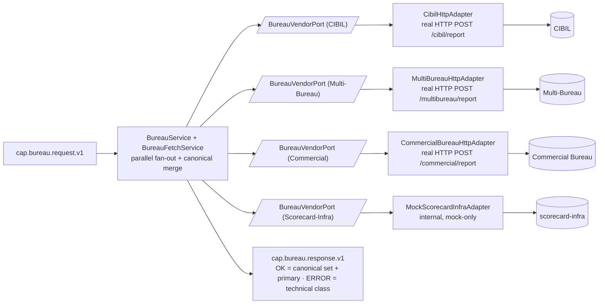

# Capability — `bureau`

| | |
|---|---|
| **One line** | Pull credit-bureau report(s) for the applicant, **fanning out across multiple bureaus in parallel** and normalizing them into one canonical set plus a single primary score/grade. Bureau **only fetches** — it does not decide (that is `scoring`). |
| **Lane** | async engine (Kafka-invoked) |
| **Capability key** | `bureau` |
| **Module** | `capabilities/bureau` |
| **Invoked by** | `loan-origination` journey, node `n_bureau` (`bureau.pull` → `context.bureau`), between `n_kyc` and `n_score`. See `orchestration/origination-journey/src/main/resources/journeys/loan-origination.journey.json`. |

## Operations
| operation | reads (input) | writes (output) | meaning |
|---|---|---|---|
| `pull` | `request.payload()` — identity (`pan`, `applicationRef`, …), optional `bureauTypes[]`, `purpose`, `consentRef` | `bureauResults[]` (one canonical entry per bureau), `bureauScore`, `bureauGrade`, `reportId` | Fan out to the requested bureaus, normalize each into a canonical result, and expose a single **primary** score/grade (CIBIL if present, else the most conservative = lowest score). |

## Hexagon — ports & adapters

- **Inbound:** the shared-capability shell (`CapabilityFrameworkConfiguration` + `CapabilityDispatcher`) consumes `cap.bureau.request.v1`, runs `pull` **idempotently** (a redelivered request returns the first pull instead of re-hitting the bureaus), and publishes to `cap.bureau.response.v1`.
- **Domain/service:** `BureauService` builds a canonical `BureauRequest` and maps the merged set; `BureauFetchService` is the **fan-out/normalize core** — one async `CompletableFuture` per requested bureau that has a registered port, joined and merged deterministically (sorted by type name). This is the single place the bank pulls bureau data.
- **Out-port(s):** one `BureauVendorPort` per vendor, indexed by `type()`. Marker sub-interfaces `CibilBureauPort` / `MultiBureauPort` / `CommercialBureauPort` / `ScorecardInfraPort` keep each independently ownable. Adapters: `CibilHttpAdapter`, `MultiBureauHttpAdapter`, `CommercialBureauHttpAdapter` (real HTTP, config URL) each with a mock twin; `MockScorecardInfraAdapter` is **mock-only** (internal backing, no external URL).

## Config (what's data, not code)
`idfc.bureau` in `application.yml`: `default-bureau-types` (default `CIBIL`, env `BUREAU_TYPES`) is what a request pulls when it doesn't specify; each external vendor (`cibil`, `multi-bureau`, `commercial`) has its own `mode` (`mock`|`real`) + `url` (all default `http://localhost:19102` via `CIBIL_URL`/`MULTI_BUREAU_URL`/`COMMERCIAL_URL`). `SCORECARD_INFRA` is internal (mock only, no URL). Real adapters are `RestClient.builder().baseUrl(url)` only — **no auth or explicit timeout** configured here. **Adding a bureau = one adapter + one config row**, not a new service.

## Outcomes & error model
A **low score is a business outcome, not an error** — a declinable applicant returns `bureauScore=540`/`grade=C` (mock keys off a `LOW` marker in `pan`/`applicationRef`) for `scoring` to decline downstream. The fan-out is **all-or-nothing**: any single vendor failure surfaces through `CompletableFuture.join()` as a `RuntimeException`, and an empty result set throws `IllegalStateException`; either way `BureauService` returns `CapabilityStatus.ERROR` with no `ErrorClass`, promoted by `BureauCapability.unwrap` to `CapabilityException(PERMANENT)` — so every technical failure classifies **PERMANENT** (no retry → DLQ; `TRANSIENT`/`AMBIGUOUS` are not used). An **unknown bureau type** in the request is silently skipped rather than failing the pull.

## Key classes
- `BureauCapability` — the `Capability` bean (`key()="bureau"`, one op `pull`); ERROR → `CapabilityException(PERMANENT)`.
- `BureauService` — builds the request, maps the merged set to `bureauResults[]` + primary `bureauScore`/`bureauGrade`/`reportId`.
- `BureauFetchService` — the parallel fan-out + canonical merge core.
- `BureauVendorPort` (+ `CibilBureauPort`/`MultiBureauPort`/`CommercialBureauPort`/`ScorecardInfraPort`) — one out-port per bureau.
- `CibilHttpAdapter`/`MultiBureauHttpAdapter`/`CommercialBureauHttpAdapter` — real HTTP adapters; `MockCibilAdapter`/`MockMultiBureauAdapter`/`MockCommercialBureauAdapter`/`MockScorecardInfraAdapter` — deterministic mocks.
- `BureauReportSet` — merged set; `primary()` = CIBIL else lowest score. `CanonicalBureauResult` — one bureau's normalized report (`type`, `score`, `grade`, `reportId`, `source`, `fetchedAt`, `normalizedReport`). `BureauRequest`, `BureauType`.
- `BureauProperties` / `BureauConfiguration` — config binding + per-vendor bean wiring.

## Tests (the proof)
- `BureauServiceTest` — locks: CIBIL pull maps the primary fields (`bureauScore=780`, `grade=A`); high vs `LOW`-marked PAN → 780/A vs 540/C; a multi-bureau request `[CIBIL, MULTI_BUREAU, COMMERCIAL]` fans out to 3 canonical results (sorted by type name) yet keeps **CIBIL** as primary (780) even though COMMERCIAL (760) is lower; a failing vendor → `CapabilityStatus.ERROR`; mock is deterministic.

## Vendor (dev vs real)
Real vendors: **CIBIL**, **Multi-Bureau**, **Commercial Bureau**; `scorecard-infra` is an internal backing (mock only, formalizing `scorecard.dev-infinity`). In dev each external bureau is either an in-JVM mock (deterministic; `LOW` in `pan`/`applicationRef` → declinable profile) or a docker mock on `:19102`. Swap any bureau to real with config only: `<VENDOR>_MODE=real` + `<VENDOR>_URL=<host>` — no code change.

---
← [capability index](README.md) · [L3 component view](../03-component.md) · [L4 journeys](../04-journeys.md)
