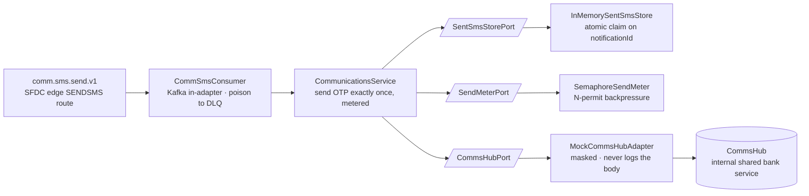

# Capability — `communications`

| | |
|---|---|
| **One line** | The **SENDSMS** action: send an OTP / notification SMS **exactly once** through the bank's shared CommsHub, for SFDC-driven customer comms. |
| **Lane** | async, Kafka-invoked — but a **topic consumer**, not the engine's `cap.*.request/response` contract. It is an edge-routed "capability action": fire-once, **no response topic**. |
| **Capability key** | n/a — it does **not** implement `Capability` (no `key()`). It is identified by its routing target `downstream-journey: communications` and the topic it consumes, `comm.sms.send.v1`. |
| **Module** | `capabilities/communications` |
| **Invoked by** | The **SFDC ingress edge's SENDSMS route** — `type: SENDSMS → topic: comm.sms.send.v1, downstream-journey: communications` (`edges/sfdc-ingress-edge/.../application.yml`, config-as-data). It is **not** invoked by any DAG journey. |

## Operations
| operation | reads (input) | writes (output) | meaning |
|---|---|---|---|
| `onSmsRequest` (the SENDSMS action) | `envelope.notificationId`; the **opaque** Salesforce Task body it owns: `envelope.payload.Mobile__c`, `envelope.payload.Description` | — (no journey context; it sends the SMS and records "sent") | Dedupe on the SFDC `Notification/Id`, meter, and send exactly once via CommsHub. This capability **owns the SENDSMS payload contract** (`Mobile__c`/`Description`). No OTP/body content is ever logged. |

## Hexagon — ports & adapters

*(No response topic — it is a fire-once action, not a request/response capability.)*

- **Inbound:** `CommSmsConsumer` (`@KafkaListener` on `comm.sms.send.v1`, group `communications`) deserializes the canonical envelope and hands the map to the service. `enable-auto-commit=false`, so the container's `DefaultErrorHandler` can retry/DLQ a failed send.
- **Domain/service:** `CommunicationsService` — the "send this OTP once, and don't flood the shared hub" decision.
- **Out-port(s):** `SentSmsStorePort` → `InMemorySentSmsStore` (idempotency); `SendMeterPort` → `SemaphoreSendMeter` (backpressure); `CommsHubPort` → `MockCommsHubAdapter` → CommsHub (internal shared bank service).

## Config (what's data, not code)
`server.port` `8101`; `idfc.communications.sms-topic` = `comm.sms.send.v1` (env `IDFC_COMM_SMS_TOPIC`, comma-splittable); `idfc.communications.group` = `communications` (env `IDFC_COMM_GROUP`); `idfc.communications.commshub.max-concurrency` = `4` (env `IDFC_COMMSHUB_MAX_CONCURRENCY`) — the semaphore cap. CommsHub is an **internal shared** resource, so the cap is a good-neighbour throttle, not a vendor timeout.

## Outcomes & error model
A **successful send** is the only outcome that leaves a durable "sent" mark. Mechanics: `markSentIfAbsent(notificationId)` is an **atomic claim** taken before the send — a concurrent/redelivered duplicate loses the claim and is skipped (no double-send). If the send throws, the claim is **released** (`unmark`) and the exception **propagates** so the consumer retries then DLQs — so the OTP is effectively "sent" **only after a successful send**, never suppressed by an optimistic mark. A **malformed** body (no inline payload map, or no `Mobile__c`) is warn-logged and **skipped** (not sent, not retried). An **undeserializable** envelope raises `PoisonMessageException` → DLQ, and the parse cause is deliberately **not** chained (PII — it can echo the OTP/mobile). **Metered:** a `Semaphore` of N permits caps concurrent sends, so a Diwali-style burst queues as consumer **lag** instead of flooding the shared hub. PII discipline throughout: no body logged, mobile masked, only body length recorded.

## Key classes
- `CommunicationsService` — the metered, idempotent SENDSMS decision.
- `CommSmsConsumer` — Kafka in-adapter; propagates failures, poison → DLQ.
- `CommsHubPort` / `MockCommsHubAdapter` — the shared-hub seam (mock adds ~20 ms latency so bursts genuinely overlap).
- `SendMeterPort` / `SemaphoreSendMeter` — bounded-concurrency backpressure; exposes `maxObservedConcurrency` for the burst test.
- `SentSmsStorePort` / `InMemorySentSmsStore` — claim/release send idempotency.

## Tests (the proof)
- `CommunicationsServiceTest` — reads `Mobile__c`/`Description` from the opaque Task body; idempotent on `Notification/Id` (a redelivery does not re-send); a body without `Mobile__c` is skipped, not sent.
- `CommunicationsServiceOtpDeliveryTest` — a failed send **releases the claim and propagates** so a redelivery re-sends; a successful send is deduped against redelivery. (Regression guard: "marked sent only after a successful send.")
- `SemaphoreSendMeterTest` — a burst of 40 never exceeds the cap N, yet genuinely overlaps (not serialised), and the whole burst drains.

## Vendor (dev vs real)
CommsHub is the bank's **internal, shared** SMS/OTP service — **not an external vendor**, but a finite resource to be a good neighbour to. In dev it is `MockCommsHubAdapter` (masked logging, fixed latency); the real internal CommsHub client is a later slice and swaps in behind `CommsHubPort`. The send-idempotency store moves off-heap by swapping `InMemorySentSmsStore` for a durable Aerospike variant.

---
← [capability index](README.md) · [L3 component view](../03-component.md) · [L4 journeys](../04-journeys.md)
