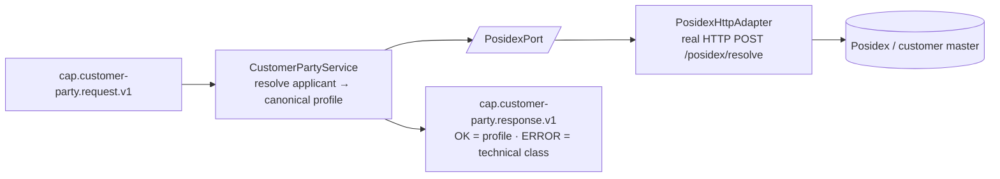

# Capability — `customer-party`

| | |
|---|---|
| **One line** | Resolve/dedup the loan applicant against the customer master (Posidex) into a canonical CRN + customer profile — an integration, it does not own the master record. |
| **Lane** | async engine (Kafka-invoked) |
| **Capability key** | `customer-party` |
| **Module** | `capabilities/customer-party` |
| **Invoked by** | `loan-origination` journey, node `n_customer` (`customer-party.resolve` → `context.customer`); it is the **start node** of that DAG. See `orchestration/origination-journey/src/main/resources/journeys/loan-origination.journey.json`. |

## Operations
| operation | reads (input) | writes (output) | meaning |
|---|---|---|---|
| `resolve` | `request.payload()` — applicant identity (`pan`, `name`, …) | `crn`, `customerId`, `customerName`, `customerStatus` | Resolve/dedup the applicant against Posidex and return the canonical customer profile. |

## Hexagon — ports & adapters

- **Inbound:** the shared-capability shell (`CapabilityFrameworkConfiguration` + `CapabilityDispatcher`) consumes `cap.customer-party.request.v1`, runs the single operation **idempotently** (keyed by `journeyInstanceId:nodeId`), and publishes to `cap.customer-party.response.v1`. Zero per-capability Kafka code.
- **Domain/service:** `CustomerPartyService` — owns the one thing: turn applicant identity into a resolved `CustomerProfile`.
- **Out-port(s):** `PosidexPort` → `PosidexHttpAdapter` (real HTTP) / `MockPosidexAdapter` (in-JVM) → Posidex.

## Config (what's data, not code)
`idfc.customer-party.posidex` in `application.yml`: `mode` (`mock`|`real`, default `mock`, env `POSIDEX_MODE`) selects the adapter; `url` (default `http://localhost:19101`, env `POSIDEX_URL`) is the Posidex base URL. The adapter is built as `RestClient.builder().baseUrl(url)` only — **no auth header or explicit timeout is configured** here (simpler than the device-validation vendor client). `mode` defaults to `mock`, so absent config the capability runs against the in-JVM mock rather than failing closed.

## Outcomes & error model
There is **one business outcome**: a resolved profile (the mock always returns `status = ACTIVE`; the real adapter passes the vendor's `status` through). There is no "customer not found" business branch. Any `RuntimeException` — including an empty vendor body — is caught by `CustomerPartyService` and returned as `CapabilityStatus.ERROR` with **no** `ErrorClass`; `CustomerPartyCapability.unwrap` then throws `CapabilityException(PERMANENT)`, so the dispatcher classifies the failure **PERMANENT** (no retry → DLQ). This capability does **not** distinguish `TRANSIENT`/`AMBIGUOUS` — every technical failure collapses to `PERMANENT`.

## Key classes
- `CustomerPartyCapability` — the `Capability` bean (`key()="customer-party"`, one op `resolve`); delegates to the service and maps ERROR → `CapabilityException(PERMANENT)`.
- `CustomerPartyService` — framework-free handler; calls the port and maps the profile into the response.
- `PosidexPort` — out-port to the customer master.
- `PosidexHttpAdapter` — real HTTP adapter (`POST /posidex/resolve`).
- `MockPosidexAdapter` — deterministic in-JVM adapter (`CRN-<pan>`, `CUST-<pan>`, `ACTIVE`).
- `CustomerProfile` — canonical result record (`crn`, `customerId`, `name`, `status`).
- `PosidexProperties` / `CustomerPartyConfiguration` — config binding + bean wiring (mode → adapter).

## Tests (the proof)
- `CustomerPartyServiceTest` — locks: `resolve` maps `crn`/`customerStatus` from the profile; a failing `PosidexPort` yields `CapabilityStatus.ERROR`; the mock is deterministic (`CRN-P1`).

## Vendor (dev vs real)
Real vendor: **Posidex** (customer source of truth / CDP). In dev it is either the in-JVM `MockPosidexAdapter` (deterministic from PAN, no infra) or a docker mock on `:19101`. Swap to real with config only: `POSIDEX_MODE=real` + `POSIDEX_URL=<host>` — no code change.

---
← [capability index](README.md) · [L3 component view](../03-component.md) · [L4 journeys](../04-journeys.md)
