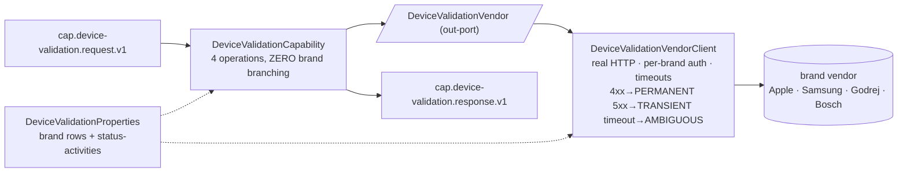

# Capability — `device-validation`

| | |
|---|---|
| **One line** | Validate / block / unblock a financed device (phone or appliance) with the brand's vendor. |
| **Lane** | async engine (Kafka-invoked) |
| **Capability key** | `device-validation` |
| **Module** | `capabilities/device-validation` |
| **Invoked by** | the `device-validation` journey (`n_decide` → gated `n_validate`/`n_block`/`n_unblock`); entered via the `DEVICE_VALIDATION` Kafka door or SFDC `Post_Disbursal_Apple` |

## Operations

| operation | reads (input) | writes (output) | meaning |
|---|---|---|---|
| `decideActivities` | `brand`/`type`, `status` | `context.plan` = `{brand, validateBy, runValidate, runBlock, runUnblock}` | intersect (request status asks) × (brand supports) → the run plan |
| `validate` | `brand`, `imei`/`serial`/`deviceId` | `context.validateResult.valid` | is the device genuine/eligible? |
| `block` | same | `context.blockResult.valid` | lock the device under finance |
| `unblock` | same | `context.unblockResult.valid` | release the lock (loan closed) |

## Hexagon — ports & adapters

- **Inbound:** the shared-capability shell consumes `cap.device-validation.request.v1`, resolves the operation, and is idempotent on `(runId, nodeId)`.
- **Domain/service:** `DeviceValidationCapability` — the decision (which activities, valid/invalid). No brand `if`s in code.
- **Out-port:** `DeviceValidationVendor` → `DeviceValidationVendorClient` → the brand's vendor.

## Config (what's data, not code)

- **Brand rows** (`device-validation.brands.*`): per brand the `validate`/`block`/`unblock` flags, `validate-by` (`imei`|`serial`), `auth-type` (OAUTH/BASIC/NA), the pass-logic `pass-path`/`pass-value`, and (for an SFDC door) its `svc-name`.
- **Request status → activities** (`device-validation.status-activities`): `"1"` = `[validate, block]`, `"2"` = `[unblock]`; absent → `default-status` `"1"`.
- **Vendor:** `vendor-base-url`, `token-url`, `connect/read-timeout-ms`.
- **Fail closed:** an unknown brand or an unmapped svcName → PERMANENT "missing/ no config row"; adding a brand is a **row**, not code.

## Outcomes & error model

- Outcomes are **valid / invalid** (terminals `n_valid`/`n_invalid`). A vendor "no" (non-pass body) is a **business invalid** (`rejected` → ops `COMPLETED_DECLINED`).
- A vendor 4xx/5xx/timeout is a **technical failure** carrying an `ErrorClass` (PERMANENT/TRANSIENT/AMBIGUOUS) → ops `FAILED_*`. A business "no" is never an error.

## Key classes

- `DeviceValidationCapability` — the 4 operations; `decideActivities` computes the run plan; `validate`/`block`/`unblock` share one parameterized vendor call.
- `DeviceValidationProperties` — the brand table + status-activities (a `BrandRow` per brand).
- `DeviceValidationVendor` / `DeviceValidationVendorClient` — the out-port + real HTTP adapter.

## Tests (the proof)

- `BrandAsConfigTest` — the intersection logic, `validate-by`, unblock, and fail-closed unknown brand/svcName; HISENSE proves "add a brand with zero code change."
- `DeviceValidationYamlBindingTest` — the real `application.yml` brand rows bind (flags + `validate-by` + svc-name).
- `LegacyPatternsDemoIT` (full-flow-it) — end-to-end over embedded Kafka incl. the status-2 unblock path and the SFDC Apple door.

## Vendor (dev vs real)

Real per-brand vendor over real HTTP; in dev it's the WireMock **mock-devicevalidation** (`:9106`) — only the response DATA is mocked. Swap to a brand's real host + contract via config.

---
← [capability index](README.md) · [L3 component view](../03-component.md) · [L4 journeys](../04-journeys.md)
