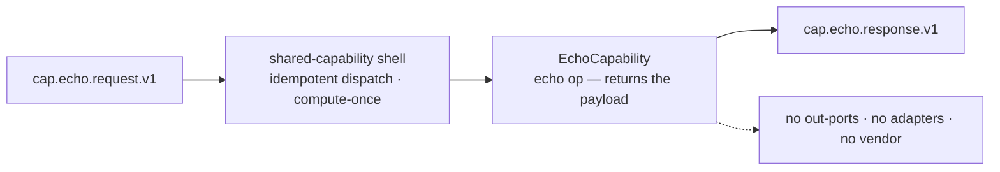

# Capability — `echo`

> **Thin / reference by design.** `echo` is the trivial reference capability: one operation that returns the request payload unchanged. It owns no state and calls no externals — its whole job is to **prove the shared capability framework** (engine-invokable contract + exactly-once idempotent dispatch) with zero plumbing in the app. There are **no out-ports, adapters, or vendor**. The page is short by design.

| | |
|---|---|
| **One line** | Echoes the request payload straight back — the reference capability that proves the homogeneous framework end-to-end. |
| **Lane** | async engine (Kafka-invoked) |
| **Capability key** | `echo` |
| **Module** | `capabilities/echo` |
| **Invoked by** | nothing — not wired into any journey. It is a framework/reference capability, exercised by tests and manual dispatch. |

## Operations
| operation | reads (input) | writes (output) | meaning |
|---|---|---|---|
| `echo` | `payload` (any) | `echo` = the request payload (or `{}` if none) | Returns the payload unchanged; owns no state, calls no external system. |

## Hexagon — ports & adapters

- **Inbound:** the shared `shared-capability` shell consumes `cap.echo.request.v1`, runs the idempotent `CapabilityDispatcher`, and publishes `cap.echo.response.v1`.
- **Domain/service:** `EchoCapability` — a single `echo` operation, no decision beyond returning the payload.
- **Out-port(s):** none — echo touches no external system (that is the point).

## Config (what's data, not code)
`server.port` `8097` (health/metrics only) and the standard shared Kafka shell (string ser/deser, `auto-offset-reset: earliest`). No vendor URL, auth, or timeouts — there is nothing external to configure.

## Outcomes & error model
Always `OK` with `{ echo: payload }`. An **unknown operation** on the capability → `ERROR` / **PERMANENT** (fail closed). Exactly-once is inherited from the shared framework's compute-once idempotency store: concurrent identical requests (same `runId+nodeId` key) run the operation once and every caller gets the same cached response.

## Key classes
- `EchoCapability` — the `Capability` bean (`key()="echo"`, one `echo` operation).
- `EchoApplication` — `@SpringBootApplication`; declares only the bean, the shared shell does the rest.

## Tests (the proof)
- `CapabilityFrameworkConcurrencyTest` — the framework gate: 32 threads with the **same idempotency key** execute the operation **exactly once** and all receive the identical (cached) response; `echo` returns the payload; an unknown operation is a **PERMANENT** error. This is the homogeneous exactly-once guarantee every capability inherits.

## Vendor (dev vs real)
None — `echo` calls no external system, so there is nothing to mock or swap. Isolating the framework from any vendor is exactly why it exists.

---
← [capability index](README.md) · [L3 component view](../03-component.md) · [L4 journeys](../04-journeys.md)
