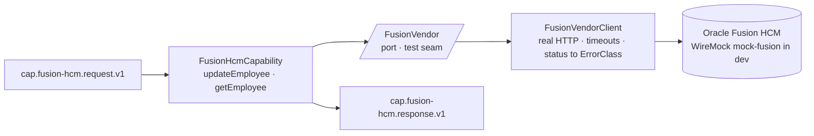

# Capability — `fusion-hcm`

| | |
|---|---|
| **One line** | The per-record Oracle Fusion HCM employee update: POST an employee's last-working-day to Fusion (the employee-LWD file-batch flow), plus a sync employee read. |
| **Lane** | async engine (Kafka-invoked) |
| **Capability key** | `fusion-hcm` |
| **Module** | `capabilities/fusion-hcm` |
| **Invoked by** | `employee-lwd-update.journey.json` — node `n_update` → `updateEmployee`, `input: { employeeId, lastWorkingDay }`, `output: context.fusion`. The **file-batch edge** (`edges/file-batch-edge`, a separate deployable) feeds one run **per CSV record**. `getEmployee` backs a sync-read reference and is not in a shipped journey. |

## Operations
| operation | reads (input) | writes (output) | meaning |
|---|---|---|---|
| `updateEmployee` | `payload.employeeId`, `payload.lastWorkingDay` | `updated` (`true`), `employeeId`, `vendor` (the Fusion response body) | Real HTTP `POST /employees/{employeeId}` with `{lastWorkingDay}`. A blank `employeeId` fails **PERMANENT before any call**; a malformed record's real Fusion **400 → PERMANENT**, so exactly that record's run fails while the rest of the batch completes. |
| `getEmployee` | `payload.employeeId` | `employeeId`, `vendor` (the Fusion response body) | Real HTTP `GET /employees/{employeeId}` — the sync-read reference drawing. |

## Hexagon — ports & adapters

- **Inbound:** the shared `shared-capability` shell consumes `cap.fusion-hcm.request.v1`, idempotent on `runId+nodeId`, and publishes `cap.fusion-hcm.response.v1`.
- **Domain/service:** `FusionHcmCapability` owns the per-record decision (validate the id, call Fusion, shape the output). `FusionVendor` is a thin **seam** so the record logic is unit-testable without a socket.
- **Out-port(s):** `FusionVendor` → `FusionVendorClient` (real `RestClient` HTTP) → Oracle Fusion HCM.

## Config (what's data, not code)
`server.port` `8111`. `fusion.base-url` (env `FUSION_VENDOR_URL`, default `http://localhost:19107/vendor/fusion`; in-container `http://mock-fusion:8080`), `fusion.connect-timeout-ms` `3000`, `fusion.read-timeout-ms` `10000`. The `local` profile points Kafka at the host listener (`localhost:29092`). The client, timeouts, and status→class mapping are **real**; only the response **data** on the far side of the wire is mocked in dev.

## Outcomes & error model
Business result = `updated:true` plus the vendor's employee body. Technical failures raise `CapabilityException(ErrorClass)` from a real HTTP-status → class mapping in `FusionVendorClient`: **4xx → PERMANENT**, **5xx → TRANSIENT**, **read-timeout (`SocketTimeoutException`) → AMBIGUOUS**, **connect/IO (`IOException`) → TRANSIENT** ("unreachable"), otherwise PERMANENT. A blank `employeeId` is refused **PERMANENT before any call is made** (fail closed). Because a malformed record surfaces the vendor's genuine 400 as PERMANENT, **that one record's run fails and the batch keeps going** — the design point of the per-record shape.

## Key classes
- `FusionHcmCapability` — the `Capability` bean (`key()="fusion-hcm"`, ops `updateEmployee`/`getEmployee`); id validation + output shaping.
- `FusionVendor` — the port/seam interface (real HTTP behind it, fake in unit tests).
- `FusionVendorClient` — real outbound HTTP (`RestClient` + `SimpleClientHttpRequestFactory` timeouts) and the HTTP-status → `ErrorClass` classification.

## Tests (the proof)
- `FusionHcmCapabilityTest` — a well-formed record updates; a malformed date surfaces the vendor's 400 as **PERMANENT** (so that record's run fails); a blank id fails **PERMANENT before any call**. The vendor is faked here to isolate the per-record logic.
- `full-flow-it/LegacyPatternsDemoIT` — proves the **real HTTP** flow end-to-end against the mock-vendors WireMock.

## Vendor (dev vs real)
The real vendor is **Oracle Fusion HCM over real HTTP**. In dev it is the compose **WireMock** service `mock-fusion` (`docker-compose.infra.yml`, `19107:8080`, mappings under `infra/mock-vendors/fusion/mappings`) — **only its response data is mocked**; the client, timeouts, and failure-class mapping are exercised for real. To go live, point `FUSION_VENDOR_URL` at the real Fusion host — no code change.

---
← [capability index](README.md) · [L3 component view](../03-component.md) · [L4 journeys](../04-journeys.md)
