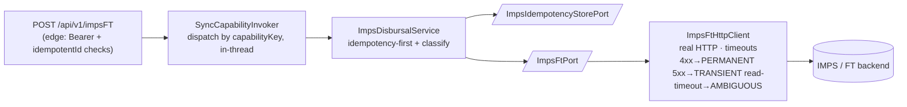

# Capability — `imps-disbursal`

| | |
|---|---|
| **One line** | Real-time IMPS fund transfer (loan disbursal) to a customer's bank account, with a guarantee it can't move money twice. |
| **Lane** | **sync** (in-thread — the caller blocks for the result) |
| **Capability key** | `imps-disbursal` |
| **Module** | `capabilities/imps-disbursal` (a **library**, not a standalone service) |
| **Invoked by** | the digital edge's `ImpsFtController` (`POST /api/v1/impsFT`, source `INDMONEY`) via `SyncCapabilityInvoker` |

## Operations

| operation | reads (input) | writes (output) | meaning |
|---|---|---|---|
| `transfer` | `custBankAccNo`, `ifscCode`, `reqId`, `loanNo`, `isDisbursalFlag`, `idempotentId`, `source` | `{reqId, status, transactionId, custBankAccNo, customerName, errCode, errMessage}` | move the loan amount; `status:S` = moved |

## Hexagon — ports & adapters

- **Inbound:** the edge controller (not Kafka) — fail-closed Bearer + `idempotentId`-required, then `SyncCapabilityInvoker.invoke("imps-disbursal","transfer",…)`.
- **Domain/service:** `ImpsDisbursalService` (implements `shared-sync`'s `SyncInvocable`) — idempotency first, then classify.
- **Out-ports:** `ImpsFtPort` → `ImpsFtHttpClient` → IMPS backend; `ImpsIdempotencyStorePort` → `InMemoryImpsIdempotencyStore` (dev) / Aerospike (prod).

## Config (what's data, not code)

- `imps-disbursal.vendor-base-url`, `vendor-auth-token`, `connect/read-timeout-ms` (timeouts mandatory — the caller waits).
- Edge Bearer allow-list `idfc.sync-edge.auth.accepted-tokens` (fail closed; prod → real Ory/Hydra introspection).

## Outcomes & error model

- **`status:S`** → success (200, `transactionId`).
- **non-S** (with `errCode`) → a **business decline** (e.g. invalid account) returned as a 200 envelope — **not** a 5xx.
- **timeout / 5xx / unreachable** → a **technical failure** → uniform **502** + `errorClass`. A read timeout on a money movement is **AMBIGUOUS** (may have moved) — never faked as success.
- **Idempotency:** `idempotentId` required; a repeat returns the PRIOR result and does not re-call (no double transfer). Only definitive outcomes (success / business decline) are cached; a technical failure is not (stays retryable).

## Key classes

- `ImpsDisbursalService` — the sync use case (idempotency-first, striped-lock single-execution, classify).
- `ImpsFtPort` / `ImpsFtHttpClient` — the vendor out-port + real HTTP adapter.
- `ImpsIdempotencyStorePort` / `InMemoryImpsIdempotencyStore` — the money-movement dedupe.
- `ImpsFtRequest` / `ImpsFtResult` — the typed request/response.
- `ImpsDisbursalModule` — the `@Configuration` the digital edge `@Import`s to assemble the beans.

## Tests (the proof)

- `ImpsDisbursalServiceTest` — idempotency/caching policy (single transfer on repeat; technical failure not cached).
- `DigitalSyncLaneIT` (edge) — end-to-end via the real edge assembly + in-JVM stub: happy / business-no / timeout(502 AMBIGUOUS) / idempotency / fail-closed auth.

## Vendor (dev vs real)

Real IMPS/FT backend; in dev the WireMock **mock-imps** (`:19110`) — only the DATA is mocked. Levers: `custBankAccNo` = `BAD-ACCOUNT` (business decline), `SLOW-ACC` (timeout), `SERVER-ERROR` (5xx). Real backend later = a host-config swap.

---
← [capability index](README.md) · [L3 component view](../03-component.md) · [L4 journeys](../04-journeys.md)
