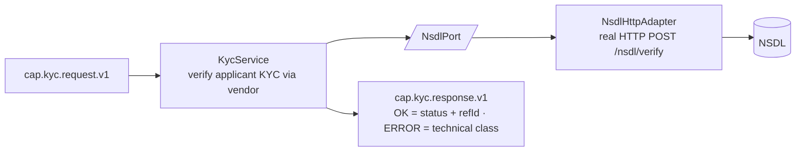

# Capability — `kyc`

| | |
|---|---|
| **One line** | Verify the applicant's KYC against NSDL and return a KYC status + reference id — an integration, it verifies against the vendor, it does not own the record. |
| **Lane** | async engine (Kafka-invoked) |
| **Capability key** | `kyc` |
| **Module** | `capabilities/kyc` |
| **Invoked by** | `loan-origination` journey, node `n_kyc` (`kyc.verify` → `context.kyc`), immediately after `n_customer`. See `orchestration/origination-journey/src/main/resources/journeys/loan-origination.journey.json`. |

## Operations
| operation | reads (input) | writes (output) | meaning |
|---|---|---|---|
| `verify` | `request.payload()` — applicant identity (`pan`, `name`, `dob`, …) | `kycStatus`, `kycRefId` | Verify KYC for the applicant via NSDL and return the vendor's status + reference. |

## Hexagon — ports & adapters

- **Inbound:** the shared-capability shell (`CapabilityFrameworkConfiguration` + `CapabilityDispatcher`) consumes `cap.kyc.request.v1`, runs `verify` **idempotently** (a redelivered request returns the first verification instead of re-calling NSDL), and publishes to `cap.kyc.response.v1`.
- **Domain/service:** `KycService` — owns the one thing: verify the applicant and map the vendor outcome into the response.
- **Out-port(s):** `NsdlPort` → `NsdlHttpAdapter` (real HTTP) / `MockNsdlAdapter` (in-JVM) → NSDL.

## Config (what's data, not code)
`idfc.kyc.nsdl` in `application.yml`: `mode` (`mock`|`real`, default `mock`, env `NSDL_MODE`) selects the adapter; `url` (default `http://localhost:9104`, env `NSDL_URL`) is the NSDL base URL. The adapter is `RestClient.builder().baseUrl(url)` only — **no auth or explicit timeout** is configured here. `mode` defaults to `mock`, so the capability runs on the in-JVM mock unless told otherwise.

## Outcomes & error model
KYC is treated as a **pass-through verification**, not a gate: the journey does **not** branch on `kycStatus` (`n_kyc` → `n_bureau` unconditionally). The mock always returns `VERIFIED`; the real adapter passes the vendor's `status` through (defaulting to `VERIFIED` when absent). Any `RuntimeException` (including an empty body) → `CapabilityStatus.ERROR` with no `ErrorClass`, which `KycCapability.unwrap` promotes to `CapabilityException(PERMANENT)` — so every technical failure classifies **PERMANENT** (no retry → DLQ). `TRANSIENT`/`AMBIGUOUS` are not used.

## Key classes
- `KycCapability` — the `Capability` bean (`key()="kyc"`, one op `verify`); ERROR → `CapabilityException(PERMANENT)`.
- `KycService` — framework-free handler; calls the port, maps `kycStatus`/`kycRefId`.
- `NsdlPort` — out-port to the KYC vendor.
- `NsdlHttpAdapter` — real HTTP adapter (`POST /nsdl/verify`).
- `MockNsdlAdapter` — deterministic in-JVM adapter (`VERIFIED`, `KYC-<pan>`).
- `KycResult` — canonical result record (`status`, `kycRefId`).
- `NsdlProperties` / `KycConfiguration` — config binding + bean wiring (mode → adapter).

## Tests (the proof)
- `KycServiceTest` — locks: `verify` maps `kycStatus=VERIFIED` + `kycRefId=KYC-<pan>`; a failing `NsdlPort` yields `CapabilityStatus.ERROR`; the mock is deterministic.

## Vendor (dev vs real)
Real vendor: **NSDL** (KYC verification). In dev it is either the in-JVM `MockNsdlAdapter` (deterministic from PAN, no infra) or a docker mock on `:9104`. Swap to real with config only: `NSDL_MODE=real` + `NSDL_URL=<host>` — no code change.

---
← [capability index](README.md) · [L3 component view](../03-component.md) · [L4 journeys](../04-journeys.md)
