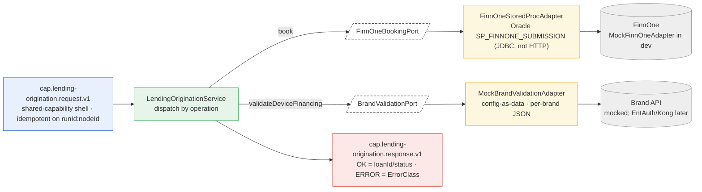

# Capability — `lending-origination`

| | |
|---|---|
| **One line** | Books an **approved** loan in FinnOne (the loan system of record) and returns the LAN; also hosts a config-driven consumer-electronics **EMI brand validation** (BRD §5) as a second, unrelated operation. |
| **Lane** | async engine (Kafka-invoked) |
| **Capability key** | `lending-origination` (`LendingOriginationCapability.key()`) |
| **Module** | `capabilities/lending-origination` |
| **Invoked by** | `loan-origination` journey, node `n_book` (operation `book`) — the terminal step after `scoring.decision == APPROVED`. The `validateDeviceFinancing` operation is **not** referenced by any journey in `orchestration/.../journeys/*.json` today (it is exercised by tests). |

## Operations
`LendingOriginationService.handle` dispatches internally on `request.operation()`; `LendingOriginationCapability` exposes exactly two.

| operation | reads (input) | writes (output) | meaning |
|---|---|---|---|
| `book` | `collectedResults` + `payload` merged (`applicationRef`, `crn`, …; payload wins) | `{loanId, status}` (journey binds to `context.loan`) | Book the loan in FinnOne for an approved application; `loanId` is the FinnOne LAN, `status` e.g. `BOOKED`. The result key **must** be exactly `loanId`. |
| `validateDeviceFinancing` | `payload.brand`, `payload.devicePayload` | `{brand, pass:"Y"|"N", rule}` | **BRD §5** pre-disbursement EMI validation against a consumer-electronics brand API. Config-as-data (`brand-config/<brand>.json` `passLogic: fieldPath equals value`). **Unrelated to booking**, and **not** the standalone `device-validation` capability — it is lending-origination's own operation. |

## Hexagon — ports & adapters

- **Inbound:** the `shared-capability` framework (`CapabilityFrameworkConfiguration`, auto-configured because a `Capability` bean is present) consumes `cap.lending-origination.request.v1`, runs the **idempotent** `CapabilityDispatcher`, and publishes to `cap.lending-origination.response.v1`. Idempotency is the whole point here: a redelivered booking (Kafka is at-least-once) must return the **first** booking's result — never re-run the stored proc.
- **Domain/service:** `LendingOriginationService` — framework-free; `book` assembles the application map (`collectedResults` + `payload`) and calls `FinnOneBookingPort.book`; `validateDeviceFinancing` calls `BrandValidationPort.validate`. Any `RuntimeException` → `CapabilityStatus.ERROR`.
- **Out-port(s):** `FinnOneBookingPort` → `MockFinnOneAdapter` (dev) / `FinnOneStoredProcAdapter` (real) → **FinnOne**; `BrandValidationPort` → `MockBrandValidationAdapter` → **brand API** (mocked).

## Config (what's data, not code)
- `idfc.lending-origination.finnone.mode` (`FINNONE_MODE`, default `mock`) — `FinnOneProperties` selects the adapter. `real` → `FinnOneStoredProcAdapter` over `spring.datasource.*` (Oracle, `oracle.jdbc.OracleDriver`; the `DataSource` is a `@Lazy` bean resolved only in real mode, so mock mode starts with no datasource). `mock` → `MockFinnOneAdapter` (deterministic `LN-<applicationRef>`).
- **Brand validation is config-as-data:** `brand-config/<brand>.json` with `passLogic {fieldPath, equals}`. **Adding a brand is a new JSON file, not code.** A missing/blank brand or absent config **throws** (fail closed) → mapped to `ERROR`.
- Idempotency store: no override, so the shared `InMemoryCapabilityIdempotencyStore` default applies (key = `idempotencyKey`, else `journeyInstanceId:nodeId`).

## Outcomes & error model
- **Business vs technical:** `book` OK → `{loanId, status:"BOOKED"}`; `validateDeviceFinancing` OK → `{pass:"Y"|"N", …}` — a `pass:"N"` is a **business** outcome (`OK`), not a failure.
- **Failure classification:** `book` failure (FinnOne down / SP error) and an unknown brand are caught as `RuntimeException` and returned `ERROR`; the service sets **no** `ErrorClass`, so `LendingOriginationCapability.unwrap` throws `CapabilityException` defaulting to **`PERMANENT`** → the engine fails the journey. (This capability does not currently classify `TRANSIENT`.)
- **Idempotency (the money guard):** a redelivered `book` returns the first result via the idempotency store; **FinnOne is invoked exactly once** — proven by `FinnOneBookingRedeliveryTest`. Undeserializable input → `PoisonMessageException` → `<topic>.dlq`.
- **Journey-level policy on `n_book`** (in `loan-origination.journey.json`, enforced by the engine, not this capability): a **concurrency meter** `pool: finnone_pool` (`maxConcurrent: 20`) bounds FinnOne stored-proc load (back-pressure; the rest wait in Kafka); `onFailure: compensate`; and a declared `compensation { operation: "reverseBooking", input: "{ loanId: context.loan.id }" }`. **Faithful caveat:** the capability implements only `book` + `validateDeviceFinancing` — there is **no `reverseBooking` operation** here. As `loan-origination` is written, `n_book`'s own failure never completes the node, so the saga has nothing to undo and `reverseBooking` is never dispatched (see `MANUAL_TEST_GUIDE.md`).

## Key classes
- `LendingOriginationCapability` — the `Capability` bean: `key()` + operations `book`, `validateDeviceFinancing`.
- `LendingOriginationService` — dispatch + `book` + `validateDeviceFinancing`, application assembly, `ERROR` mapping.
- `FinnOneBookingPort` + `MockFinnOneAdapter` / `FinnOneStoredProcAdapter` (`SP_FINNONE_SUBMISSION`, JDBC `CallableStatement`); `LoanBooking` (LAN + status).
- `BrandValidationPort` + `MockBrandValidationAdapter` (config-as-data brand rules).
- `FinnOneProperties`, `LendingOriginationConfiguration` (port wiring, lazy real-mode `DataSource`).

## Tests (the proof)
- `FinnOneBookingRedeliveryTest` — real context over an embedded broker: the same request delivered twice yields two `OK` responses with the **same** `loanId`, but `SP_FINNONE_SUBMISSION` executes **exactly once** (the money assertion).
- `LendingOriginationServiceTest` — `book` maps `loanId`/`status`; a FinnOne failure → `ERROR`; the mock adapter is deterministic.
- `BrandValidationTest` — `samsung-upgrade` with `Status:"0"` → `pass:"Y"`, `brand:"SAMSUNG"`; non-zero → `pass:"N"`; unknown brand → `ERROR`; the booking path still works.
- `LendingOriginationApplicationTests` — context loads (mock mode, no datasource).

## Vendor (dev vs real)
Real vendors: **FinnOne** — an Oracle **stored procedure** (`SP_FINNONE_SUBMISSION`) over JDBC, **not** HTTP — and a consumer-electronics **brand API** (real EntAuth/Kong + transforms are a later step). Dev uses `MockFinnOneAdapter` and `MockBrandValidationAdapter` (JSON rules). Swap FinnOne with `FINNONE_MODE=real` + `spring.datasource.*`; the domain never knows which adapter is wired.

---
← [capability index](README.md) · [L3 component view](../03-component.md) · [L4 journeys](../04-journeys.md)
