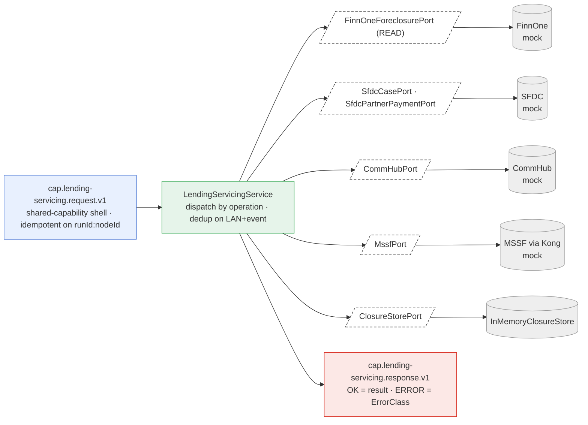

# Capability — `lending-servicing`

| | |
|---|---|
| **One line** | Post-origination loan **closure/servicing** (BRD §4): process matured/closed loans, excess-amount handling, batch foreclosure, and Maruti (MSSF) loan/doc status — it **reads FinnOne and writes SFDC cases, never books**. |
| **Lane** | async engine (Kafka-invoked) |
| **Capability key** | `lending-servicing` (`LendingServicingCapability.key()`) |
| **Module** | `capabilities/lending-servicing` |
| **Invoked by** | **No journey** in `orchestration/.../journeys/*.json` references `lending-servicing` today. The capability is fully wired on the shared shell (it would consume `cap.lending-servicing.request.v1`) but is **not yet orchestrated** by any DAG in this repo. |

> **Substantive logic, all-mock edges.** The service is real and moderately rich (5 operations, dedup, read-then-create-case), but **every out-adapter is a mock** and no real vendor is integrated yet — the real FinnOne-READ / SFDC / CommHub / MSSF-via-Kong are config-driven later steps (§10).

## Operations
`LendingServicingCapability` maps five §7 operations to `LendingServicingService` methods. `lan`/`loanRef` are required (missing → `PERMANENT`).

| operation | reads (input) | writes (output) | meaning |
|---|---|---|---|
| `processMaturedLoan` | `payload.lan` | `{lan, status:"MATURED"}` or `{…, duplicate:true}` | Record a matured loan; dedup on `lan+"matured"`. |
| `processClosedLoan` | `payload.lan` | `{lan, status:"SFDC_CREATED", sfdcCaseId}` or `{…, duplicate:true}` | Create the SFDC closure case; idempotent on `lan+"closed"`. |
| `processExcessAmount` | `payload.lan` | `{lan, partnerPayment, notified}` | If there is **no** partner payment, notify CommHub. |
| `batchClosure` | `payload.lan` | `{lan, status:"SFDC_CREATED"|"VALIDATION_FAILED", foreclosureAmount, sfdcCaseId?}` | READ FinnOne foreclosure amount; `> 0` fails validation, else create the SFDC case. |
| `getMaruti` | `payload.loanRef`, `payload.kind` (default `LOAN_STATUS`) | `{loanRef, kind, result}` | Maruti loan/doc status via the MSSF adapter (BRD §4a). |

## Hexagon — ports & adapters

- **Inbound:** the `shared-capability` framework (`CapabilityFrameworkConfiguration`, triggered by the `Capability` bean) consumes `cap.lending-servicing.request.v1`, runs the idempotent `CapabilityDispatcher`, and publishes to `cap.lending-servicing.response.v1` — zero per-capability Kafka code.
- **Domain/service:** `LendingServicingService` — dedups on `LAN+event` via `ClosureStorePort.insertIfAbsent`, reads FinnOne, creates SFDC cases, notifies CommHub, calls MSSF; `required()` throws `CapabilityException(PERMANENT)` for a missing field.
- **Out-port(s):** `FinnOneForeclosurePort` (`foreclosureAmount`, READ) · `SfdcCasePort` (`createClosureCase`) · `SfdcPartnerPaymentPort` (`hasPartnerPayment`) · `CommHubPort` (`notify`) · `MssfPort` (`call`) · `ClosureStorePort` (`insertIfAbsent`/`save`). All six are satisfied by `MockServicingAdapters` (+ `InMemoryClosureStore`).

## Config (what's data, not code)
`application.yml` is intentionally minimal — server port, app name, actuator, logging; **no `idfc.*` rows, no vendor URLs**, because every external is a mock bean. The mock behaviour is deterministic-by-convention: FinnOne foreclosure returns `0` (closeable) unless the LAN contains `DUE` (→ `1500`); partner payment is `true` only if the LAN contains `PAID`; SFDC case id = `CASE-<lan>`; MSSF returns a canned map. The shared `InMemoryCapabilityIdempotencyStore` provides exactly-once at the shell; the service adds its own `LAN+event` dedup on top. Real FinnOne-READ / SFDC / CommHub / MSSF-via-Kong (token → AES → POST → decrypt) are config-driven later steps.

## Outcomes & error model
- **Business results:** `MATURED`, `SFDC_CREATED`, `VALIDATION_FAILED`, `duplicate:true`, and CommHub `notified` are all **business outcomes** (`OK`) — a duplicate event or a foreclosure that fails validation is **not** a technical failure.
- **`ErrorClass`:** a missing required field → `CapabilityException(PERMANENT)`; any other exception is treated as `PERMANENT` by the shared `CapabilityDispatcher`. No `TRANSIENT` path exists yet (all edges are in-memory mocks). `ClosureStatus.ERROR` is defined but not currently emitted by the service.
- **Idempotency (two layers):** the shell runs each request once per idempotency key, **and** the service dedups on `LAN+event`, so a redelivered closed-loan event creates the SFDC case exactly once. Undeserializable input → `PoisonMessageException` → DLQ via the shell. There is no capability-specific meter/compensation/DLQ wiring, since no journey drives it yet.

## Key classes
- `LendingServicingCapability` — the `Capability` bean: `key()` + five operations.
- `LendingServicingService` — the servicing logic (read FinnOne, create SFDC case, notify, dedup).
- `ClosureRecord` / `ClosureStatus` — the closure record (keyed by `LAN+event`) and its state enum.
- `FinnOneForeclosurePort`, `SfdcCasePort`, `SfdcPartnerPaymentPort`, `CommHubPort`, `MssfPort`, `ClosureStorePort` — the six out-ports.
- `MockServicingAdapters` (the only vendor impls) + `InMemoryClosureStore`.

## Tests (the proof)
- `LendingServicingServiceTest` — `batchClosure` creates a case when foreclosure amount is `0` and returns `VALIDATION_FAILED` when the LAN is `DUE`; `processClosedLoan` is idempotent on the LAN (SFDC case created **once**); `processExcessAmount` notifies CommHub only when there is no partner payment; `getMaruti` routes through MSSF.

## Vendor (dev vs real)
Real vendors (later): **FinnOne** (READ), **SFDC** (closure cases + partner-payment lookup), **CommHub** (notifications), and **MSSF** reached via **Kong** (Kong token → AES-encrypt → POST → decrypt) for Maruti. Dev uses `MockServicingAdapters` + `InMemoryClosureStore` for all six ports. Swap = provide real adapter beans behind the same ports (config-driven, §10); the service is untouched.

---
← [capability index](README.md) · [L3 component view](../03-component.md) · [L4 journeys](../04-journeys.md)
