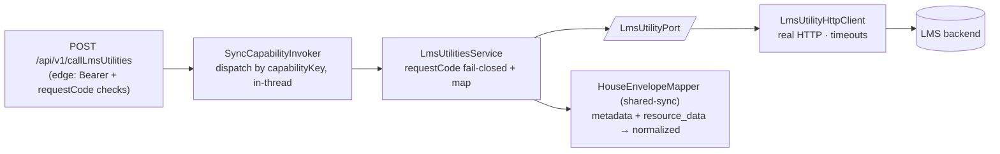

# Capability — `lms-utilities`

| | |
|---|---|
| **One line** | Real-time LMS query (e.g. a customer's pre-approved loan offer), selected by a request code. |
| **Lane** | **sync** (in-thread — the caller blocks for the result) |
| **Capability key** | `lms-utilities` |
| **Module** | `capabilities/lms-utilities` (a **library**, not a standalone service) |
| **Invoked by** | the digital edge's `LmsUtilitiesController` (`POST /api/v1/callLmsUtilities`, source `SAVEIN`) via `SyncCapabilityInvoker` |

## Operations

The `requestCode` **is** the operation (config-dispatched, not a code switch).

| requestCode | reads (input) | writes (output) | meaning |
|---|---|---|---|
| `OFFER_CHECK` | `entityName`, `agreementId`, `crnNo`, `requestCode` | `{status, message, resourceData[]}` | return the pre-approved offer row(s) |
| *(siblings)* | — | — | balance / foreclosure / schedule — **add a config row + a stub**, no code |
| *(unknown)* | — | — | **fails closed → 422**, never reaches the backend |

## Hexagon — ports & adapters

- **Inbound:** the edge controller — fail-closed Bearer + `requestCode`-required, then `SyncCapabilityInvoker.invoke("lms-utilities", requestCode, …)`.
- **Domain/service:** `LmsUtilitiesService` (implements `SyncInvocable`) — validates the requestCode against `known-request-codes` (fail closed), calls the port, maps the house envelope.
- **Out-port:** `LmsUtilityPort` → `LmsUtilityHttpClient` → LMS backend. Response normalized by the **shared** `HouseEnvelopeMapper` (reused across LMS, Karza, future services).

## Config (what's data, not code)

- `lms-utilities.vendor-base-url`, `vendor-auth-token`, `connect/read-timeout-ms`.
- `lms-utilities.known-request-codes` — the allow-list of supported codes (dispatch is data). Unknown → 422 fail closed.
- Edge Bearer allow-list `idfc.sync-edge.auth.accepted-tokens` (shared with imps-disbursal).

## Outcomes & error model

- **SUCCESS + rows** → 200 with `resourceData`.
- **SUCCESS + empty `resource_data`** → a legitimate business **"no offer"** — a clean empty result (200), **not** an error.
- **unknown `requestCode`** → **422** (`UNKNOWN_REQUEST_CODE`), fail closed, backend never called.
- **timeout / 5xx** → uniform **502** + `errorClass`.

## Key classes

- `LmsUtilitiesService` — the sync use case (requestCode fail-closed + house-envelope mapping).
- `LmsUtilityPort` / `LmsUtilityHttpClient` — the vendor out-port + real HTTP adapter.
- `LmsRequest` — the typed request (`entityName`, `agreementId`, `crnNo`, `requestCode`).
- `LmsUtilitiesProperties` — vendor config + `knownRequestCodes` (+ `isKnown`).
- `LmsUtilitiesModule` — the `@Configuration` the digital edge `@Import`s.
- `HouseEnvelopeMapper` (`shared-sync`) — the `{metadata, resource_data[]}` normalizer, shared with Karza.

## Tests (the proof)

- `LmsUtilitiesServiceTest` — OFFER_CHECK success; empty-`resource_data` is a clean no-offer (not an error); unknown requestCode fails closed and never calls the backend; a technical failure propagates.
- `DigitalSyncLaneIT` (edge) — end-to-end: offer / no-offer / unknown-requestCode(422) / fail-closed auth.

## Vendor (dev vs real)

Real LMS backend; in dev the WireMock **mock-lms** (`:9111`) — only the DATA is mocked. Lever: `crnNo` = `NO-OFFER-CRN` → the empty-offer case. Real backend later = a host-config swap.

---
← [capability index](README.md) · [L3 component view](../03-component.md) · [L4 journeys](../04-journeys.md)
