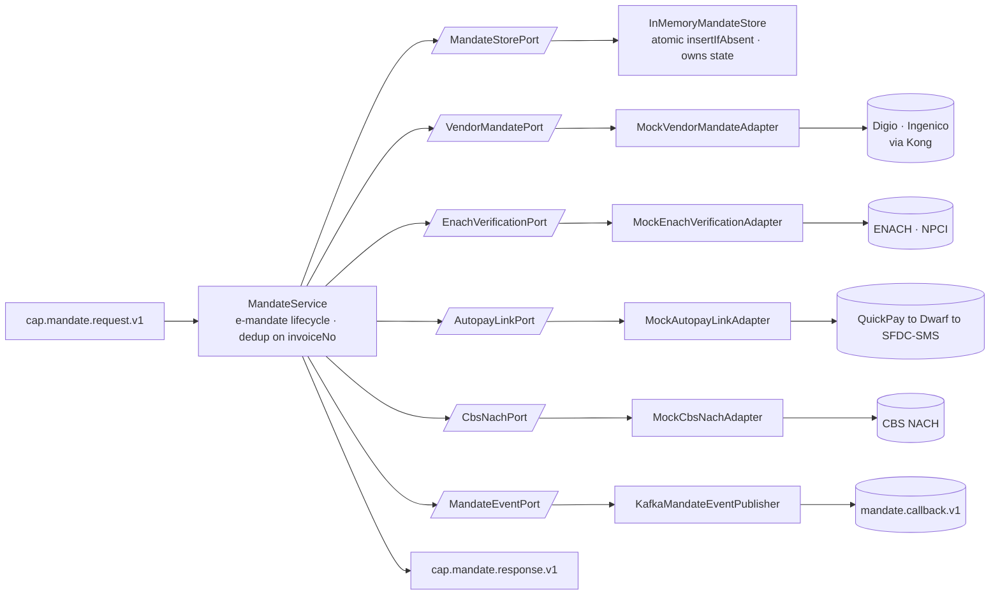

# Capability — `mandate`

| | |
|---|---|
| **One line** | The e-mandate (NACH / e-NACH autopay) lifecycle for loan-repayment collection: register a mandate with the vendor, verify it, set up **and** deliver the autopay link, and cancel a mandate. |
| **Lane** | async engine (Kafka-invoked) |
| **Capability key** | `mandate` |
| **Module** | `capabilities/mandate` |
| **Invoked by** | `emandate-autopay-setup.journey.json` — node `n_setup` → `setupAutopayLink`; and `emandate-cancel.journey.json` — node `n_cancel` → `cancel`, then a `branch` on `context.cancel.found` (`MandateCancelled` vs a `rejected` `MandateNotFound`). The other three operations (`register`, `verifyEnach`, `handleVendorCallback`) are part of the capability's lifecycle but are **not** wired into a shipped journey today. |

## Operations
| operation | reads (input) | writes (output) | meaning |
|---|---|---|---|
| `register` | `payload.invoiceNo`, `payload.vendor` (`DIGIO` default \| `INGENICO`) | `invoiceNo`, `registrationRef`, `status` (`PENDING`), `duplicate` | Atomic dedup on `invoiceNo` via `insertIfAbsent`; **only the winner calls the vendor**, persists `PENDING`. A redelivery returns the prior result with `duplicate:true`. |
| `verifyEnach` | `payload.invoiceNo` | `invoiceNo`, `enachStatus` | Verify the e-NACH mandate via ENACH Elite Services / NPCI. |
| `setupAutopayLink` | `payload.invoiceNo` | `invoiceNo`, `autopayLink`, `sent` (`true`) | Build **and** deliver the autopay link: QuickPay (UPI intent) → Dwarf (shorten) → SFDC-SMS (send), as one chained step. |
| `cancel` | `payload.invoiceNo` | `invoiceNo`, `found`, `cancelled` | CBS `EnquireNACHMandate`; if found → `CreateNACHMandate(cancel)` and mark the txn `FAILURE`. `found` drives the journey `branch`. |
| `handleVendorCallback` | `payload.invoiceNo`, `payload.status` | `invoiceNo`, `status`, `processed` | Decrypt (mocked) → update lifecycle state → emit the `MandateCallback` event (correlation = `invoiceNo`). |

## Hexagon — ports & adapters

- **Inbound:** the shared `shared-capability` shell consumes `cap.mandate.request.v1`, runs idempotent dispatch on `runId+nodeId`, and publishes `cap.mandate.response.v1`.
- **Domain/service:** `MandateService` owns the mandate lifecycle state (keyed by `invoiceNo`) and the "call the vendor exactly once" decision.
- **Out-port(s):** `VendorMandatePort` → `MockVendorMandateAdapter` → Digio/Ingenico (via Kong); `EnachVerificationPort` → `MockEnachVerificationAdapter` → ENACH/NPCI; `AutopayLinkPort` → `MockAutopayLinkAdapter` → QuickPay/Dwarf/SFDC-SMS; `CbsNachPort` → `MockCbsNachAdapter` → CBS NACH; `MandateStorePort` → `InMemoryMandateStore` (owned state); `MandateEventPort` → `KafkaMandateEventPublisher` → `mandate.callback.v1`.

## Config (what's data, not code)
`server.port` `8098`; `idfc.mandate.callback-topic` = `mandate.callback.v1` (env `MANDATE_CALLBACK_TOPIC`). **Every vendor is mocked locally today** (Digio/Ingenico via Kong, ENACH/NPCI, QuickPay, Dwarf, SFDC-SMS, CBS-NACH) — there are no real vendor URLs / auth / timeouts yet; "real wiring is a config-driven later step," and the real HTTP-over-Kong + JWE encryption swaps in behind the existing ports without touching `MandateService`.

## Outcomes & error model
A business result (`status` `PENDING`/`SUCCESS`/`FAILURE`; `cancel.found` true/false → journey branch; a not-found cancel is a `rejected` terminal, not an error) is never conflated with a technical failure. Technical failures raise `CapabilityException(ErrorClass)`: an unknown `vendor` or a blank/missing `invoiceNo` → **PERMANENT** (fail closed). The dedup gate is the whole point for a money-adjacent registration — `insertIfAbsent` on `invoiceNo` means a concurrent/redelivered `register` calls the vendor **exactly once**. `MandateCallback` is published with confirmed delivery (`KafkaDelivery.confirm`) so a lost callback surfaces rather than being silently swallowed.

## Key classes
- `MandateCapability` — the `Capability` bean; maps `key()="mandate"` and the five operations to `MandateService` methods.
- `MandateService` — the lifecycle brain; dedup, state transitions, port orchestration.
- `MandateTransaction` / `MandateStatus` / `Vendor` — the owned state model.
- `InMemoryMandateStore` (`MandateStorePort`) — atomic `putIfAbsent` dedup gate; a durable Aerospike `CREATE_ONLY` variant swaps in behind the port.
- `KafkaMandateEventPublisher` (`MandateEventPort`) — confirmed `MandateCallback` emit.
- `MockVendorMandateAdapter` / `MockEnachVerificationAdapter` / `MockAutopayLinkAdapter` / `MockCbsNachAdapter` — the mocked vendor edges.

## Tests (the proof)
- `MandateServiceTest` — per-operation behaviour: `register` persists `PENDING` and is idempotent on `invoiceNo` (vendor called once across two registers); `cancel` branches on the CBS enquiry; `handleVendorCallback` updates state and emits exactly one `MandateCallback`.
- `MandateRegisterIdempotencyTest` — 32 threads register the **same** `invoiceNo`; the atomic insert admits one winner so the vendor is registered **exactly once** ("the whole ballgame" for a money-adjacent registration).

## Vendor (dev vs real)
All mandate vendors are mocked in-process today (deterministic refs; `MISSING`/`REJECT` markers drive the mock branches). Each real vendor swaps in by implementing the same out-port (`VendorMandatePort`, `EnachVerificationPort`, `AutopayLinkPort`, `CbsNachPort`) with a real Kong/HTTP client + config; state moves off-heap by swapping `InMemoryMandateStore` for the Aerospike variant. No business logic changes.

---
← [capability index](README.md) · [L3 component view](../03-component.md) · [L4 journeys](../04-journeys.md)
