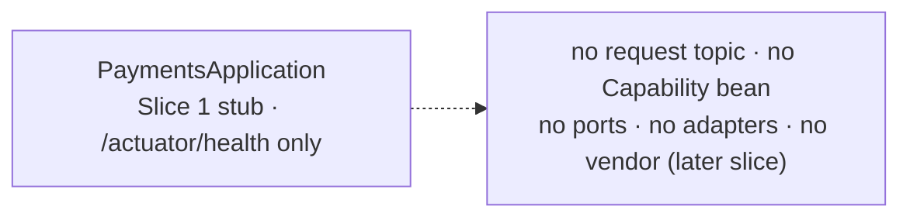

# Capability — `payments`

> **Thin / reference — a Slice 1 stub.** This module is an honest placeholder: a runnable Spring Boot app that serves `/actuator/health` and nothing else. **No `Capability` bean, no Kafka consumer, no operations, no ports, no vendor.** The real payments capability arrives in a later slice. The page is short by design.

| | |
|---|---|
| **One line** | Reserved `payments` capability — a Slice 1 runnable stub (health/actuator only); no business logic yet. |
| **Lane** | none yet — it does not participate in the async engine lane. It is a bare Spring Boot process (later: "payments: Kafka-only; endpoints/rails wired in a later slice"). |
| **Capability key** | none — no `Capability` bean is declared. The intended key is `payments` (the module/app name). |
| **Module** | `capabilities/payments` |
| **Invoked by** | nothing — not referenced by any journey or routing row. |

## Operations
| operation | reads (input) | writes (output) | meaning |
|---|---|---|---|
| — (none) | — | — | Slice 1 stub — no operations implemented yet. |

## Hexagon — ports & adapters

- **Inbound:** none — no capability request topic is consumed.
- **Domain/service:** none — `PaymentsApplication` starts the context and exposes actuator health.
- **Out-port(s):** none.

## Config (what's data, not code)
`server.port` `8096`; actuator exposure locked to `health,info,prometheus` (no env/heapdump). The `local` profile points Kafka at `localhost:29092`; the `eks` profile notes "payments: Kafka-only; endpoints (rails) wired in a later slice." No vendor URL, auth, or timeouts exist yet.

## Outcomes & error model
n/a — no business logic. The process only answers health probes.

## Key classes
- `PaymentsApplication` — the Slice 1 stub (`@SpringBootApplication`, no beans of its own).

## Tests (the proof)
- `PaymentsApplicationTests` — a framework-free placeholder asserting the stub module/package is present (kept trivial so the stub builds fast and deterministically).

## Vendor (dev vs real)
None yet. Real payment rails and the vendor adapter arrive in a later slice (`build.gradle.kts` marks it a "Slice 1 stub"; see `docs/SLICE1_PUNCH_LIST.md` scope fence).

---
← [capability index](README.md) · [L3 component view](../03-component.md) · [L4 journeys](../04-journeys.md)
