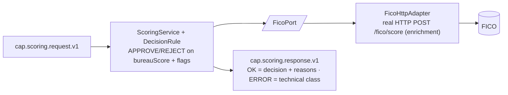

# Capability — `scoring`

| | |
|---|---|
| **One line** | The credit **decisioning** capability — combine the upstream bureau score with negative flags (plus a FICO enrichment) and produce `APPROVED`/`REJECTED` with reasons. The journey's branch routes on this. |
| **Lane** | async engine (Kafka-invoked) |
| **Capability key** | `scoring` |
| **Module** | `capabilities/scoring` |
| **Invoked by** | `loan-origination` journey, node `n_score` (`scoring.decide` → `context.scoring`); the next node `n_decide` (branch) routes on `context.scoring.decision == 'APPROVED'`. See `orchestration/origination-journey/src/main/resources/journeys/loan-origination.journey.json`. |

## Operations
| operation | reads (input) | writes (output) | meaning |
|---|---|---|---|
| `decide` | `collectedResults["bureau"].bureauScore` (upstream bureau node), `payload.negativeFlags[]`, `payload` (→ FICO) | `decision` (`APPROVED`/`REJECTED`), `score` (= bureau score), `reasons[]` | Decide the credit outcome: `APPROVED` iff `bureauScore >= threshold` **and** no negative flags, else `REJECTED`. |

## Hexagon — ports & adapters

- **Inbound:** the shared-capability shell (`CapabilityFrameworkConfiguration` + `CapabilityDispatcher`) consumes `cap.scoring.request.v1`, runs `decide` **idempotently** (a redelivered request returns the first decision instead of re-deciding), and publishes to `cap.scoring.response.v1`.
- **Domain/service:** `ScoringService` orchestrates (reads the upstream bureau score, calls FICO, applies the rule); `DecisionRule` is the **pure** in-house decision — the heart, unit-tested in isolation with no framework or I/O.
- **Out-port(s):** `FicoPort` → `FicoHttpAdapter` (real HTTP) / `MockFicoAdapter` (in-JVM) → FICO. FICO is **enrichment only** — its score is appended to `reasons` as `fico=<n>`; it does **not** drive the APPROVE/REJECT decision.

## Config (what's data, not code)
`idfc.scoring` in `application.yml`: `threshold` (default `700`, env `SCORING_THRESHOLD`) is the bureau-score cutoff — the decision boundary is **data, not code**; `fico-mode` (`mock`|`real`, default `mock`, env `FICO_MODE`) selects the FICO adapter; `fico-url` (default `http://localhost:9103`, env `FICO_URL`). The real adapter is `RestClient.builder().baseUrl(url)` only — **no auth or explicit timeout** configured here.

## Outcomes & error model
A **`REJECTED` is a business outcome, not a failure** — it is returned as a normal `CapabilityStatus.OK` response (`decision=REJECTED`, with `reasons`), never paged; the journey's `n_decide` branch declines it. **Fail-closed default:** a missing upstream bureau result reads `bureauScore = 0`, which is below any threshold → `REJECTED` (it never defaults to approve). A **technical** failure is different: because FICO is called before the rule, a FICO outage throws a `RuntimeException` → `CapabilityStatus.ERROR`, promoted by `ScoringCapability.unwrap` to `CapabilityException(PERMANENT)` — so the node fails **PERMANENT** (no retry → DLQ) even though FICO is only enrichment. `TRANSIENT`/`AMBIGUOUS` are not used.

## Key classes
- `ScoringCapability` — the `Capability` bean (`key()="scoring"`, one op `decide`); ERROR → `CapabilityException(PERMANENT)`.
- `ScoringService` — reads `collectedResults["bureau"].bureauScore` + `payload.negativeFlags`, calls FICO, applies the rule, enriches reasons.
- `DecisionRule` — the pure decision (`APPROVED` iff `bureauScore >= threshold` and flags empty, else `REJECTED`); `score` on the decision is the bureau score.
- `ScoringDecision` — result record (`decision`, `score`, `reasons`) with `APPROVED`/`REJECTED` constants.
- `FicoPort` — enrichment out-port; `FicoHttpAdapter` (`POST /fico/score`), `MockFicoAdapter` (fixed `750`).
- `ScoringProperties` / `ScoringConfiguration` — config binding (threshold + FICO) + bean wiring.

## Tests (the proof)
- `DecisionRuleTest` — parameterized truth table: `780`→APPROVED, `540`→REJECTED, `700` (exactly at threshold)→APPROVED, `820` **with** `FRAUD_HIT`→REJECTED; flags surfaced in `reasons`; null flags treated as empty.
- `ScoringServiceTest` — approve when bureau score meets threshold; reject when below; reasons enriched with `fico=750`; **missing bureau result → score 0 → REJECTED**; a failing `FicoPort` → `CapabilityStatus.ERROR`.

## Vendor (dev vs real)
Real vendor: **FICO** (score enrichment). In dev it is either the in-JVM `MockFicoAdapter` (constant `750`, no infra) or a docker mock on `:9103`. Swap to real with config only: `FICO_MODE=real` + `FICO_URL=<host>`. Note the **decision itself is in-house** (`DecisionRule` on bureau score + flags + threshold) — FICO is a swappable enrichment, not the decision engine.

---
← [capability index](README.md) · [L3 component view](../03-component.md) · [L4 journeys](../04-journeys.md)
