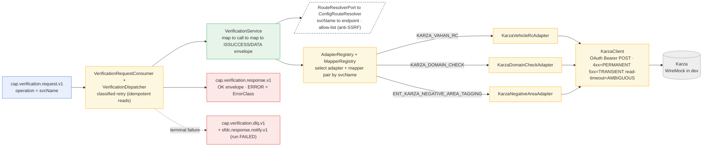

# Capability — `verification`

| | |
|---|---|
| **One line** | Runs one external identity/asset verification by `svcName` (Karza vehicle-RC, email-domain, negative-area): maps the run context into the vendor request, calls the **control-plane-resolved** endpoint, and returns the universal `{ISSUCCESS, DATA}` envelope the journey branches on. |
| **Lane** | async engine (Kafka-invoked) |
| **Capability key** | `verification` (topic key). Note: verification does **not** register a shared `Capability` bean — it wires its **own** consumer + dispatcher (below), but still uses the `cap.verification.*` topic convention. |
| **Module** | `capabilities/verification` |
| **Invoked by** | Three single-task journeys, each one `svcName`: `vehicle-rc-verification` (`n_vehicleRc` → `KARZA_VAHAN_RC`), `domain-check-verification` (`n_domainCheck` → `KARZA_DOMAIN_CHECK`), `negative-area-verification` (`n_negativeArea` → `ENT_KARZA_NEGATIVE_AREA_TAGGING`). The engine sends the `svcName` as the request `operation`. |

## Operations
Here the request **`operation` _is_ the `svcName`**. Each is one route row + one adapter + one mapper pair.

| operation (`svcName`) | reads (input) | writes (output) | meaning |
|---|---|---|---|
| `KARZA_VAHAN_RC` | `registrationNumber` (or `reg_no`), `consent`; mapper adds `version:1.0` | `context.vehicleRc` = `{ISSUCCESS, DATA:{Status, result:[{requestId, statusCode, timeStamp, result}]}}` | Karza VAHAN vehicle-RC lookup. Branch proceeds when `result[0].result.rcStatus == ACTIVE && blackListStatus == CLEAR`. |
| `KARZA_DOMAIN_CHECK` | `organizationName`, `individualName`, `email` (or `emailId`), `consent` | `context.domainCheck` = same envelope shape | Email/organisation domain legitimacy. Branch proceeds when `result == true && data.disposable == false && …org_domain_match[0].match == true`. |
| `ENT_KARZA_NEGATIVE_AREA_TAGGING` | address context (journey passes `addressId`), `consent` | `context.negativeArea` = same envelope shape | Address negative-area risk. Branch proceeds when `result[0].result.is_negative == false`. |
| `ECHO` | any payload | `{echoed, resolvedEndpoint}` | Step-1 shell proof (no vendor) — echoes the mapped request and the **control-plane** endpoint. |

## Hexagon — ports & adapters

- **Inbound:** `VerificationRequestConsumer` (`@KafkaListener` on `cap.verification.request.v1`, group `cap-verification`) → `VerificationDispatcher` → `KafkaVerificationResultPublisher` to `cap.verification.response.v1`. Unlike the other capabilities it does **not** ride the generic `shared-capability` shell — it owns its retry/DLQ/notify path.
- **Domain/service:** `VerificationService.verify(svcName, payload)` — resolve route (control plane + allow-list), select adapter by `svcName` (`AdapterRegistry`), select mapper pair by `svcName` (`MapperRegistry`), `requestMapper.map` → `adapter.call` → `responseMapper.map` → `VerificationEnvelope.success`. **No decision beyond mapping** — approve/decline is the journey branch.
- **Out-port(s):** `RouteResolverPort` → `ConfigRouteResolver`; `VerificationAdapter` (per-`svcName`) → `KarzaVehicleRcAdapter` / `KarzaDomainCheckAdapter` / `KarzaNegativeAreaAdapter` (thin over `KarzaClient`) + `EchoVerificationAdapter` → **Karza**; `TokenProviderPort` → `MockOAuthTokenProvider`; `VerificationDlqPort` → `KafkaVerificationDlqPublisher`; `SfdcNotifyPort` → `KafkaSfdcNotifyPublisher`.

## Config (what's data, not code)
`VerificationProperties` (`idfc.verification.*` in `application.yml`) — all config-as-data:
- **Routes** (`routes[]`, `svcName → base-url + auth-type`): `ECHO`/`NONE`, `KARZA_VAHAN_RC`/`OAUTH_BEARER`, `KARZA_DOMAIN_CHECK`/`OAUTH_BEARER`, `ENT_KARZA_NEGATIVE_AREA_TAGGING`/`OAUTH_BEARER`. The endpoint is **ours**, never taken from the inbound message (a `route-config` registry swaps in behind `RouteResolverPort` later).
- **Allow-list** (`allowed-hosts`: `echo.mock`, `mock-karza`, `karza.mock`, `imps.mock`) — anti-SSRF; the resolved host must be listed.
- **Retry** (`RetryPolicy.idempotentReads`): `max-attempts 3`, `backoff 200ms`, `max-backoff 5000ms`, `jitter true`.
- **HTTP timeouts** (`idfc.verification.http.*`): connect `3000ms`, read `20000ms` (well under the Kafka poll interval).
- **Egress topics**: `dlq-topic = cap.verification.dlq.v1`, `sfdc-notify-topic = sfdc.response.notify.v1`.
- **Fail closed:** unknown `svcName` (no route row) → `NO_ROUTE`; resolved host not allow-listed → `TARGET_NOT_ALLOWED`; no adapter for `svcName` → `NO_ADAPTER` — all `PERMANENT`, never a silent default. Adding a `svcName` = a route row + an adapter bean + a mapper-pair registration.

## Outcomes & error model
- **Business result vs technical failure:** a `200` vendor body → `{ISSUCCESS:"True", DATA}`; a **decline is not here** — it is a `200` the journey branch declines on. `VerificationDlqTest` proves a business decline stays `OK` and never touches DLQ/notify.
- **`ErrorClass`** is set by `KarzaClient`: `4xx → PERMANENT`, `5xx → TRANSIENT`, read-timeout → `AMBIGUOUS`, connect/IO → `TRANSIENT`, empty body → `PERMANENT`; resolver/registry throw `PERMANENT`.
- **Retry (classified, not blind):** verifications are **idempotent reads**, so `TRANSIENT` **and** `AMBIGUOUS` retry with exponential backoff + jitter to `max-attempts`; `PERMANENT` fails fast.
- **Terminal technical failure fails closed:** DLQ the full request to `cap.verification.dlq.v1` (durable, replay by new correlationId) **and** notify SFDC on `sfdc.response.notify.v1` (`outcome:"FAILED"`) — the run FAILs, never a silent ack. An undeserializable record → `PoisonMessageException` → raw-record DLQ via the container error handler.

## Key classes
- `VerificationService` — the one verification: resolve → select → map → call → map → envelope.
- `VerificationDispatcher` — classified retry, then DLQ + SFDC-notify on terminal failure.
- `VerificationRequestConsumer` — inbound Kafka listener (its own, not the shared shell).
- `ConfigRouteResolver` (`RouteResolverPort`) — control-plane `svcName → endpoint` + allow-list.
- `AdapterRegistry` / `MapperRegistry` / `MapperPair` — `svcName`-keyed adapter & mapper routing (unregistered mapper → passthrough).
- `KarzaClient` — shared OAuth POST + transport-error classification for every `KARZA_*` adapter.
- `Karza{VahanRc,DomainCheck,NegativeArea}Adapter` + their request/response mappers; `Karza*Registration` register each pair.
- `VerificationEnvelope` — the `{ISSUCCESS, ERROR, DATA}` shape; `VerificationProperties` — the config rows.

## Tests (the proof)
- `VerificationServiceTest` — endpoint comes from the control plane (not the message); non-allow-listed target refused (anti-SSRF); unknown `svcName` → `PERMANENT`; alt-field tolerance (`registrationNumber` OR `reg_no`).
- `VerificationDlqTest` — `PERMANENT` fast-fails to DLQ+notify (1 call); `TRANSIENT` retried to 3 then DLQ+notify; `AMBIGUOUS` retried (idempotent read); business decline stays `OK`, never DLQ/notify.
- `KarzaClientTimeoutTest` — a stalled Karza endpoint fails **fast** and is classified `AMBIGUOUS` (`@Timeout` proves it returns, doesn't hang the consumer thread).
- `KarzaStep3MapperTest`, `KarzaVahanRcMapperTest`, `KarzaVehicleRcAdapterTest` — mapper/adapter shaping.

## Vendor (dev vs real)
Real vendor is **Karza** (OAuth Bearer). In dev every `KARZA_*` route points at a WireMock (`mock-karza` compose service) and `MockOAuthTokenProvider` returns a stub token. To go real: change the route `base-url` + wire the real token endpoint/creds (vault), and add the real host to `allowed-hosts` — **no capability code changes**.

---
← [capability index](README.md) · [L3 component view](../03-component.md) · [L4 journeys](../04-journeys.md)
