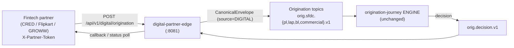
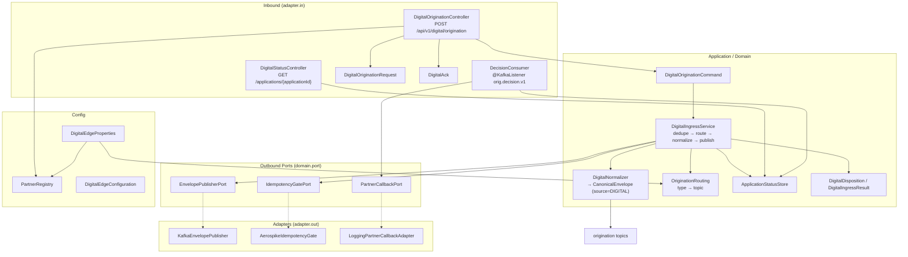
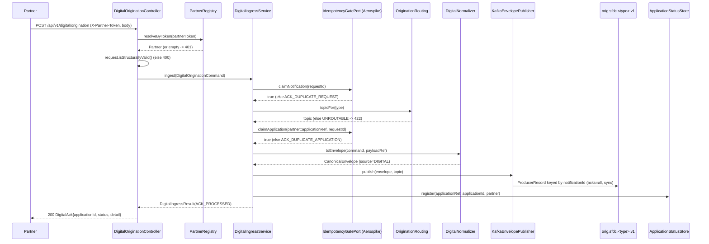

# Digital Partner Edge — Architecture

> **Module:** `edges/digital-partner-edge` · **Type:** protocol edge · **Port:** 8081 · **Runtime:** Spring Boot (Java, hexagonal) · **Status:** implemented

## 1. Purpose & Context

The **digital twin of the SFDC edge**: fintech partners (CRED / Flipkart / GROWW) originate loans over **synchronous REST**, and this edge authenticates the partner, dedupes, and normalizes each request into the **same shared `CanonicalEnvelope`** that `sfdc-ingress-edge` produces — publishing it to the **same origination Kafka topics** the **same origination-journey engine** consumes. The only field that differs is `source = DIGITAL`; the envelope deliberately carries no partner field, so the engine cannot tell which door a request entered. It also consumes the engine's decision topic (`orig.decision.v1`) and returns outcomes to the originating partner, proving one platform serves all channels with the engine and capabilities untouched.

## 2. High-Level Block Diagram

## 3. Low-Level Block Diagram

## 4. Flow Diagram

## 5. Key Classes & Files

| File | Role |
|---|---|
| `DigitalPartnerEdgeApplication.java` | Spring Boot entry point. |
| `adapter/in/rest/DigitalOriginationController.java` | Synchronous partner door; auth via `X-Partner-Token`, validate, build command, fast-ACK (200/400/401/422/503). |
| `adapter/in/rest/DigitalOriginationRequest.java` | Inbound REST body `{requestId, applicationRef, type, orgId, payload}` (no partner field). |
| `adapter/in/rest/DigitalAck.java` | ACK response `{applicationId, status, detail}`. |
| `adapter/in/rest/DigitalStatusController.java` | `GET /applications/{applicationId}` partner status/poll. |
| `adapter/in/kafka/DecisionConsumer.java` | `@KafkaListener` on `orig.decision.v1`; records decision and triggers partner callback for DIGITAL-originated apps. |
| `application/DigitalIngressService.java` | Core ingress: dedupe → route → normalize → publish → register status. |
| `application/DigitalOriginationCommand.java` | Framework-free validated command; `applicationKey()` = `partner::applicationRef`. |
| `application/DigitalNormalizer.java` | Maps command → shared `CanonicalEnvelope` (`source=DIGITAL`, schema `digital-partner.v1`). |
| `application/OriginationRouting.java` | Port: `type` → origination topic (same topics as SFDC edge). |
| `application/ApplicationStatusStore.java` | In-memory per-application status (PENDING → decision), keyed by partner. |
| `application/DigitalDisposition.java` / `DigitalIngressResult.java` | Ingress outcome enum + result record. |
| `domain/port/EnvelopePublisherPort.java` | OUT port: publish envelope to a topic. |
| `domain/port/IdempotencyGatePort.java` | OUT port: CREATE_ONLY claim gates. |
| `domain/port/PartnerCallbackPort.java` | OUT port: push decision back to partner. |
| `adapter/out/kafka/KafkaEnvelopePublisher.java` | Serializes envelope to JSON, synchronous `KafkaTemplate.send().get()` keyed by `notificationId`. |
| `adapter/out/aerospike/AerospikeIdempotencyGate.java` | Two CREATE_ONLY Aerospike claim sets with hot-key retry. |
| `adapter/out/partnercallback/LoggingPartnerCallbackAdapter.java` | Mock callback (logs the returned decision). |
| `config/DigitalEdgeProperties.java` | `idfc.digital-edge.*` config-as-data: partners, routing, aerospike, decisionTopic. |
| `config/PartnerRegistry.java` | Resolves partner from inbound auth token. |
| `config/DigitalEdgeConfiguration.java` | Wires ports/adapters, Kafka producer, Aerospike client. |

## 6. Interfaces

- **Inbound:**
  - `POST /api/v1/digital/origination` (header `X-Partner-Token`, optional `X-Correlation-Id`).
  - `GET /api/v1/digital/applications/{applicationId}` (status poll).
  - Kafka consumer on `orig.decision.v1` (group `digital-partner-edge-decisions`).
- **Outbound:**
  - Produces the `CanonicalEnvelope` (JSON, keyed by `notificationId`) to the origination topics resolved by `type`: `orig.sfdc.pl.v1`, `orig.sfdc.lap.v1`, `orig.sfdc.bl.v1`, `orig.sfdc.commercial.v1` — the **same topics as the SFDC edge**.
  - Partner decision callback via `PartnerCallbackPort` (mock logs in this slice; a real adapter POSTs to the partner `callbackUrl`).
  - Aerospike claim writes to sets `idem` (notification) and `idem_app` (application) in namespace `idfc` — the **same platform idempotency store**.
- **Contract:** `com.idfcfirstbank.integration.shared.domain.envelope.CanonicalEnvelope` (shared-domain), `source = SourceSystem.DIGITAL`. The shape is byte-identical to the SFDC edge's output — asserted by `EnvelopeShapeIdentityTest`.

## 7. Configuration & How to Run

- **Server port:** `8081` (`${SERVER_PORT:8081}`), distinct from the SFDC edge (8080).
- **Key config (`idfc.digital-edge.*` in `application.yml`, config-as-data):**
  - `partners`: list of `{code, token, callbackUrl}` (CRED / FLIPKART / GROWW) — onboarding a partner is a config row, not a service.
  - `routing`: `{type → topic}` mapping (same topics as the SFDC edge).
  - `aerospike`: `host/port/namespace/notificationSet=idem/applicationSet=idem_app/ttlSeconds` (default TTL 2592000s).
  - `decisionTopic`: `orig.decision.v1` (default); consumer group `digital-partner-edge-decisions`.
- **Dependencies:** Kafka (`spring.kafka.bootstrap-servers`, default `localhost:9092`, producer `acks=all`) and Aerospike. The Aerospike client uses `failIfNotConnected=false`, so the app still starts if the cluster is not yet up.
- **Profiles:** `application.yml` plus `application-local.yml` and `application-eks.yml` overlays.
- **Management:** `health,info,prometheus` exposed; health probes enabled.
- **Run:** `./gradlew :edges:digital-partner-edge:bootRun`, or via the root `demo.sh digital` in compose (listens on `:8081`, points at `kafka:9092` + `aerospike`).
