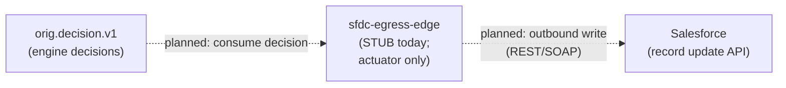
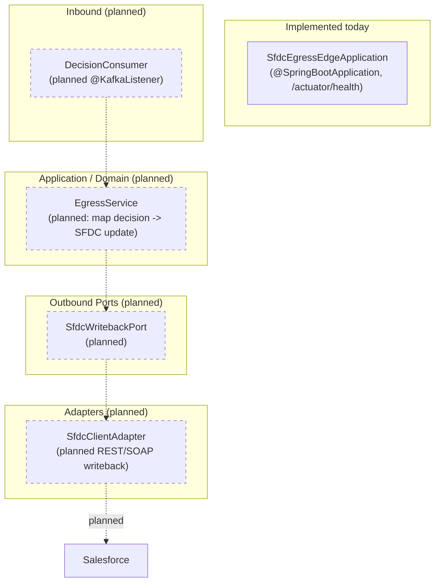
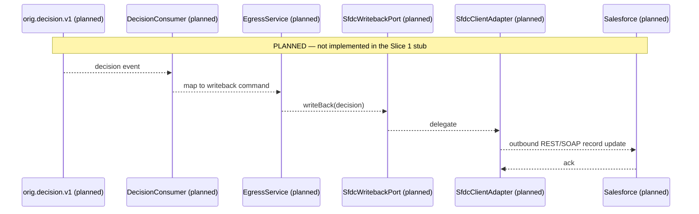

# SFDC Egress Edge — Architecture

> **Module:** `edges/sfdc-egress-edge` · **Type:** protocol edge · **Port:** n/a (default 8080, actuator only) · **Runtime:** Spring Boot (Java, hexagonal) · **Status:** stub/planned

## 1. Purpose & Context

This is the **outbound** (egress) counterpart to the SFDC ingress edge: where ingress receives Salesforce outbound messages into the platform, this edge **calls back to SFDC** to write origination decisions / status onto the Salesforce record. **It is currently a Slice 1 STUB** — the only real code is `SfdcEgressEdgeApplication` (a Spring Boot launcher serving `/actuator/health`) plus a placeholder test. There is no controller, consumer, port, adapter, or domain logic yet; the real capability arrives in a later slice (per the build file's scope fence: `docs/SLICE1_PUNCH_LIST.md`). Everything below describing inbound consumption, mapping, and the SFDC outbound call is **planned**.

## 2. High-Level Block Diagram

## 3. Low-Level Block Diagram

## 4. Flow Diagram

## 5. Key Classes & Files

| File | Role |
|---|---|
| `src/main/java/.../sfdcegress/SfdcEgressEdgeApplication.java` | The only real class: Spring Boot launcher; serves `/actuator/health` with no business logic (Slice 1 stub). |
| `src/test/java/.../sfdcegress/SfdcEgressEdgeApplicationTests.java` | Placeholder test asserting the stub module's package is present. |
| `src/main/resources/application.yml` | Minimal config: app name `sfdc-egress-edge`, actuator exposure locked to `health,info,prometheus`. |
| `build.gradle.kts` | Marks this a Slice 1 stub (`idfc.spring-boot-app-conventions`); real implementation deferred. |
| _(planned)_ `DecisionConsumer`, `EgressService`, `SfdcWritebackPort`, `SfdcClientAdapter` | Inbound consumer, mapping service, outbound port, and SFDC client adapter — **not yet present**. |

## 6. Interfaces

- **Inbound:** None implemented. _Planned:_ a Kafka consumer on the engine's decision topic (e.g. `orig.decision.v1`).
- **Outbound:** None implemented. _Planned:_ an outbound call to Salesforce (REST/SOAP) to write the decision/status back onto the originating record.
- **Contract:** _Planned:_ consume the shared `com.idfcfirstbank.integration.shared.domain.envelope.CanonicalEnvelope` / decision payload and map to the SFDC record-update shape. None defined in this module today.

## 7. Configuration & How to Run

- **Server port:** not set in `application.yml`; defaults to Spring Boot `8080`. Only the actuator endpoints are served.
- **Profiles / settings:** single `application.yml`; `spring.application.name=sfdc-egress-edge`; actuator exposure restricted to `health,info,prometheus` with health probes enabled. No Kafka, SFDC, or datastore configuration yet.
- **Run:** the stub builds and boots — `./gradlew :edges:sfdc-egress-edge:bootRun` starts the app and exposes `/actuator/health`. **Stub — not yet runnable for real**: it performs no egress work; the SFDC writeback capability is implemented in a later slice.
