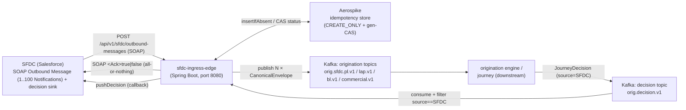
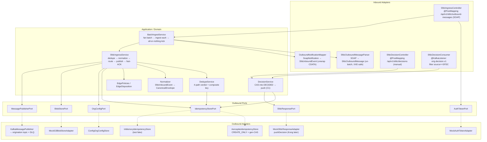

# SFDC Ingress Edge — Architecture

> **Module:** `edges/sfdc-ingress-edge` · **Type:** protocol edge (inbound, Slice-1 reference) · **Port:** `8080` (`${SERVER_PORT:8080}`) · **Runtime:** Spring Boot (Java, hexagonal)

## 1. Purpose & Context

The SFDC ingress edge is the **channel door for Salesforce (the assisted channel)**: it receives a real SFDC **SOAP Outbound Message** and is deliberately thin — it authenticates, parses the SOAP, un-batches, unwraps, normalizes, dedupes, routes, and ACKs, with **no business logic** of its own. A single Outbound Message batches **1..100 `<Notification>`** blocks, each carrying its business payload as JSON inside a `Request__c` CDATA and a `SVCNAME__c` routing key; the edge fans that batch into N canonical requests. **The engine never sees SOAP.** Its single contract with the rest of the platform is the `CanonicalEnvelope` (in `shared-domain`): the edge maps each notification onto that canonical envelope and publishes it to the engine's origination Kafka topic, so the engine "cannot tell which door" an event entered through. It then closes the loop by consuming the engine's decision topic (`orig.decision.v1`), filtering for `source == SFDC`, and pushing the decision back to SFDC. **Exactly-once is anchored on Aerospike `CREATE_ONLY`**: two concurrent identical notifications contend on an atomic insert keyed by the `Notification/Id`, exactly one wins, and every subsequent status change is a generation compare-and-set (`EXPECT_GEN_EQUAL`) — so a decision is pushed back to SFDC exactly once, never zero or twice (the C1 ownership guard). The SOAP `<Ack>` is **all-or-nothing** for the batch: `true` only after every notification is durably accepted; otherwise `false`, and SFDC resends the whole batch while per-`Notification/Id` dedup skips the ones that already landed.

## 2. High-Level Block Diagram



## 3. Low-Level Block Diagram



## 4. Flow Diagram

**4a. Inbound ingest**

```mermaid
sequenceDiagram
    participant SFDC
    participant Ctrl as SfdcIngressController
    participant Auth as AuthTokenPort
    participant Batch as BatchIngestService
    participant Parser as SfdcOutboundMessageParser
    participant Mapper as OutboundNotificationMapper
    participant Svc as SfdcIngressService
    participant Store as IdempotencyStorePort<br/>(AerospikeIdempotencyStore)
    participant Pub as MessagePublisherPort<br/>(KafkaMessagePublisher)
    participant Kafka as orig.sfdc.&lt;line&gt;.v1

    SFDC->>Ctrl: POST /api/v1/sfdc/outbound-messages<br/>(SOAP Outbound Message, X-Auth-Token)
    Ctrl->>Auth: authenticate(authToken)
    Ctrl->>Batch: ingestBatch(soapXml)
    Batch->>Parser: parse(soapXml)
    Parser-->>Batch: SfdcOutboundMessage (1..100 SoapNotification)
    loop each Notification (un-batch)
        Batch->>Mapper: toEvent(notification, message)
        Note over Mapper: unwrap Request__c CDATA → msgBdy;<br/>typeCode=SVCNAME, dedup key=Notification/Id
        Mapper-->>Batch: SfdcInboundEvent
        Batch->>Svc: ingest(event)
        Svc->>Store: insertIfAbsent(record)  %% CREATE_ONLY dedup
        Svc->>Pub: publish(CanonicalEnvelope, routing, headers)
        Pub->>Kafka: send(topic, key=notificationId, JSON)  %% sync, acks=all
        Svc-->>Batch: EdgeResult (ACK_* | RETRY_TRANSIENT)
    end
    Batch-->>Ctrl: BatchAck (accepted = no RETRY_TRANSIENT)
    Ctrl-->>SFDC: 200 + &lt;Ack&gt;true|false&lt;/Ack&gt;<br/>(500 SOAP fault if envelope unparseable)
```

**4b. Decision return**

```mermaid
sequenceDiagram
    participant Kafka as orig.decision.v1
    participant Cons as SfdcDecisionConsumer
    participant Svc as DecisionService
    participant Store as IdempotencyStorePort<br/>(AerospikeIdempotencyStore)
    participant Sfdc as SfdcResponsePort<br/>(MockSfdcResponseAdapter)

    Kafka->>Cons: onMessage(decisionJson)
    Cons->>Cons: parse source, notificationId, outcome, loanId
    Note over Cons: filter — return early unless source == "SFDC"
    Cons->>Svc: applyDecision(notificationId, Decision, correlationId)
    Svc->>Store: findByNotificationId(notificationId)
    alt status already DECIDED
        Svc-->>Cons: false (already decided; no push — C1)
    else transition into DECIDED
        Svc->>Store: compareAndSetStatus(record, DECIDED, decision)  %% gen-CAS on notificationId
        alt CAS applied (we own the transition)
            Svc->>Sfdc: pushDecision(decidedRecord, correlationId)
            Sfdc-->>Svc: pushed
            Svc-->>Cons: true (transitioned + pushed exactly once)
        else CAS lost (concurrent winner)
            Svc-->>Cons: false (cas-lost; no push — C1)
        end
    end
```

## 5. Key Classes & Files

### Inbound ingest path

| File | Role |
|------|------|
| `src/main/java/.../adapter/in/rest/SfdcIngressController.java` | REST `@PostMapping /api/v1/sfdc/outbound-messages` (consumes SOAP); auth → `BatchIngestService.ingestBatch`; returns SOAP `<Ack>` (HTTP 200), 500 SOAP fault on unparseable envelope, 401 on bad token |
| `src/main/java/.../adapter/in/rest/soap/SfdcOutboundMessageParser.java` | Framework-free, XXE-safe DOM parser: SOAP Outbound Message → `SfdcOutboundMessage` (envelope metadata + 1..100 `SoapNotification`), matched by local name, direct-child scoped |
| `src/main/java/.../adapter/in/rest/soap/SfdcOutboundMessage.java`, `SoapNotification.java` | Parsed batch model (org/action ids + notifications) and one parsed `<Notification>` (Id, sf1:Id, SVCNAME, Request__c CDATA) |
| `src/main/java/.../adapter/in/rest/soap/OutboundNotificationMapper.java` | Pure map `SoapNotification` (+ envelope) → `SfdcInboundEvent`: unwrap CDATA → `msgBdy`, `typeCode=SVCNAME`, `applicationRef=msgId`, generated `correlationId` |
| `src/main/java/.../adapter/in/rest/soap/SoapAck.java` | Builds the SOAP `<notificationsResponse><Ack>` / `<Fault>` response strings |
| `src/main/java/.../application/BatchIngestService.java` | Parse → un-batch → ingest each via `SfdcIngressService` → fold into an all-or-nothing `BatchAck`; per-notification bad-CDATA/unknown-SVCNAME → DLQ but still ACKed |
| `src/main/java/.../domain/model/SfdcInboundEvent.java` | Validated framework-free inbound event; `hasApplicationFallback()` |
| `src/main/java/.../application/SfdcIngressService.java` | Orchestration: dedupe → normalize → route → claim-check → publish → fast-ACK; C2/C4/C5 error handling |
| `src/main/java/.../application/DedupeService.java` | 4-path dedupe verdict; primary `notificationId` CREATE_ONLY gate + composite `sfdcRecordId+applicationRef` application-pointer fallback |
| `src/main/java/.../application/DedupeResult.java`, `DedupePath.java` | Dedupe verdict (NEW / IN_FLIGHT / DECIDED / FAILED) |
| `src/main/java/.../application/Normalizer.java` | Pure map `SfdcInboundEvent` → `CanonicalEnvelope` (`SCHEMA_VERSION = sfdc-ingress.v1`, `source=SFDC`) |
| `src/main/java/.../application/EdgeDisposition.java`, `EdgeResult.java`, `EdgePolicies.java` | ACK/no-ACK semantics + poison/retry policy ceilings |
| `src/main/java/.../adapter/out/kafka/KafkaMessagePublisher.java` | Publishes envelope JSON to origination topic (keyed by `notificationId`, sync `acks=all`); `publishToDlq` |
| `src/main/java/.../adapter/in/kafka/FinnOneBackpressureConsumer.java` | §G backpressure harness consumer (bounded to N) off origination topics — not the decision path |

### Decision-return path

| File | Role |
|------|------|
| `src/main/java/.../adapter/in/kafka/SfdcDecisionConsumer.java` | `@KafkaListener` on `orig.decision.v1`; filters `source==SFDC`; calls `DecisionService.applyDecision(notificationId, …)` |
| `src/main/java/.../adapter/in/rest/SfdcDecisionController.java` | Manual `@PostMapping /api/v1/sfdc/decisions` driving the same `DecisionService` |
| `src/main/java/.../application/DecisionService.java` | C1 ownership guard: CAS into DECIDED on `notificationId`; pushes back exactly once on the winning transition |
| `src/main/java/.../adapter/out/mock/MockSfdcResponseAdapter.java` | `SfdcResponsePort` impl: logs `sfdc.push-decision` (real Kong delivery is a later slice) |
| `src/main/java/.../domain/model/Decision.java` | Opaque decision value (outcome, applicationId, termsJson) |

### Idempotency

| File | Role |
|------|------|
| `src/main/java/.../domain/port/IdempotencyStorePort.java` | OUT port: `insertIfAbsent` (CREATE_ONLY), `compareAndSetStatus` (gen-CAS), `linkApplication`, retry/redelivery CAS |
| `src/main/java/.../adapter/out/aerospike/AerospikeIdempotencyStore.java` | Real store: `RecordExistsAction.CREATE_ONLY`, `GenerationPolicy.EXPECT_GEN_EQUAL`, native TTL, hot-key (KEY_BUSY) retry |
| `src/main/java/.../domain/model/IdempotencyRecord.java`, `RecordStatus.java`, `ApplicationKey.java`, `domain/port/CasResult.java` | Record + lifecycle (`RECEIVED→IN_FLIGHT→DECIDED|FAILED`) + CAS result |
| `src/main/java/.../config/AerospikeProperties.java`, `config/EdgeBeanConfiguration.java` | Aerospike client/store wiring (concrete adapter exposed only as the port) |
| `src/test/java/.../support/InMemoryIdempotencyStore.java` | In-memory fake mirroring CREATE_ONLY + gen-CAS for unit tests (not a substitute for the real concurrency gate) |

### Shared contract / config

| File | Role |
|------|------|
| `shared/shared-domain/.../envelope/CanonicalEnvelope.java` | THE shared origination contract emitted by every edge |
| `shared/shared-domain/.../envelope/SourceSystem.java` | `SFDC` / `DIGITAL` channel discriminator |
| `src/main/java/.../config/KafkaConfig.java`, `config/EdgeProperties.java` | Bounded listener factory + topic auto-create; routing/known-orgs as data |
| `src/main/resources/application.yml` (+ `-local.yml`, `-eks.yml`) | Port, Kafka, Aerospike, routing, topics |

## 6. Interfaces

### Inbound

- **REST (SOAP):** `POST /api/v1/sfdc/outbound-messages` (`SfdcIngressController`) — the primary SFDC door; consumes a SOAP Outbound Message (`text/xml`), header `X-Auth-Token`; returns the SOAP `<Ack>true|false</Ack>` at HTTP 200 (all-or-nothing per batch — `false` makes SFDC resend the whole batch), a 500 SOAP fault if the envelope is unparseable, 401 on auth failure. Routing key per notification is `SVCNAME__c` (e.g. `Inbound_Wrapper`).
- **REST (manual):** `POST /api/v1/sfdc/decisions` (`SfdcDecisionController`) — manual decision callback for the same `DecisionService`; header `X-Auth-Token` (same edge token as the SOAP inbound), 401 without it.
- **Kafka (consumed):** `orig.decision.v1` (group `sfdc-ingress-edge-decisions`) via `SfdcDecisionConsumer` — the engine's decision topic; only `source == SFDC` messages are acted on.

### Outbound

- **Kafka (produced):** origination topics `orig.sfdc.pl.v1`, `orig.sfdc.lap.v1`, `orig.sfdc.bl.v1`, `orig.sfdc.commercial.v1` (one per business line, resolved via `OrgConfigPort` routing); DLQ `orig.sfdc.dlq.v1`. Keyed by `notificationId`, value = `CanonicalEnvelope` JSON, `acks=all`, synchronous send.
- **SFDC callback:** `SfdcResponsePort.pushDecision(...)` (mocked by `MockSfdcResponseAdapter`; real Kong delivery later).
- **Aerospike:** `IdempotencyStorePort` → `AerospikeIdempotencyStore` (namespace `idfc`, sets `idem` + `idem_app`).

### Contract

- **`CanonicalEnvelope`** (shared-domain): `transactionId, schemaVersion (sfdc-ingress.v1), source (SFDC), type, notificationId, orgId, sfdcRecordId, applicationRef, correlationId, originalCorrelationId, payloadRef, payloadContentType, occurredAt`.
- **JourneyDecision (on `orig.decision.v1`):** JSON consumed by `SfdcDecisionConsumer` — fields `source`, `notificationId`, `outcome`, `loanId`, `correlationId`. `source` (filter to `SFDC`) and `notificationId` (CAS key) are load-bearing; `sfdcRecordId`/`applicationRef` of the originating SFDC record live on the stored idempotency record keyed by that `notificationId`.

## 7. Configuration & How to Run

- **Server port:** `8080` (override via `SERVER_PORT`).
- **Spring profiles:**
  - `local` (`application-local.yml`) — Kafka via host listener `localhost:29092` against docker-compose infra.
  - `eks` (`application-eks.yml`) — production posture; endpoints injected from cluster ConfigMap/Secret env vars.
  - default `application.yml` — `localhost:9092` Kafka, `localhost:3000` Aerospike.
- **Aerospike vs in-memory toggle:** the runtime wiring (`EdgeBeanConfiguration`) binds `IdempotencyStorePort` to `AerospikeIdempotencyStore`; the in-memory `InMemoryIdempotencyStore` is a **test-only** fake under `src/test`. The Aerospike client sets `failIfNotConnected = false` so the context can start for Kafka-only paths even without a live cluster.
- **Key config values (`application.yml` → `idfc.*`):**
  - `idfc.aerospike`: `namespace=idfc`, `record-set=idem`, `app-pointer-set=idem_app`, `ttl-seconds=2592000` (30d; must exceed the SFDC retry window).
  - `idfc.edge.dlq-topic=orig.sfdc.dlq.v1`; `poison-redelivery-threshold=5` (C5); `max-journey-retry=1` (C3); `finnone.max-concurrency=4` (§G backpressure cap).
  - `idfc.edge.routing`: **`SVCNAME__c`→topic→journey** rows (config-as-data — a new SVCNAME is a config row, not code): `PERSONAL_LOAN`→`orig.sfdc.pl.v1`, `LAP`→`orig.sfdc.lap.v1`, `BUSINESS_LOAN`→`orig.sfdc.bl.v1`, `COMMERCIAL`→`orig.sfdc.commercial.v1`, and `Inbound_Wrapper`→`orig.sfdc.pl.v1` (`account-creation`; publishes to an engine-consumed topic so — with the engine's `type-to-journey` empty — it starts the default journey, proving the plumbing).
  - **Decision topic / group** (`SfdcDecisionConsumer`): `idfc.edge.decision-topic` (default `orig.decision.v1`), `idfc.edge.decision-group` (default `sfdc-ingress-edge-decisions`).
  - `idfc.edge.known-orgs`: `ORG1, IDFC_RETAIL, IDFC_BUSINESS, 00D6D00000020HoUAI` (unknown org → refresh+recheck → DLQ, C2).
- **Run (local):**
  1. Start infra: `docker compose -f docker-compose.infra.yml up -d` (Kafka on `29092`, Aerospike on `3000`).
  2. `./gradlew :edges:sfdc-ingress-edge:bootRun --args='--spring.profiles.active=local'`.
  3. Smoke test: `POST http://localhost:8080/api/v1/sfdc/outbound-messages` with header `X-Auth-Token: dev-token`, `Content-Type: text/xml`, and a SOAP Outbound Message body (see the golden fixture `src/test/resources/sfdc-outbound-golden.xml`). Expect `200` + `<Ack>true</Ack>`.
  - Health: `GET /actuator/health` (exposure limited to `health,info,prometheus`).
