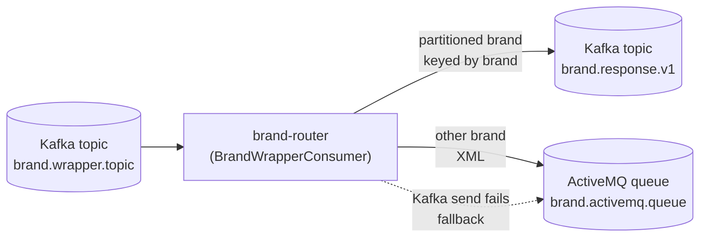
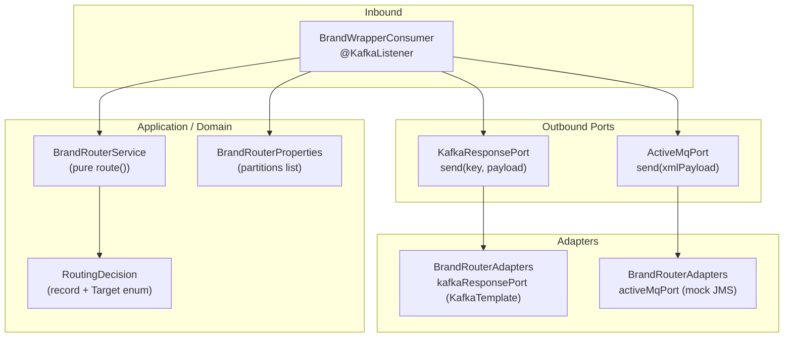
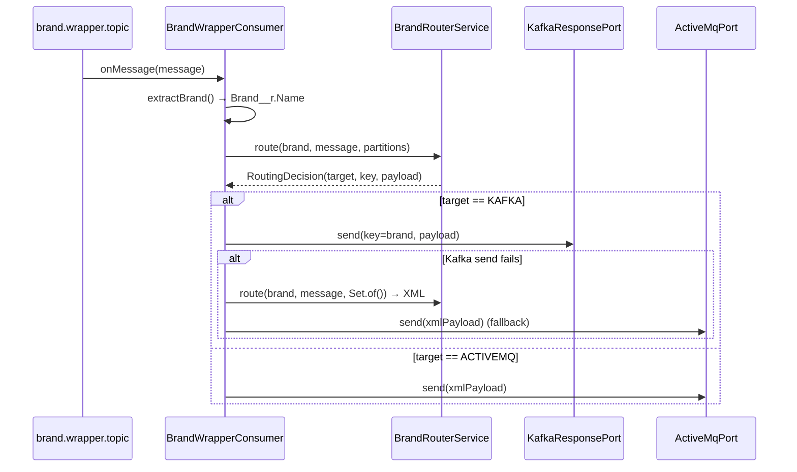

# Brand Router — Architecture

> **Module:** `integration/brand-router` · **Type:** integration routing adapter · **Port:** 8099 · **Runtime:** Spring Boot (Java, hexagonal)

## 1. Purpose & Context
Brand Router is a thin routing adapter (BRD §6), **not** a business capability. It consumes an SFDC "brand wrapper" message off Kafka, extracts the brand name from `Brand__r.Name`, and decides — purely from **config-as-data** (the `idfc.brand-router.partitions` list) — whether the message goes to the Kafka response topic (partitioned brands, keyed by brand) or is converted to XML and dropped on the ActiveMQ queue (every other brand). It sits between the inbound brand-wrapper topic and the two downstream transports; if the Kafka publish fails it falls back to ActiveMQ. Adding a brand to the partitions list is a config row, not code.

## 2. High-Level Block Diagram


## 3. Low-Level Block Diagram


## 4. Flow Diagram


## 5. Key Classes & Files
| File | Role |
| --- | --- |
| `src/main/java/.../BrandRouterApplication.java` | Spring Boot entry point; `@EnableConfigurationProperties(BrandRouterProperties.class)`. |
| `src/main/java/.../adapter/in/kafka/BrandWrapperConsumer.java` | IN adapter; `@KafkaListener` on the wrapper topic, extracts `Brand__r.Name`, drives routing + Kafka→ActiveMQ fallback. |
| `src/main/java/.../application/BrandRouterService.java` | Pure routing logic; `route(...)` returns a `RoutingDecision`, builds the `<ActivemqRequest>` XML. No I/O. |
| `src/main/java/.../domain/RoutingDecision.java` | Record `(Target target, String key, String payload)` with `enum Target { KAFKA, ACTIVEMQ }`. |
| `src/main/java/.../domain/KafkaResponsePort.java` | OUT port: `send(String key, String payload)`. |
| `src/main/java/.../domain/ActiveMqPort.java` | OUT port: `send(String xmlPayload)`. |
| `src/main/java/.../adapter/out/BrandRouterAdapters.java` | Wires `KafkaResponsePort` (real `KafkaTemplate`) and `ActiveMqPort` (mocked JMS). |
| `src/main/java/.../config/BrandRouterProperties.java` | Config-as-data: `partitions`, `responseTopic`, `activemqQueue` (`idfc.brand-router.*`). |
| `src/main/resources/application.yml` | Topic names, partitions list, Kafka serializers, port 8099. |

## 6. Interfaces
- **Inbound:** Kafka topic `brand.wrapper.topic` (property `idfc.brand-router.wrapper-topic`, group `brand-router`), consumed by `BrandWrapperConsumer.onMessage`.
- **Outbound:**
  - Kafka topic `brand.response.v1` (property `idfc.brand-router.response-topic`) via `KafkaResponsePort`, **keyed by brand name**.
  - ActiveMQ queue `brand.activemq.queue` (property `idfc.brand-router.activemq-queue`) via `ActiveMqPort`, **XML payload** (`<ActivemqRequest><brand>…</brand><payload>…</payload></ActivemqRequest>`).
- **Contract / Config:** The decision is config-as-data — `idfc.brand-router.partitions` (a `List<String>` of brand names). A brand in the list → `Target.KAFKA`; otherwise → `Target.ACTIVEMQ`. Inbound message shape: JSON with `Brand__r.Name` (fallback to top-level `brand`).

## 7. Configuration & How to Run
- **Server port:** `8099` (`SERVER_PORT` override).
- **Spring profiles:** none defined; single `application.yml`. Application name `brand-router`.
- **Key `application.yml` settings:**
  - `spring.kafka.bootstrap-servers` = `${KAFKA_BOOTSTRAP_SERVERS:localhost:9092}` (String key/value (de)serializers, `auto-offset-reset: earliest`).
  - `idfc.brand-router.wrapper-topic` = `brand.wrapper.topic`
  - `idfc.brand-router.response-topic` = `brand.response.v1`
  - `idfc.brand-router.activemq-queue` = `brand.activemq.queue`
  - `idfc.brand-router.partitions` = `[GODREJ, BOSCH, TCL, KENSTAR, BPL]` (config-as-data list)
  - Actuator: `health, info, prometheus`.
- **Run:**
  ```bash
  ./mvnw -pl integration/brand-router spring-boot:run
  # or, after a build:
  java -jar integration/brand-router/target/*.jar
  ```
  Requires a reachable Kafka broker (`KAFKA_BOOTSTRAP_SERVERS`). The ActiveMQ port is mocked locally (logs `activemq.send (mock) …`); a real JMS `ConnectionFactory`/`JmsTemplate` swaps in behind `ActiveMqPort`.
