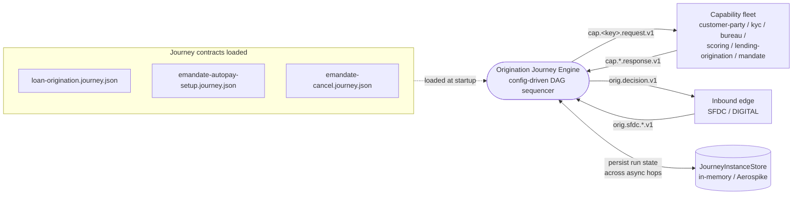
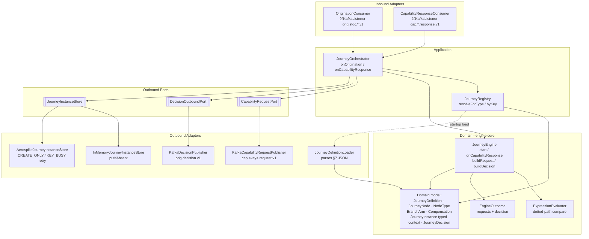
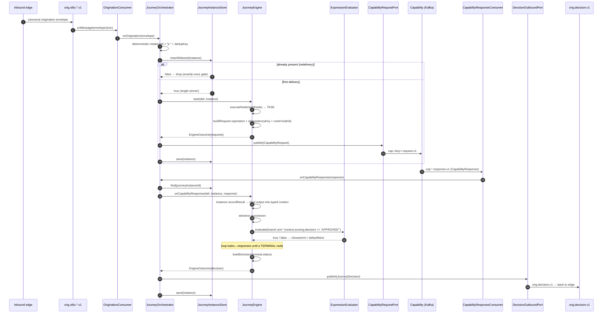

# Origination Journey Engine — Architecture

> **Module:** `orchestration/origination-journey` · **Type:** orchestration (config-driven DAG engine) · **Port:** 8082 · **Runtime:** Spring Boot (Java, hexagonal)

## 1. Purpose & Context

This module is **the orchestration engine** at the heart of the platform: a config-driven DAG sequencer. On startup it loads one or more **Charter §7 journey JSON** contracts (`resources/journeys/*.journey.json`) into immutable `JourneyDefinition`s via the `JourneyDefinitionLoader` — the journey is **config, not code**. At runtime it consumes a canonical origination envelope from an inbound topic, then drives the journey's capability calls **over Kafka**, binding each task's response into a **typed run context** on the `JourneyInstance` and evaluating **branch conditions** against that context with the `ExpressionEvaluator` (dotted paths like `context.scoring.decision`). When the DAG reaches a `terminal` node, the engine emits a `JourneyDecision` back to the inbound edge over the decision topic. Start is **exactly-once**: a deterministic instance id derived from the inbound envelope plus an atomic `insertIfAbsent` gate makes a redelivered origination (Kafka is at-least-once) a no-op. The engine executes the **T1 subset** of the 10 `NodeType` kinds (task / branch / parallel / join / terminal); the remaining kinds parse and load but throw `UnsupportedOperationException` until their tier ships.

## 2. High-Level Block Diagram



## 3. Low-Level Block Diagram



## 4. Flow Diagram



## 5. Key Classes & Files

| Layer | File | Role |
|-------|------|------|
| bootstrap | `OriginationJourneyApplication.java` | Spring Boot entry point |
| config | `config/EngineConfiguration.java` | Wires framework-free engine to its ports; selects in-memory vs Aerospike store; builds Kafka producer |
| config | `config/EngineProperties.java` | `idfc.engine.*` config-as-data (journeys, decision topic, type→journey, state store, Aerospike) |
| inbound | `adapter/in/kafka/OriginationConsumer.java` | `@KafkaListener` on `orig.sfdc.*.v1` → `onOrigination` |
| inbound | `adapter/in/kafka/CapabilityResponseConsumer.java` | `@KafkaListener` topicPattern `cap.*.response.v1` → `onCapabilityResponse` |
| application | `application/JourneyOrchestrator.java` | Coordinates engine ↔ ports; deterministic id + `insertIfAbsent` start gate; dispatches outcomes |
| application | `application/JourneyRegistry.java` | Holds loaded definitions; `resolveForType` (by businessLine `type`) / `byKey` |
| domain (engine) | `domain/service/JourneyEngine.java` | Pure DAG sequencer: `start`, `onCapabilityResponse`, `buildRequest`, `buildDecision`, `chooseArm`, T1 node switch |
| domain (engine) | `domain/service/ExpressionEvaluator.java` | Dotted-path resolve + binary compare (`== != >= <= > <`) |
| domain (engine) | `domain/service/EngineOutcome.java` | Per-step result: capability requests + optional decision |
| domain (model) | `domain/model/JourneyDefinition.java` | Immutable parsed journey: `node(id)`, `startNode`, `predecessorsOf` |
| domain (model) | `domain/model/JourneyNode.java` | One fat record per node; factories per kind; `successors()` |
| domain (model) | `domain/model/NodeType.java` | The 10 DAG node kinds |
| domain (model) | `domain/model/BranchArm.java` | `when` expression + `next` target |
| domain (model) | `domain/model/Compensation.java` | Saga undo `operation` + `input` (authored, enforced in T2) |
| domain (model) | `domain/model/JourneyInstance.java` | Mutable run state; typed `context`; `recordResult` binding; `evaluationContext` |
| domain (model) | `domain/model/JourneyDecision.java` | Final decision (APPROVED/REJECTED/ERROR) pushed to the edge |
| domain (model) | `domain/model/InstanceStatus.java` | RUNNING / COMPLETED / FAILED |
| outbound port | `domain/port/CapabilityRequestPort.java` | Publish a `CapabilityRequest` |
| outbound port | `domain/port/DecisionOutboundPort.java` | Publish a `JourneyDecision` |
| outbound port | `domain/port/JourneyInstanceStore.java` | `insertIfAbsent` / `save` / `find` (exactly-once-start gate) |
| outbound adapter | `adapter/out/kafka/KafkaCapabilityRequestPublisher.java` | → `cap.<key>.request.v1` (via `CapabilityTopics`) |
| outbound adapter | `adapter/out/kafka/KafkaDecisionPublisher.java` | → decision topic (`orig.decision.v1`) |
| outbound loader | `adapter/out/loader/JourneyDefinitionLoader.java` | Parses §7 JSON into `JourneyDefinition` |
| persistence | `adapter/out/store/InMemoryJourneyInstanceStore.java` | `ConcurrentHashMap.putIfAbsent` (default, Docker-free) |
| persistence | `adapter/out/store/AerospikeJourneyInstanceStore.java` | `RecordExistsAction.CREATE_ONLY`; `KEY_EXISTS`→duplicate, `KEY_BUSY`→retry |
| contracts | `resources/journeys/*.journey.json` | The §7 journey configs (loan-origination, emandate-autopay-setup, emandate-cancel) |
| contract (shared) | `shared:shared-domain` `CapabilityRequest` / `CapabilityResponse` / `CapabilityTopics` | The cross-module capability wire contract |

## 6. Node Types & Tiers

`NodeType` defines 10 kinds (Charter §2). The `JourneyEngine.executeNode` switch executes the T1 subset; every other kind hits the `default ->` arm and throws `UnsupportedOperationException`. The `JourneyDefinitionLoader` *parses* all of them (HUMAN/FOREACH/SUBJOURNEY as `passthrough`, WAIT/TIMER fully), so a journey can author them today even though only T1 runs.

| # | NodeType | Executed in T1? | Engine behaviour |
|---|----------|-----------------|------------------|
| 1 | `TASK` | ✅ Yes | `buildRequest` → emit `CapabilityRequest` (carries `operation` + `idempotencyKey = runId:nodeId`) |
| 2 | `BRANCH` | ✅ Yes | `chooseArm`: first matching arm `when`, else `defaultNext`; throws if neither |
| 3 | `PARALLEL` | ✅ Yes | Fan out to every `branches` target |
| 4 | `JOIN` | ✅ Yes (allOf) | Gated by `joinOn` — fires only when all listed nodes `isCompleted`, then `next` |
| 5 | `TERMINAL` | ✅ Yes | `complete()` + `buildDecision` from `terminal.status` |
| 6 | `WAIT` | ❌ Load-only | Parsed (`waitFor`/`correlation`/`timeout`/`onTimeout`); throws at execute |
| 7 | `TIMER` | ❌ Load-only | Parsed (`delay`/`at`); throws at execute |
| 8 | `HUMAN` | ❌ Load-only | Parsed as passthrough; throws at execute |
| 9 | `FOREACH` | ❌ Load-only | Parsed as passthrough; throws at execute |
| 10 | `SUBJOURNEY` | ❌ Load-only | Parsed as passthrough; throws at execute |

Cross-cutting T1 features beyond the kinds: per-node `condition` gating (skip-and-advance when false), `onFailure` routing to a recovery node id on a `CapabilityStatus.ERROR` response (otherwise an ERROR decision), and double-dispatch protection via the instance's dispatched/completed node sets. Saga `Compensation` and the `meter`/retry/circuitBreaker policies are authored in the JSON now and enforced in T2.

## 7. Interfaces

**Inbound (consumed)**
- Origination topics: `idfc.engine.origination-topics` — default `orig.sfdc.pl.v1,orig.sfdc.lap.v1,orig.sfdc.bl.v1,orig.sfdc.commercial.v1` (group `origination-journey-engine`). Body is a canonical origination envelope (JSON map: `type`, `correlationId`, `applicationRef`, `notificationId`, `source`, `sfdcRecordId`, optional inline `payload`).
- Capability responses: topic **pattern** `cap\..*\.response\.v1` — one listener catches every capability, so a new capability needs no engine change. Body is a `CapabilityResponse`.

**Outbound (produced)**
- Capability requests: `cap.<capabilityKey>.request.v1` (topic derived via `CapabilityTopics.request`), keyed by `journeyInstanceId`. Body is a `CapabilityRequest`.
- Decision: `idfc.engine.decision-topic` — default `orig.decision.v1`, keyed by `applicationRef`. Body is a `JourneyDecision`.

**Contract**
- **§7 journey JSON schema** (parsed by `JourneyDefinitionLoader`): top-level `journeyKey` (or `key`), `startNodeId`, `nodes[]`; node fields per kind (`id`, `type`, `condition`, `capability`, `operation`, `output`, `next`, `arms`/`default`, `branches`, `joinOn`/`policy`, `compensation`, `policies.meter.pool`, terminal `action`/`emit`/`status`). `layout`, `pools`, `context` are authoring/future-tier metadata ignored by T1.
- **`CapabilityRequest` / `CapabilityResponse`** (`shared:shared-domain`): the authoritative capability wire shape every capability implements. Request carries `operation` + `idempotencyKey`; response carries `status`, `result`, `errorClass`.
- **`JourneyDecision`**: `outcome` (APPROVED/REJECTED/ERROR), `loanId`, `terminalNodeId`, `emitted`, plus echoed routing identity (`source`, `notificationId`, `sfdcRecordId`) so the edge can CAS its idempotency record.
- Journey files present: `loan-origination.journey.json` (task→task→task→task→branch→task/terminal with compensation + meter), `emandate-autopay-setup.journey.json`, `emandate-cancel.journey.json`.

## 8. Configuration & How to Run

**Server port:** `8082` (`server.port`, override `SERVER_PORT`).

**Spring profiles**
- `local` (`application-local.yml`): host Kafka listener `localhost:29092`, durable Aerospike state (`localhost:3000`). Run against `docker-compose.infra.yml`.
- `eks` (`application-eks.yml`): production posture; endpoints come from the cluster ConfigMap/Secret; `state-store=aerospike`.
- default (`application.yml`): Kafka `localhost:9092`, in-memory state store.

**Key config-as-data (`idfc.engine.*`)**
- `journey-resources` — classpath journey JSONs to load (default `journeys/loan-origination.journey.json`).
- `decision-topic` — default `orig.decision.v1`.
- `origination-topics` — CSV (env `IDFC_ENGINE_ORIGINATION_TOPICS`).
- `type-to-journey` — businessLine `type` → journey key map (empty ⇒ single loaded journey is the default).
- **`state-store` toggle** — `in-memory` (default, Docker-free) or `aerospike` (durable audit source-of-truth; env `IDFC_ENGINE_STATE_STORE`). Aerospike block: `host`/`port`/`namespace`/`instance-set` (`journey_instance`)/`ttl-seconds` (default 604800 = 7 days). `EngineConfiguration.journeyInstanceStore` picks the impl from `EngineProperties.usesAerospikeState()`.

**Run**
```bash
# in-memory (default), needs a Kafka broker on localhost:9092
./gradlew :orchestration:origination-journey:bootRun

# local profile: docker-compose infra (Kafka 29092 + Aerospike 3000)
docker compose -f docker-compose.infra.yml up -d
SPRING_PROFILES_ACTIVE=local ./gradlew :orchestration:origination-journey:bootRun

# tests: fast Docker-free unit suite (build/check run only this)
./gradlew :orchestration:origination-journey:test
# Testcontainers (real Kafka/Aerospike), separate task
./gradlew :orchestration:origination-journey:integrationTest
```

Health/metrics exposed at `/actuator/health|info|prometheus` (locked down — no env/heapdump).
