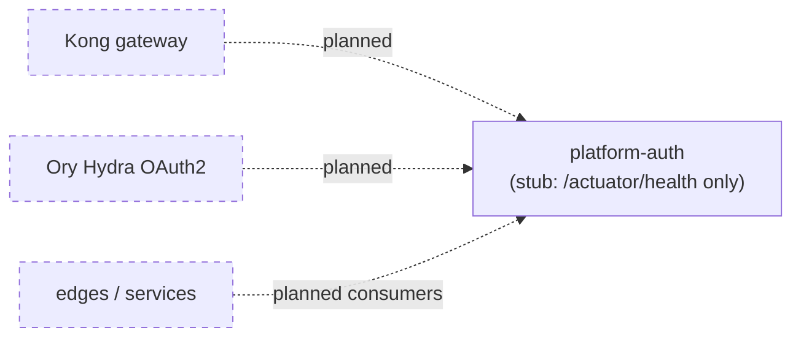
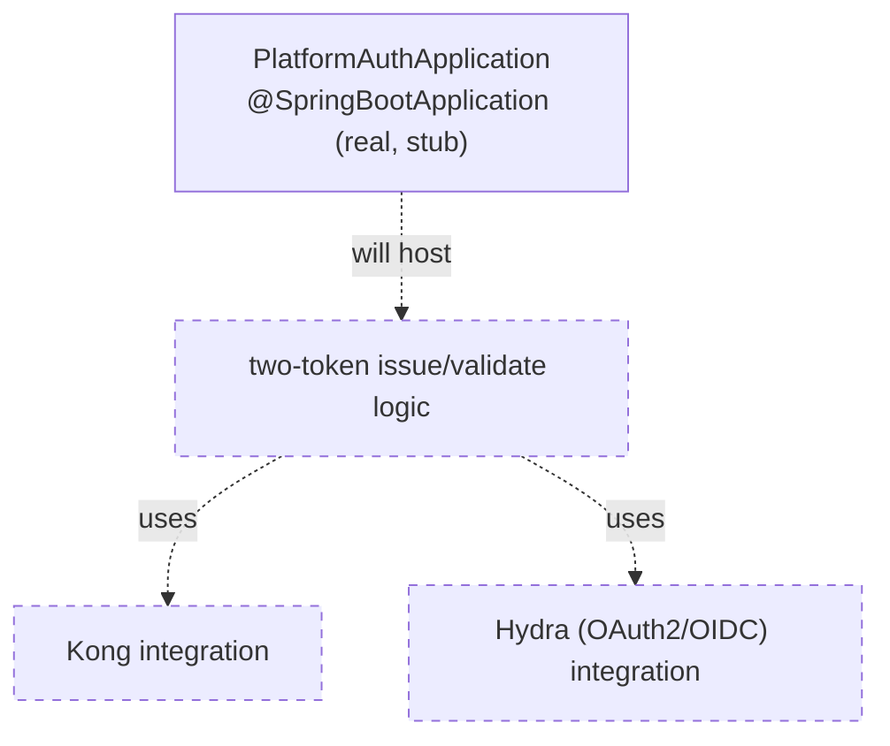
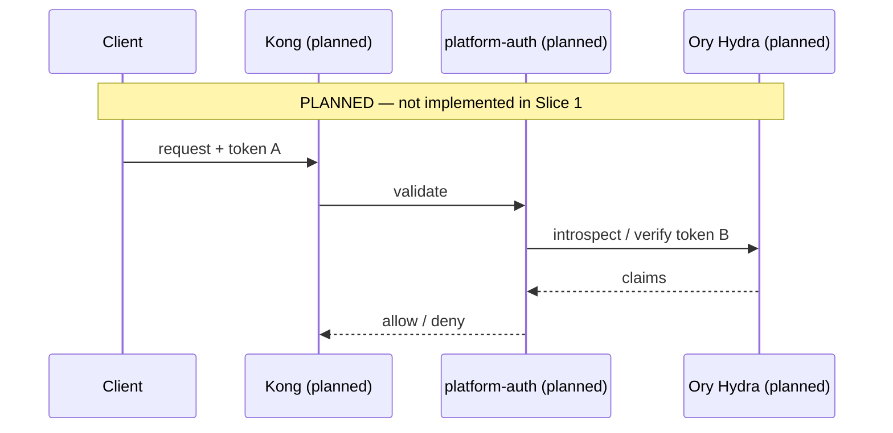

# Platform Auth — Architecture

> **Module:** `platform/platform-auth` · **Type:** platform service (stub) · **Port:** 8080 (Spring Boot default; only `/actuator/health` is served) · **Runtime:** Spring Boot · **Status:** stub/planned

## 1. Purpose & Context

**This is a Slice 1 stub** — a runnable Spring Boot app serving only `/actuator/health` with no business logic yet (`PlatformAuthApplication`). Its **intended** responsibility (per `settings.gradle.kts`: *"Hydra + Kong two-token auth"*) is the platform's authentication/authorization service: issuing and validating the two-token scheme where Kong (API gateway) and Ory Hydra (OAuth2/OIDC) together gate inbound traffic. None of that is implemented yet.

## 2. High-Level Block Diagram

## 3. Low-Level Block Diagram

## 4. Flow Diagram

## 5. Key Types / Classes & Files

| File | Role |
| --- | --- |
| `src/main/java/.../PlatformAuthApplication.java` | Slice 1 stub Spring Boot entrypoint; serves `/actuator/health`, no logic. |
| `src/main/resources/application.yml` | App name `platform-auth`; exposes `health,info,prometheus` only; health probes enabled. |

## 6. Interfaces / Dependents

- **Intended inbound:** edges/services and Kong delegating token validation.
- **Intended outbound:** Ory Hydra (OAuth2/OIDC), Kong admin/data plane.
- **Today:** none — placeholder.

## 7. Configuration & How to Run / Use

Runnable only as a health-check shell (Spring Boot default port **8080**, `/actuator/health`). **Not yet runnable for real** — no auth logic exists. Build via `idfc.spring-boot-app-conventions`.
