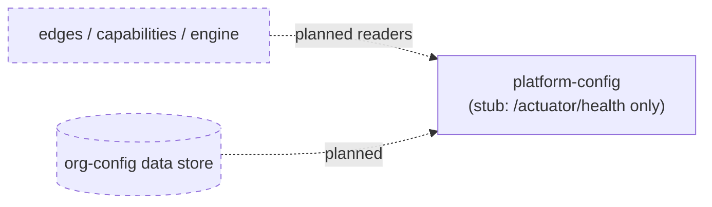
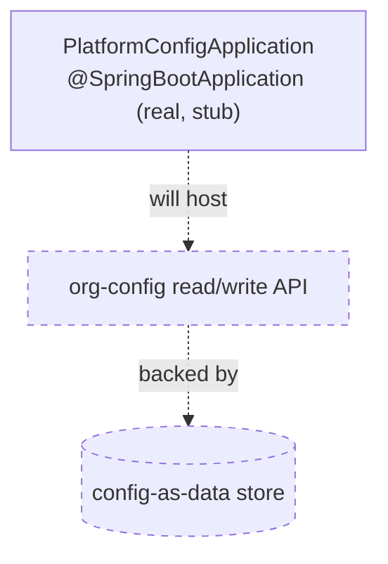
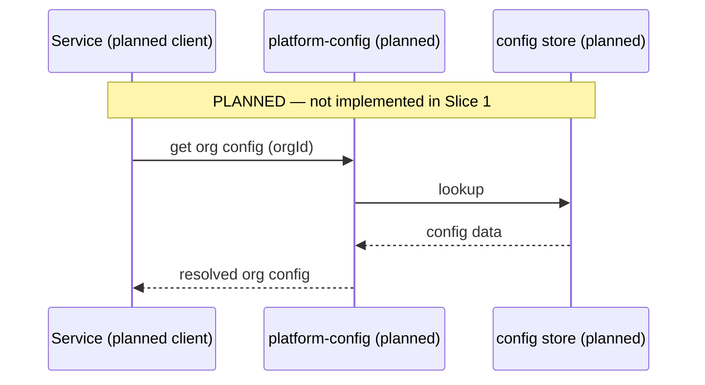

# Platform Config — Architecture

> **Module:** `platform/platform-config` · **Type:** platform service (stub) · **Port:** 8080 (Spring Boot default; only `/actuator/health` is served) · **Runtime:** Spring Boot · **Status:** stub/planned

## 1. Purpose & Context

**This is a Slice 1 stub** — a runnable Spring Boot app serving only `/actuator/health` with no business logic yet (`PlatformConfigApplication`). Its **intended** responsibility (per `settings.gradle.kts`: *"org-config-as-data store"*) is the platform's organization-configuration store, holding per-org settings as data (config-not-code) so onboarding orgs/journeys is a data change rather than a deploy. None of that is implemented yet.

## 2. High-Level Block Diagram

## 3. Low-Level Block Diagram

## 4. Flow Diagram

## 5. Key Types / Classes & Files

| File | Role |
| --- | --- |
| `src/main/java/.../PlatformConfigApplication.java` | Slice 1 stub Spring Boot entrypoint; serves `/actuator/health`, no logic. |
| `src/main/resources/application.yml` | App name `platform-config`; exposes `health,info,prometheus` only; health probes enabled. |

> Note: the EKS deployment manifests reference a Kubernetes ConfigMap named `idfc-platform-config` for env wiring — that is cluster config plumbing, distinct from this future config-as-data service.

## 6. Interfaces / Dependents

- **Intended inbound:** edges, capabilities, and the engine resolving per-org configuration.
- **Intended outbound:** the org-config data store.
- **Today:** none — placeholder.

## 7. Configuration & How to Run / Use

Runnable only as a health-check shell (Spring Boot default port **8080**, `/actuator/health`). **Not yet runnable for real** — no config store exists. Build via `idfc.spring-boot-app-conventions`.
