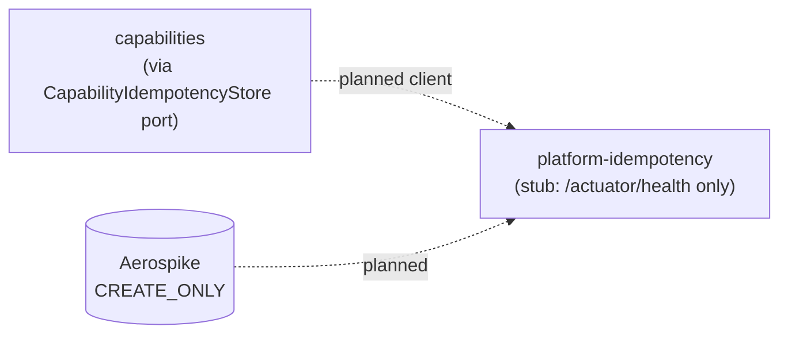
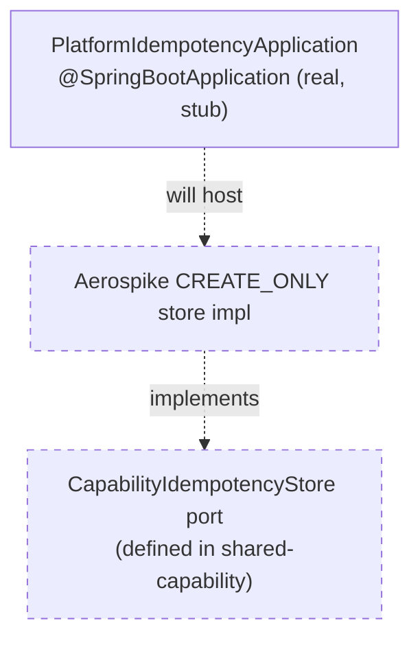
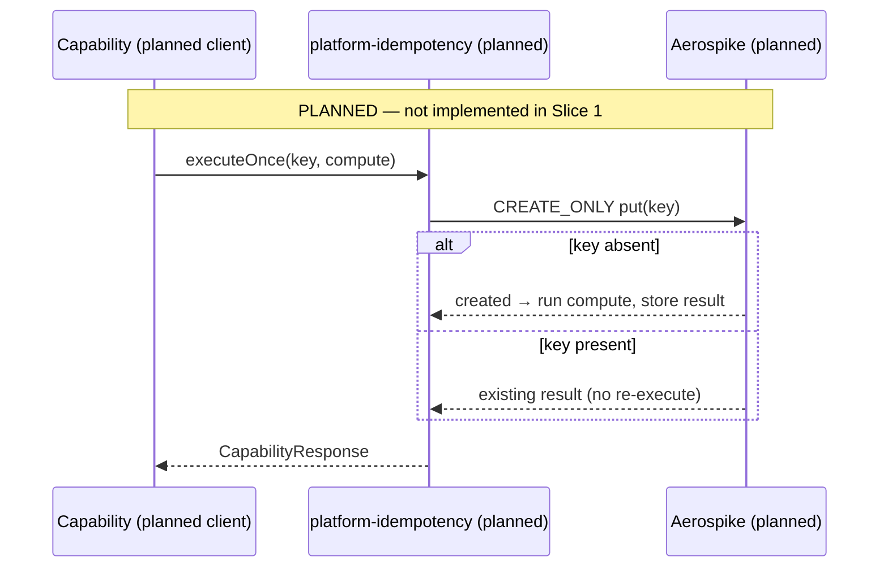

# Platform Idempotency — Architecture

> **Module:** `platform/platform-idempotency` · **Type:** platform service (stub) · **Port:** 8080 (Spring Boot default; only `/actuator/health` is served) · **Runtime:** Spring Boot · **Status:** stub/planned

## 1. Purpose & Context

**This is a Slice 1 stub** — a runnable Spring Boot app that starts and serves `/actuator/health` with no business logic yet (`PlatformIdempotencyApplication`). Its **intended** role (per `settings.gradle.kts`: *"later extraction target for the Aerospike store"*) is to host the durable, multi-instance idempotency store — the Aerospike `CREATE_ONLY` CAS variant that swaps in behind the `CapabilityIdempotencyStore` port defined in `shared-capability`. Today that port's only implementation is the in-memory one; this module is where the durable store will be extracted to.

## 2. High-Level Block Diagram

## 3. Low-Level Block Diagram

## 4. Flow Diagram

## 5. Key Types / Classes & Files

| File | Role |
| --- | --- |
| `src/main/java/.../PlatformIdempotencyApplication.java` | Slice 1 stub Spring Boot entrypoint; serves `/actuator/health`, no logic. |
| `src/main/resources/application.yml` | App name `platform-idempotency`; exposes `health,info,prometheus` only; health probes enabled. |

## 6. Interfaces / Dependents

- **Intended inbound:** capability apps needing durable exactly-once dedup, via the `CapabilityIdempotencyStore` port.
- **Intended outbound:** Aerospike (`CREATE_ONLY` CAS) for the durable record.
- **Today:** none — nothing depends on it; it is a placeholder.

## 7. Configuration & How to Run / Use

Runnable only as a health-check shell (Spring Boot default port **8080**, `/actuator/health`). **Not yet runnable for real** — no idempotency logic exists. Build via `idfc.spring-boot-app-conventions`.
