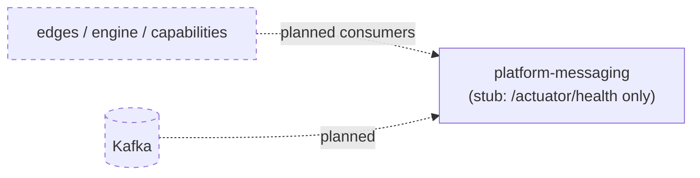
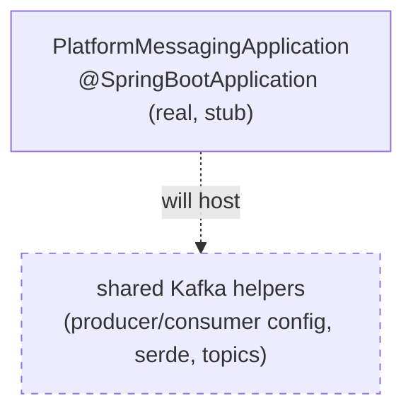
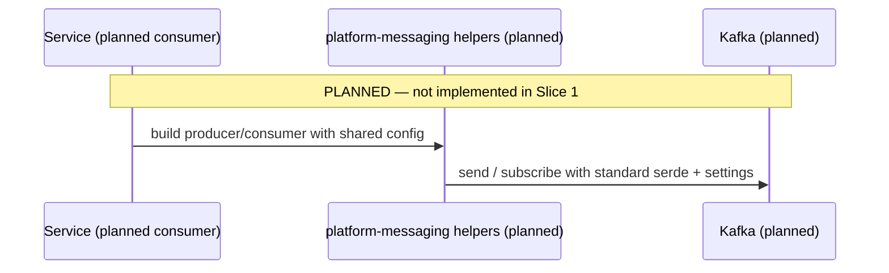

# Platform Messaging — Architecture

> **Module:** `platform/platform-messaging` · **Type:** platform service (stub) · **Port:** 8080 (Spring Boot default; only `/actuator/health` is served) · **Runtime:** Spring Boot · **Status:** stub/planned

## 1. Purpose & Context

**This is a Slice 1 stub** — a runnable Spring Boot app serving only `/actuator/health` with no business logic yet (`PlatformMessagingApplication`). Its **intended** responsibility (per `settings.gradle.kts`: *"shared Kafka helpers"*) is to hold common Kafka producer/consumer configuration and helpers shared across edges, the engine, and capabilities, so messaging conventions live in one place. None of that is implemented yet. (Note: the capability framework's own Kafka shell currently lives in `shared-capability`, not here.)

## 2. High-Level Block Diagram

## 3. Low-Level Block Diagram

## 4. Flow Diagram

## 5. Key Types / Classes & Files

| File | Role |
| --- | --- |
| `src/main/java/.../PlatformMessagingApplication.java` | Slice 1 stub Spring Boot entrypoint; serves `/actuator/health`, no logic. |
| `src/main/resources/application.yml` | App name `platform-messaging`; exposes `health,info,prometheus` only; health probes enabled. |

## 6. Interfaces / Dependents

- **Intended inbound:** services importing shared Kafka helper config.
- **Intended outbound:** Kafka brokers.
- **Today:** none — placeholder. (As a stub it is a Spring Boot app; whether the real extraction lands as a library or service is a later-slice decision.)

## 7. Configuration & How to Run / Use

Runnable only as a health-check shell (Spring Boot default port **8080**, `/actuator/health`). **Not yet runnable for real** — no messaging helpers exist. Build via `idfc.spring-boot-app-conventions`.
