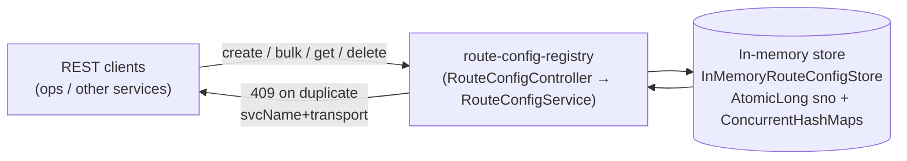
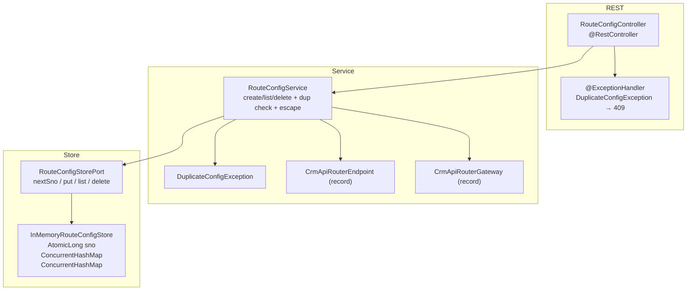
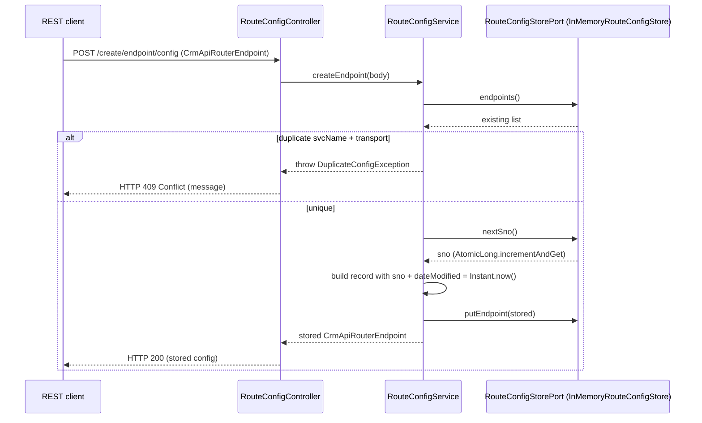

# Route Config Registry — Architecture

> **Module:** `platform/route-config-registry` · **Type:** platform CRUD service · **Port:** 8100 · **Runtime:** Spring Boot (Java, hexagonal)

## 1. Purpose & Context
Route Config Registry is a platform control-plane CRUD service (BRD §7), **not** a business capability. It is a **config registry** that stores API-router endpoint and gateway configuration as data, exposed over REST and backed by an in-memory store (an `AtomicLong` sno counter plus `ConcurrentHashMap`s) that mocks the Aerospike sets `crm-api-router-endpoint` / `crm-api-router-gateway`. It enforces duplicate validation on `svcName + transport`, auto-assigns `sno`, stamps `dateModified` on create, and XSS-escapes the delete `set` input. Other services read this registry to know how to route; it holds no business logic.

## 2. High-Level Block Diagram


## 3. Low-Level Block Diagram


## 4. Flow Diagram


## 5. Key Classes & Files
| File | Role |
| --- | --- |
| `src/main/java/.../RouteConfigRegistryApplication.java` | Spring Boot entry point. |
| `src/main/java/.../adapter/in/rest/RouteConfigController.java` | `@RestController`; REST CRUD endpoints + `@ExceptionHandler` mapping `DuplicateConfigException` → 409. |
| `src/main/java/.../application/RouteConfigService.java` | Duplicate validation (`svcName`+`transport`), auto `sno`, `dateModified`, XSS-escape on delete; defines `DuplicateConfigException`. |
| `src/main/java/.../domain/CrmApiRouterEndpoint.java` | Endpoint config record (Aerospike set `crm-api-router-endpoint`). |
| `src/main/java/.../domain/CrmApiRouterGateway.java` | Gateway config record `(sno, svcName, transport)` (set `crm-api-router-gateway`). |
| `src/main/java/.../domain/port/RouteConfigStorePort.java` | Store port: `nextSno`, `putEndpoint`, `endpoints`, `putGateway`, `gateways`, `delete`. |
| `src/main/java/.../adapter/out/store/InMemoryRouteConfigStore.java` | In-memory adapter: `AtomicLong sno` + two `ConcurrentHashMap`s. |
| `src/main/resources/application.yml` | Port 8100, app name, actuator exposure. |

## 6. Interfaces
- **Inbound (REST):**
  - `POST /create/endpoint/config` — create one endpoint config (`CrmApiRouterEndpoint`).
  - `POST /bulk/create/endpoint/config` — create a list of endpoint configs.
  - `GET /endpoint/config` — list endpoint configs (sorted by `sno`).
  - `POST /create/gateway/config` — create a gateway config (`CrmApiRouterGateway`).
  - `GET /gateway/config` — list gateway configs (sorted by `sno`).
  - `DELETE /delete?set={set}&sno={sno}` — delete by set + sno; returns `200 "deleted"` or `404 "not found"`.
  - Duplicate `svcName + transport` → `409 Conflict`.
- **Outbound:** In-memory store via `RouteConfigStorePort` (`InMemoryRouteConfigStore`), mocking Aerospike sets `crm-api-router-endpoint` / `crm-api-router-gateway`.
- **Contract / Config (record types):**
  - `CrmApiRouterEndpoint(long sno, String svcName, String version, String endpointHost, Integer endpointPort, String endpointBasePath, String endpointPath, String dateModified, String comments, String authorization, String transport, String encSource, String responseTopic, String scope)`.
  - `CrmApiRouterGateway(long sno, String svcName, String transport)`.
  - `delete` uses set key `crm-api-router-gateway` for gateways; any other `set` value targets endpoints. Input is XSS-escaped (`<`/`>` → `&lt;`/`&gt;`).

## 7. Configuration & How to Run
- **Server port:** `8100` (`SERVER_PORT` override).
- **Spring profiles:** none defined; single `application.yml`. Application name `route-config-registry`.
- **Key `application.yml` settings:**
  - No external datastore config — the Aerospike sets `crm-api-router-endpoint` / `crm-api-router-gateway` are mocked in-memory; a real Aerospike adapter swaps in behind `RouteConfigStorePort`.
  - Actuator: `health, info, prometheus`.
- **State model:** `sno` is an `AtomicLong` counter (`incrementAndGet`); endpoints and gateways are held in separate `ConcurrentHashMap<Long, …>`. Not transactional and no idempotency (config data, per the profile).
- **Run:**
  ```bash
  ./mvnw -pl platform/route-config-registry spring-boot:run
  # or, after a build:
  java -jar platform/route-config-registry/target/*.jar

  # smoke test:
  curl -X POST localhost:8100/create/endpoint/config \
    -H 'Content-Type: application/json' \
    -d '{"svcName":"crmApi","transport":"REST"}'
  curl localhost:8100/endpoint/config
  ```
