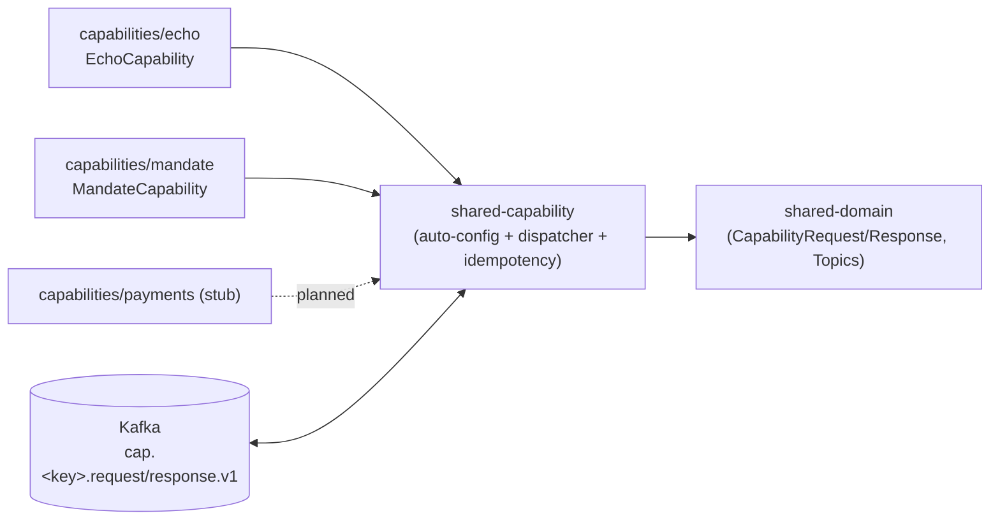
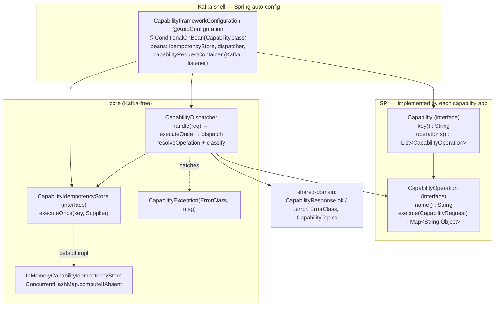
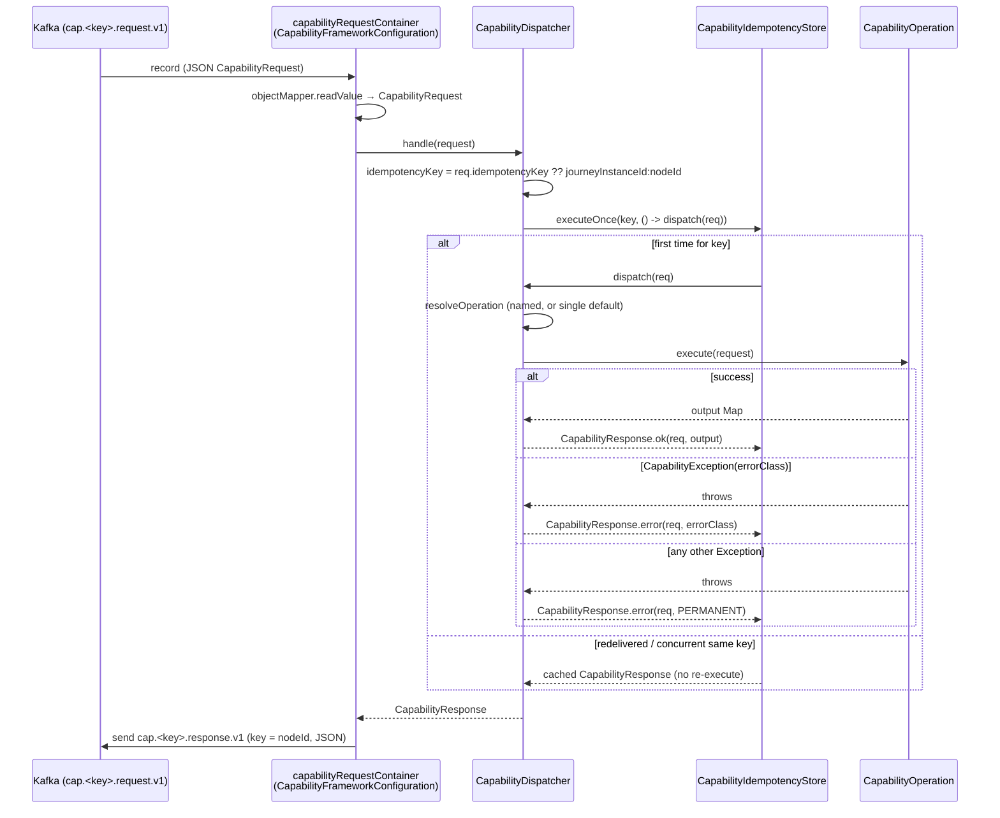

# Shared Capability Framework — Architecture

> **Module:** `shared/shared-capability` · **Type:** library · **Port:** n/a (library — auto-configures inside each capability app) · **Runtime:** Spring Boot / Java library · **Status:** implemented

## 1. Purpose & Context

`shared-capability` is **THE homogeneous capability framework** (BRD §2, §9): the shared shell every capability is built from. Given an app's single `Capability` bean it wires — with **zero per-capability code** — a Kafka listener on `cap.<key>.request.v1` that resolves the request's operation, executes it **exactly once** (idempotent on `(runId,nodeId)`), and publishes a classified `CapabilityResponse` to `cap.<key>.response.v1`. All the cross-cutting plumbing (dispatch, idempotency, error classification, the Kafka request→response shell) lives here, **not** per service. This is what `echo` and `mandate` build on: they implement only `Capability` + their `CapabilityOperation`s.

## 2. High-Level Block Diagram



## 3. Low-Level Block Diagram



## 4. Flow Diagram

The reusable core: a capability request flowing through the dispatcher's exactly-once path to a classified response.



## 5. Key Types / Classes & Files

| File | Role |
| --- | --- |
| `src/main/java/.../Capability.java` | SPI: a capability = `key()` + `operations()`. Each app provides exactly one bean. |
| `src/main/java/.../CapabilityOperation.java` | SPI: one named operation; `execute(CapabilityRequest)` returns the output map. |
| `src/main/java/.../CapabilityDispatcher.java` | Homogeneous core (Kafka-free): `handle` → `executeOnce` → `dispatch`; resolves operation, executes, classifies. |
| `src/main/java/.../CapabilityIdempotencyStore.java` | Exactly-once gate port: `executeOnce(key, Supplier)` — must be atomic (compute-if-absent / CREATE_ONLY CAS). |
| `src/main/java/.../InMemoryCapabilityIdempotencyStore.java` | Default impl using `ConcurrentHashMap.computeIfAbsent` (single-instance/demo); Aerospike CREATE_ONLY swaps in behind the same port. |
| `src/main/java/.../CapabilityException.java` | Thrown by operations to signal a classified failure (`TRANSIENT` / `PERMANENT`). |
| `src/main/java/.../CapabilityFrameworkConfiguration.java` | `@AutoConfiguration @ConditionalOnBean(Capability.class)` — wires idempotency store, dispatcher, and the Kafka request→response listener container. |
| `src/main/resources/META-INF/spring/org.springframework.boot.autoconfigure.AutoConfiguration.imports` | Registers the auto-config so it activates on the classpath. |

## 6. Interfaces / Dependents

- **Depended on by:** `capabilities/echo` (`EchoCapability`), `capabilities/mandate` (`MandateCapability`), and the planned `capabilities/payments`. They implement `Capability` + `CapabilityOperation` and get the whole Kafka/idempotency shell for free.
- **What dependents import:** `Capability`, `CapabilityOperation`, `CapabilityException`; the framework injects `CapabilityDispatcher` + `CapabilityIdempotencyStore` for them.
- **Depends on (api):** `shared-domain` (`CapabilityRequest`, `CapabilityResponse`, `CapabilityStatus`, `ErrorClass`, `CapabilityTopics`). **Implementation:** Spring Kafka, Spring Boot autoconfigure, Jackson.
- **Inbound/outbound runtime:** consumes `cap.<key>.request.v1`, produces `cap.<key>.response.v1` (consumer group `cap-<key>`), keyed by `nodeId`.

## 7. Configuration & How to Run / Use

This is a **library** — it does not run on its own and exposes no port; it auto-configures inside whatever capability app puts it on the classpath and declares a `Capability` bean. Consume it via Gradle:

```kotlin
dependencies {
    implementation(project(":shared:shared-capability")) // brings shared-domain transitively (api)
}
```

The app provides one `@Component implements Capability`; `CapabilityFrameworkConfiguration` does the rest. The default `InMemoryCapabilityIdempotencyStore` is replaceable by providing your own `CapabilityIdempotencyStore` bean (`@ConditionalOnMissingBean`). Group/version: `com.idfcfirstbank` (Java 21, Spring Boot 3.4.5, spring-kafka per `springKafkaVersion`).
