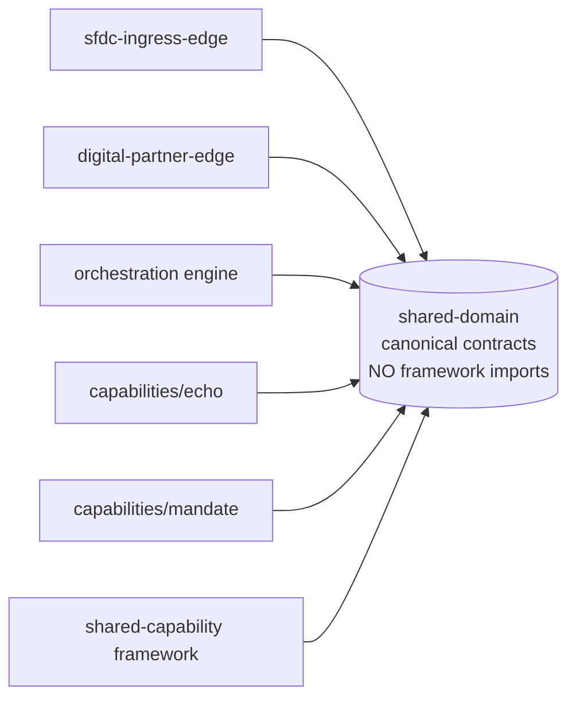
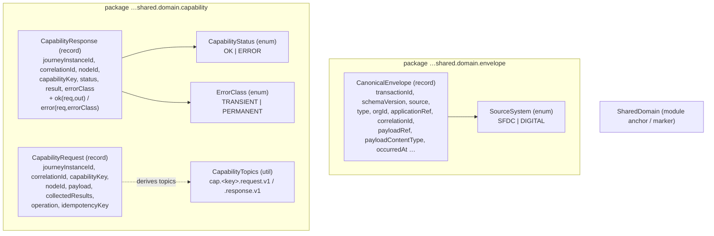
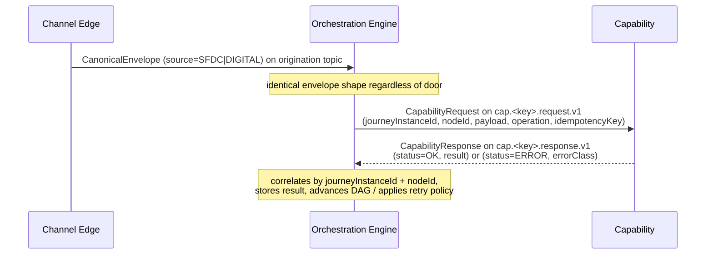

# Shared Domain — Architecture

> **Module:** `shared/shared-domain` · **Type:** library · **Port:** n/a (library) · **Runtime:** Spring Boot / Java library · **Status:** implemented

## 1. Purpose & Context

`shared-domain` is the schema backbone of the platform: the canonical contracts that every channel edge, the orchestration engine, and every capability depend on. It carries **NO framework imports** (pure Java records/enums) so it can be shared everywhere without coupling. It defines two contract families: the **edge→engine envelope** (`CanonicalEnvelope` + `SourceSystem`) and **THE CAPABILITY CONTRACT** (`CapabilityRequest` / `CapabilityResponse` + `CapabilityStatus` / `ErrorClass` / `CapabilityTopics`). These types exist precisely so different doors emit the identical shape — proven by construction, not by a fixture that can drift.

## 2. High-Level Block Diagram



## 3. Low-Level Block Diagram



## 4. Flow Diagram

How the contract types flow edge → engine → capability and back:



## 5. Key Types / Classes & Files

| File | Role |
| --- | --- |
| `src/main/java/.../envelope/CanonicalEnvelope.java` | The canonical origination envelope — THE shared contract between every edge and the engine; S3 claim-check via `payloadRef`. |
| `src/main/java/.../envelope/SourceSystem.java` | Enum of the channel a request entered through: `SFDC`, `DIGITAL`. |
| `src/main/java/.../capability/CapabilityRequest.java` | THE CAPABILITY CONTRACT (request half) — authoritative wire shape the engine emits per task node. |
| `src/main/java/.../capability/CapabilityResponse.java` | THE CAPABILITY CONTRACT (response half) — with `ok(...)` / `error(...)` factories echoing routing identity. |
| `src/main/java/.../capability/CapabilityStatus.java` | Terminal outcome enum: `OK` / `ERROR`. |
| `src/main/java/.../capability/ErrorClass.java` | Failure classification for the engine's retry policy: `TRANSIENT` / `PERMANENT`. |
| `src/main/java/.../capability/CapabilityTopics.java` | Single topic-naming convention: `cap.<key>.request.v1` / `cap.<key>.response.v1`. |
| `src/main/java/.../SharedDomain.java` | Module anchor / marker class. |

## 6. Interfaces / Dependents

- **Depended on by:** every edge (`sfdc-ingress-edge`, `digital-partner-edge`), the orchestration engine, every capability (`echo`, `mandate`, …), and `shared-capability` (which re-exports it via `api(project(":shared:shared-domain"))`).
- **What they import:** `CanonicalEnvelope` + `SourceSystem` (edges/engine), and `CapabilityRequest` / `CapabilityResponse` / `CapabilityStatus` / `ErrorClass` / `CapabilityTopics` (engine + capabilities + framework).
- **Outbound:** none — pure data types, no runtime dependencies, no framework imports.

## 7. Configuration & How to Run / Use

This is a **library**, not a runnable service — there is no server port and nothing to start. Consume it as a Gradle dependency:

```kotlin
dependencies {
    implementation(project(":shared:shared-domain"))
}
```

Group/version: `com.idfcfirstbank` (Java 21, Spring Boot 3.4.5 toolchain). Build via `idfc.library-conventions`.
